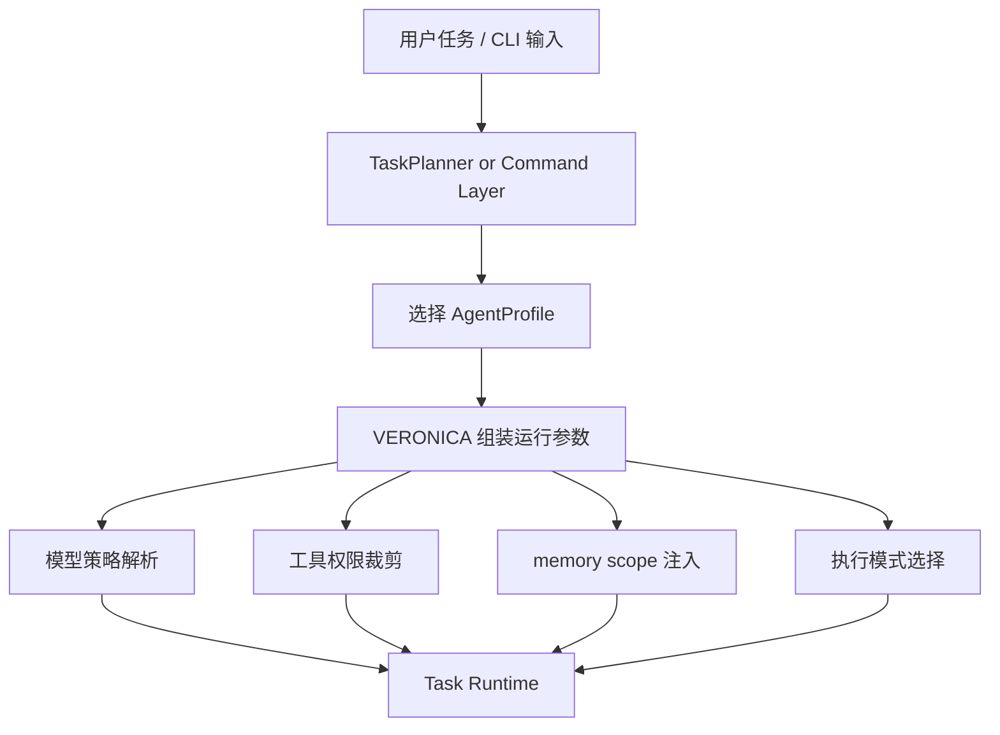

---
tags:
  - alice
  - agent-profile
  - architecture
  - draft
aliases:
  - ALICE AgentProfile 设计草案
---

# ALICE-AgentProfile 设计草案

> [!summary]
> 这份草案的目标不是“照抄 Claude Code 的 AgentDefinition”，而是为 **ALICE / VERONICA** 抽象出一层适合自身产品形态的 **AgentProfile**。  
> 重点是：**让角色、工具、模型、权限、记忆、运行模式有统一入口。**

---

## 1. 为什么 ALICE 需要 AgentProfile

当前 ALICE 已经具备：

- CLI / TUI 交互入口
- VERONICA daemon 常驻
- LLM Provider 抽象
- 工具体系
- 会话管理

但如果继续往“更强的 Agent 能力”走，会很快遇到一个问题：

> 系统里会出现越来越多“隐形角色”。

例如：

- 主对话 Agent
- 研究型任务
- 执行型任务
- 审阅型任务
- 日志整理 / 总结任务

如果这些角色只是散落在 prompt、配置、工具条件判断里，那么系统会逐渐失控。

所以需要一层统一结构来回答这些问题：

- 这个 Agent 是谁？
- 它的职责是什么？
- 它默认用什么模型？
- 它能用哪些工具？
- 它的权限边界在哪？
- 它是否支持后台运行？
- 它是否带有持久记忆？

这层结构，我建议叫：`AgentProfile`

---

## 2. AgentProfile 的设计目标

### 目标一：统一描述“角色”

不要让角色只存在于 prompt 里。  
角色必须有结构化定义。

### 目标二：统一收口“运行约束”

角色不仅有描述，还应该包含：

- 工具权限
- 模型策略
- memory scope
- 生命周期策略
- 是否允许后台运行

### 目标三：为未来多 Agent 能力打基础

即使当前不做 swarm / teammate / fork，也应该让结构支持以后扩展。

### 目标四：保持 MVP 可承受复杂度

这个设计应该是 **渐进式引入**，而不是一上来就铺满整个系统。

### 目标五：承认用户需求经常是模糊的

真实用户并不总是“已经想清楚，只差下命令”。

更常见的是：

- 用户脑中只有一个模糊想法
- 用户并不知道自己真正要解决的问题是什么
- 用户表达能力不足以把真实意图准确描述出来
- 用户想的是 A，却表述成了 B

所以系统里不能只有“执行者”，还要有角色专门负责：

1. 帮用户把事情讨论清楚
2. 帮用户把后果提前预演出来

这也是为什么我认为 `Consultant` 和 `Oracle` 不是花哨补充，而是有真实产品价值的角色。

---

## 3. 我建议的核心结构

```ts
export type AgentProfileId =
  | 'main'
  | 'consultant'
  | 'oracle'
  | 'researcher'
  | 'executor'
  | 'reviewer'
  | 'summarizer'

export type AgentModelPolicy =
  | { type: 'inherit' }
  | { type: 'fixed'; model: string }
  | { type: 'tier'; tier: 'fast' | 'balanced' | 'strong' }

export type AgentPermissionPolicy =
  | 'follow-session'
  | 'confirm-sensitive'
  | 'read-only'
  | 'full-auto'

export type AgentMemoryScope = 'none' | 'user' | 'project' | 'local'

export type AgentExecutionMode =
  | 'foreground'
  | 'background-allowed'
  | 'background-preferred'

export interface AgentProfile {
  id: AgentProfileId
  name: string
  description: string
  systemPromptTemplate?: string
  modelPolicy: AgentModelPolicy
  allowedTools?: string[]
  deniedTools?: string[]
  permissionPolicy: AgentPermissionPolicy
  memoryScope: AgentMemoryScope
  executionMode: AgentExecutionMode
  maxTurns?: number
  tags?: string[]
}
```

---

## 4. 为什么这样拆

### 4.1 `id / name / description`

这是最基础的角色身份层。

- `id` 给系统识别
- `name` 给 UI 展示
- `description` 给 prompt / 日志 / 调试使用

### 4.2 `modelPolicy`

我建议不要直接在 profile 里硬写模型名，而是引入策略层。

因为模型是会变的：

- 可能切 provider
- 可能切 alias
- 可能切 tier

所以 profile 更应该表达“意图”，而不是绑定死具体字符串。

### 4.3 `allowedTools / deniedTools`

这决定角色的能力边界。  
比“在 prompt 里提醒不要乱用工具”更可靠。

### 4.4 `permissionPolicy`

工具边界和权限边界不是一回事。

例如：

- 都能调用 `executeCommand`
- 但有的角色必须确认
- 有的角色只能读
- 有的角色可以自动执行

### 4.5 `memoryScope`

决定角色是否可带持久知识，以及知识属于哪一层。

### 4.6 `executionMode`

这是面向未来的字段。  
它让一个角色可以天然表达：

- 适合前台即时对话
- 可以转后台
- 本来就适合后台跑

---

## 5. 推荐的初始内置角色

> [!tip]
> 不建议一上来做十几个角色。  
> 但如果某些角色在产品逻辑上承担的是完全不同的职责，就应该明确建模。  
> 当前我建议先定义 7 个角色，其中 `Consultant` 与 `Oracle` 的价值在于帮助用户“想清楚”和“看清后果”。

## 5.1 `main`

主对话角色。

特点：

- 跟随会话模型
- 工具权限跟随当前 session
- memory 视需要启用
- 默认前台

## 5.2 `consultant`

顾问角色。

职责：

- 与用户讨论问题
- 帮用户澄清目标、约束、优先级和成功标准
- 通过搜索、资料、案例、证据对比来推动用户把需求想清楚
- 在执行前把模糊直觉收敛成可执行描述

特点：

- 偏前台交互
- 允许上网搜索和资料收集
- 更偏讨论、论证、比较，不承担重执行
- 默认少做写操作

`Consultant` 的价值不只是“帮用户写 prompt”，而是：

> **帮助用户形成真正清晰的决策。**

现实里很多问题不是 AI 不够聪明，而是用户自己还没想清楚。  
`Consultant` 的意义就是承认这一现实。

## 5.3 `oracle`

先知角色。

职责：

- 对方案结果做预演
- 对用户决策的可能后果进行预判
- 对风险、连锁反应、副作用、失败面给出提前提示
- 在后台持续做风险扫描与情景模拟

特点：

- 可以读取较广的记忆与历史
- 允许上网搜索补充外部信息
- 更偏“推演 / 预警 / 风险提醒”，而不是直接执行
- 很适合后台运行，作为其他任务的伴随分析层

这里要特别强调：  
`Oracle` 不是“神谕式正确答案机器”，更像是：

> **一个情景预演与风险提示角色。**

它输出的不是“必然真相”，而是：

- 可能结果
- 风险路径
- 触发条件
- 建议关注点

为什么它重要？  
因为现实里很多用户并不知道自己的决策会带来什么后果。  
即使他有想法，也未必有足够知识或表达能力把问题讲对。  
`Oracle` 的价值，就是在执行之前提醒一句：

> “你这样做，接下来大概率会遇到什么问题。”

## 5.4 `researcher`

研究 / 阅读 / 汇总类角色。

特点：

- 倾向只读工具
- 尽量少写文件
- 更偏大上下文、强理解

## 5.5 `executor`

执行 / 修改 / 修复类角色。

特点：

- 允许文件写入、命令执行
- 对危险操作进行确认
- 更适合后台运行

## 5.6 `reviewer`

审查 / 对比 / 风险识别角色。

特点：

- 偏只读
- 强调分析、指出问题
- 禁止直接大范围修改

## 5.7 `summarizer`

摘要 / 汇报 / 状态整理角色。

特点：

- 不需要复杂工具
- 可用快速模型
- 常作为后台辅助角色

---

## 5.8 这些角色之间的关系

我建议把这 7 个角色分成三组理解：

### A. 面向用户理解与决策的角色

- `main`
- `consultant`
- `oracle`

这组角色的重点不是“直接做事”，而是：

- 理解用户
- 帮用户想清楚
- 提前提示后果

### B. 面向信息和执行的角色

- `researcher`
- `executor`
- `reviewer`

这组角色是更典型的工作执行层。

### C. 面向收口和沟通的角色

- `summarizer`

这组角色重点是把复杂过程转译成清晰输出。

这样分组的好处是：

> 你不会把所有角色都理解成“干活工人”，而会认识到有些角色的职责，是帮助用户形成正确任务，而不是直接执行任务。

---

## 6. AgentProfile 在系统里的位置



核心意思是：

> AgentProfile 不直接执行任务，它负责生成“任务该怎么跑”的配置基础。

---

## 7. 最小落地方案

### 第一阶段：只做定义，不做复杂调度

先建立：

- `src/core/agentProfile.ts`
- `getAgentProfile(id)`
- `resolveModelPolicy(profile, session)`
- `resolvePermissionPolicy(profile, session)`

并让一部分任务执行入口从 profile 读取配置。

### 第二阶段：让工具权限跟 profile 挂钩

把：

- `allowedTools`
- `deniedTools`
- `permissionPolicy`

接到现有 ToolRegistry / ToolExecutor 入口上。

### 第三阶段：让 memory 和后台模式接进来

这时再把：

- `memoryScope`
- `executionMode`

接入 runtime。

---

## 8. 暂时不要做的事

为了避免一上来复杂化，我建议这版先不做：

- teammate / swarm
- 自动角色选择过度智能化
- 每个角色一套超长 prompt
- 复杂策略表达式语言
- 插件侧自由定义所有 profile 字段

这不是说以后不能做，而是现在先把结构站稳。

---

## 9. 我对这个设计的判断

> [!important]
> AgentProfile 不是“为了显得高级”。  
> 它的真正价值是：**把角色、能力和边界从散落逻辑里收回来，形成统一入口。**

如果这一步做成，ALICE 后面很多功能会自然顺起来：

- 顾问式讨论
- 风险预演
- 角色化任务
- 后台任务
- 只读研究员 / 可执行工人 / 审阅员
- 分层记忆
- 更清晰的 UI 展示

---

## 10. 讨论问题

我建议你读这篇时重点思考 4 个问题：

1. `Consultant` 与 `Oracle` 是否应该作为一等角色，而不是临时 prompt 技巧？
2. 哪些字段是必须结构化的，哪些可以继续留在 prompt 层？
3. 你希望“角色”更多体现能力边界，还是体现行为风格？
4. 你希望 AgentProfile 只是内部运行结构，还是未来对用户可见？

---

## 当前结论

我的倾向是：

> **先把 AgentProfile 做成内部运行结构。**

先别急着让用户直接编辑它。  
等运行时稳定后，再决定要不要开放成可配置能力。
