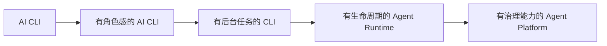
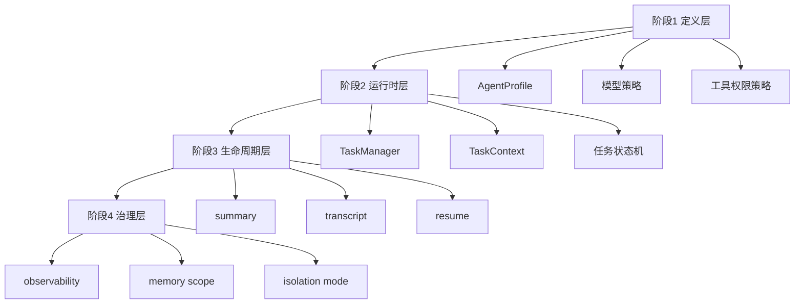

---
tags:
  - alice
  - veronica
  - roadmap
  - agent-runtime
  - draft
aliases:
  - ALICE 从 AI CLI 升级到 Agent Runtime 的路线图
---

# ALICE 从 AI CLI 升级到 Agent Runtime 的路线图

> [!summary]
> 这份路线图讨论的不是“多加几个功能”，而是产品形态升级：  
> **ALICE 如何从一个很强的 AI CLI，逐步升级成一个可治理的 Agent Runtime 产品。**

---

## 1. 先说结论：ALICE 其实已经有一半基础了

从当前架构看，ALICE / VERONICA 已经具备这些关键底座：

- `alice` 负责 CLI / TUI 交互
- `veronica` 负责常驻服务
- 有 LLM provider 抽象
- 有工具注册与执行
- 有会话系统
- 有事件系统
- 有 MCP 接入

这意味着：

> 你们并不是从 0 开始做 Agent Runtime。  
> 你们真正缺的是“统一的运行时抽象”和“生命周期治理”。

---

## 2. 什么叫“从 AI CLI 升级到 Agent Runtime”

我建议用下面这张图理解：

### AI CLI 阶段的特点

- 用户输入 prompt
- 系统调用模型
- 执行工具
- 返回结果

### Agent Runtime 阶段的特点

- 任务有身份
- 角色有边界
- 上下文可恢复
- 任务可后台持续运行
- 系统能观察、管理、恢复任务

---

## 3. 我建议的升级路径：分四层推进

---

## 第一层：定义层升级

### 目标

让系统从“散落角色”升级到“统一角色定义”。

### 核心建设

- AgentProfile
- 模型策略抽象
- 工具权限策略抽象
- memory scope 抽象

### 这一层做完后会得到什么

- 主对话、研究、执行、总结等角色有统一入口
- 新角色不再靠复制 prompt 拼接
- 工具边界可以结构化管理

### 这一层的产品价值

用户未必马上能感知，但系统内部会明显更稳。

---

## 第二层：运行时层升级

### 目标

让任务从“执行过程”升级为“运行实体”。

### 核心建设

- TaskManager
- RuntimeTask 元数据
- TaskContext
- 状态机

### 这一层做完后会得到什么

- 每个任务有 taskId
- UI 可以展示任务状态
- daemon 能管理多个任务
- 可以开始支持 background task

### 这一层的产品价值

ALICE 会第一次有“真的在替我做事”的感觉。

---

## 第三层：生命周期层升级

### 目标

让任务能持续存在，而不是一次性结束。

### 核心建设

- task summary
- transcript
- resumable task
- daemon restart 后的任务识别

### 这一层做完后会得到什么

- 用户退出后回来还能看到任务轨迹
- daemon 重启后不至于彻底失忆
- 背景任务能更像真正的“助手”

### 这一层的产品价值

这是 ALICE 从普通 CLI 迈向 Agent Runtime 的关键门槛。

---

## 第四层：治理层升级

### 目标

让系统不仅能跑，还能被理解、被约束、被演化。

### 核心建设

- observability
- task trace
- task list / task history
- memory scope 管理
- isolation mode

### 这一层做完后会得到什么

- 任务为什么失败能看见
- 哪些角色能做哪些事更透明
- 系统复杂后仍可维护

### 这一层的产品价值

系统会从“能用”变成“能长期长大”。

---

## 4. 路线图总览

---

## 5. 每一阶段的“完成标志”

## 阶段 1 完成标志

- 至少有 3~5 个内置 AgentProfile
- 执行入口能按 profile 解析模型 / 工具 / 权限
- 角色边界不再只靠 prompt

## 阶段 2 完成标志

- VERONICA 能维护任务对象
- TUI 能看到任务状态
- 任务有基础摘要

## 阶段 3 完成标志

- 背景任务可被列出
- daemon 重启后能识别未完成任务
- 至少有一类任务能 resume

## 阶段 4 完成标志

- 能查看任务轨迹
- 能区分不同 memory scope
- 能清楚表达哪些任务在什么隔离模式下运行

---

## 6. 我建议最先做的 5 件事

如果你现在要开始动手，我会建议优先级是：

1. `AgentProfile` 最小结构
2. `TaskManager` 最小实现
3. `RuntimeTask` 元数据持久化
4. TUI / CLI 显示任务状态
5. 后台任务摘要

因为这 5 件事会快速把“AI CLI”往“Agent Runtime”推一步，而且投入产出比很高。

---

## 7. 这条路最容易踩的坑

### 坑一：一开始就做太复杂

比如：

- 一上来搞 swarm
- 一上来搞复杂多角色协作
- 一上来搞自动角色选择

这些容易让系统变重，但收益未必立刻可见。

### 坑二：把所有东西都塞进 prompt

如果角色、权限、memory、模式都只靠 prompt 约束，那么随着系统变大，迟早会失控。

### 坑三：先炫技，后治理

比如先做很花的多 agent 编排，但没有：

- 任务状态
- 可观测性
- 恢复能力

这类系统初期看起来很酷，后期很难维护。

---

## 8. ALICE 与 Claude Code 真正不同的地方

这里很重要。  
ALICE 不应该变成“Claude Code 中文复刻版”。

ALICE 的独特路径应该是：

1. **更强的模型切换韧性**  
   模型是可替换资源，业务连续性更重要。

2. **更适合办公 / 多通道场景**  
   VERONICA 有 daemon 和 gateway 潜力，这和 Claude Code 的代码工作流中心化不同。

3. **更强调产品化协作体验**  
   ALICE 可以更早把任务状态、摘要、通知做成面向用户的能力。

所以路线图的目标不是“像 Claude Code”，而是：

> **借鉴它的 Agent Runtime 思想，长成 ALICE 自己的产品形态。**

---

## 9. 一个我很认同的原则

> [!important]
> **先让系统可治理，再让系统显得聪明。**

这句话我觉得应该成为 ALICE 未来一段时间的设计纪律。

因为：

- 模型会换
- provider 会变
- 能力会加
- 需求会扩

但只要运行时结构稳定，系统就不会散。

---

## 10. 最终判断

如果把 ALICE 的未来分成两条路线：

### 路线 A：继续做更强的 AI CLI

优点：

- 开发速度快
- 用户立刻能感知

缺点：

- 复杂度上来后会越来越难治理

### 路线 B：升级成 Agent Runtime

优点：

- 长期可扩展
- 能承载后台任务、恢复、角色化能力
- 能形成产品护城河

缺点：

- 需要更强的架构纪律
- 初期收益不如功能堆叠那么显眼

我的判断是：

> **ALICE 应该继续保留“好用的 AI CLI”外壳，但内核逐步按 Agent Runtime 方向演进。**

这条路兼顾现实和未来。

---

## 11. 读完这篇后建议讨论的 4 个问题

1. 你希望 ALICE 的下一阶段更偏“更强 CLI”，还是“更稳 Runtime”？
2. 任务生命周期在你心里是不是产品核心，而不只是工程细节？
3. 角色边界是否应该先结构化，再讨论多 Agent？
4. 你希望 ALICE 最终区别于 Claude Code 的核心特征是什么？

---

## 当前结论

ALICE 最值得走的路不是：

> “复制 Claude Code 的功能列表”

而是：

> **吸收它的运行时设计思想，然后结合 ALICE 自己的模型切换能力、daemon 架构、多通道潜力，长出自己的 Agent Runtime。**

