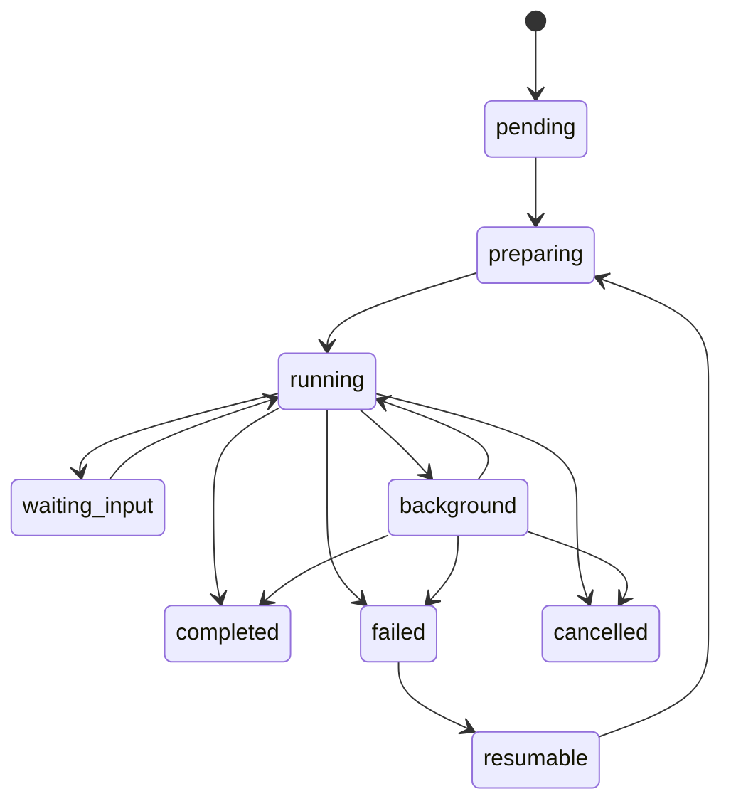
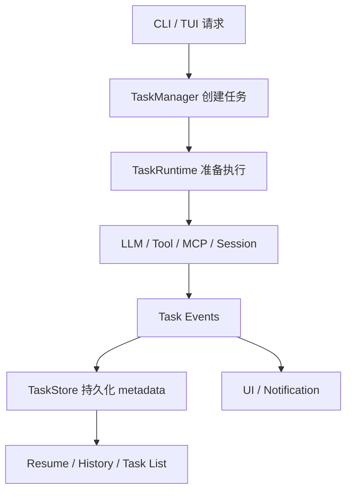

---
tags:
  - veronica
  - task-lifecycle
  - architecture
  - draft
aliases:
  - VERONICA 任务生命周期设计草案
---

# VERONICA-任务生命周期设计草案

> [!summary]
> 这份草案想回答一个很实际的问题：  
> **VERONICA 里的“任务”到底应该被当成什么？**  
> 我的建议是：任务不是一次性函数调用，而应该是一个 **有状态、可观察、可恢复** 的运行单元。

---

## 1. 为什么现在就该想任务生命周期

在 MVP 阶段，很多系统都把任务理解成：

> “收到请求 → 调模型 → 工具调用 → 返回结果”

这在简单场景下是够的。  
但只要开始出现下面这些情况，就不够了：

- 一个任务要跑很久
- 任务需要后台继续执行
- 任务中途失败了
- 用户退出了 TUI 又回来
- daemon 重启了
- 任务需要给出中间进度

这时任务就不再是“函数调用”，而是“运行实体”。

VERONICA 本身就是 daemon，这其实给了它一个很大的天然优势：

> 它非常适合做任务生命周期管理。

---

## 2. 设计目标

### 目标一：任务有明确状态

任何时刻都应该能回答：

- 这个任务现在在哪个阶段？
- 它是不是还活着？
- 它是在前台还是后台？

### 目标二：任务可观察

至少应该能看到：

- taskId
- 状态
- 摘要
- 最近更新时间
- 最近失败原因

### 目标三：任务可恢复

哪怕先不做完整断点续跑，也应保留恢复基础：

- metadata
- transcript
- progress summary

### 目标四：任务要和会话解耦但可关联

任务不应等于会话，但要能挂到某个 session 下。

---

## 3. 我建议的任务状态机



### 关键状态解释

- `pending`：任务刚创建，还没开始执行
- `preparing`：正在组装模型、权限、工具、上下文
- `running`：正在执行
- `waiting_input`：等待用户输入或确认
- `background`：在后台持续运行
- `completed`：完成
- `failed`：失败
- `cancelled`：取消
- `resumable`：理论上可以恢复

---

## 4. 任务对象建议结构

```ts
export type TaskStatus =
  | 'pending'
  | 'preparing'
  | 'running'
  | 'waiting_input'
  | 'background'
  | 'completed'
  | 'failed'
  | 'cancelled'
  | 'resumable'

export interface RuntimeTask {
  taskId: string
  sessionId?: string
  parentTaskId?: string
  agentProfileId: string
  title: string
  summary?: string
  status: TaskStatus
  createdAt: number
  updatedAt: number
  startedAt?: number
  finishedAt?: number
  errorMessage?: string
  resumeToken?: string
  metadata?: Record<string, unknown>
}
```

---

## 5. 为什么这些字段有价值

### `taskId`

任务级唯一标识，是观测和恢复的基础。

### `sessionId`

让任务跟对话会话关联，但不强绑定。

### `parentTaskId`

为以后子任务、后台派生任务、多角色协作预留。

### `summary`

这是一个非常值钱的小字段。  
它让 UI 不只是显示“正在运行”，而是能显示：

- “正在读取 provider 配置”
- “正在执行 workspace 检查”
- “正在汇总代码变更”

这会极大改善产品感知。

### `resumeToken`

即使现在先不真正实现恢复，也应该先给结构位置。

---

## 6. VERONICA 中任务生命周期的推荐分层



### 我建议的职责划分

#### `TaskManager`

负责：

- 创建任务
- 更新状态
- 查询任务
- 终止任务

#### `TaskRuntime`

负责：

- 组装上下文
- 驱动 LLM / 工具执行
- 生成 summary
- 抛出状态事件

#### `TaskStore`

负责：

- 持久化任务 metadata
- 保存摘要
- 保存恢复所需最小信息

---

## 7. 最小实现路线

> [!tip]
> 生命周期系统一旦设计过头，会立刻变重。  
> 所以最好的方式是三步走。

## 第一步：先做任务元数据和状态

最小集合：

- taskId
- status
- createdAt / updatedAt
- summary
- errorMessage

这一步的目标只是：

> 让 VERONICA 知道“现在有哪些任务，它们处于什么状态”。

## 第二步：支持后台任务与简单恢复

新增：

- background 状态
- 任务摘要持久化
- 未完成任务列表

这一步目标是：

> daemon 重启后，至少能告诉用户“你之前还有哪些任务没跑完”。

## 第三步：支持 resumable

新增：

- transcript 或最小恢复上下文
- resumeToken
- 明确哪些任务可恢复、哪些不可恢复

这一步才是真正让 Agent Runtime 质变的部分。

---

## 8. 哪些任务不适合恢复

并不是所有任务都应该 resume。  
我建议先明确“不可恢复任务”：

- 完全依赖交互式 stdin 的任务
- 强依赖外部临时环境的任务
- 已经过期的确认任务
- 没有足够上下文可重建的任务

这很重要，因为恢复不是目标，**可解释的恢复策略** 才是目标。

---

## 9. 任务生命周期与用户体验的关系

任务生命周期不是后台工程细节，它直接决定用户体验：

- 用户能不能放心把任务扔后台
- 用户退出后再回来是否还能接上
- 用户能不能理解系统在忙什么
- 用户能不能知道失败发生在哪

如果 VERONICA 把生命周期做好，ALICE 的体验会立刻从：

> “一个会跑模型的 CLI”

提升到：

> “一个会持续替你处理任务的系统”

---

## 10. 我建议先落哪三件事

如果只做最值钱的三件事，我建议：

1. `TaskManager` 基础抽象
2. `RuntimeTask` 元数据持久化
3. 后台任务列表 + 任务摘要显示

这三件事不会太重，但收益很高。

---

## 11. 暂时不要做的事

这一版我建议先不做：

- 复杂任务调度优先级
- 分布式多 worker
- 过细的状态拆分
- 任务依赖 DAG
- 自动恢复所有任务

这些都容易把系统一下子拉得太复杂。

---

## 当前结论

> [!important]
> VERONICA 的任务生命周期，不应该设计成“调用过程日志”。  
> 应该设计成“任务对象的状态演化”。  
> 只要这个抽象站住，未来后台任务、恢复、协作、多角色都能挂上去。

