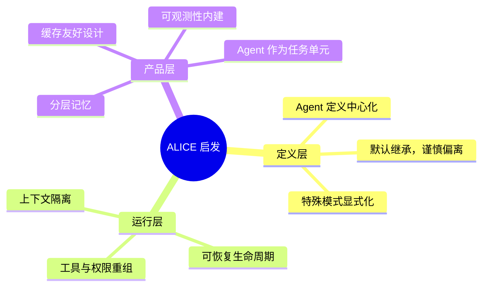
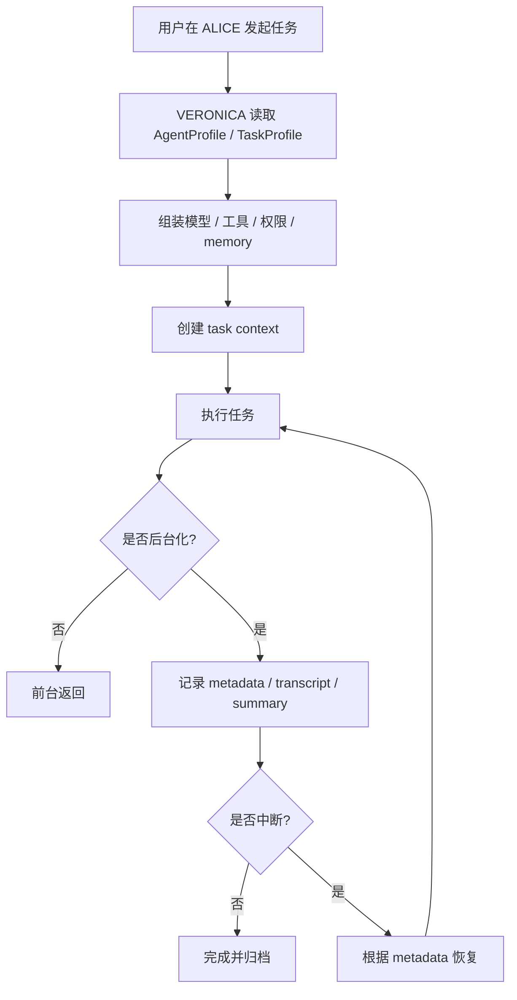

---
tags:
  - agent-runtime
  - claude-code
  - alice
  - veronica
  - architecture
aliases:
  - 对ALICE最有价值的10条可落地启发
---

# 对 ALICE 最有价值的 10 条可落地启发

> [!summary]
> 这份笔记不讨论“抄代码”，只讨论 **Claude Code 背后的工程方法**。  
> 核心结论：**ALICE / VERONICA 下一阶段最值得补的，不是某个 prompt 技巧，而是 Agent Runtime 的边界、恢复、观测和治理能力。**

![[alice-agent-runtime-lessons.svg]]

---

## 一眼先看懂：这 10 条到底在说什么



> [!tip]
> 可以把这 10 条压缩成一句话：  
> **把 Agent 从“会说话的 Prompt”升级成“可治理的运行单元”。**

---

## 0. 为什么 Claude Code 会想出这套设计

我对它背后设计思路的判断是：

1. **他们不是把 Agent 当功能，而是当 Runtime。**
2. **他们默认系统会失败，所以先设计恢复能力。**
3. **他们默认并发会复杂，所以先设计上下文隔离。**
4. **他们默认成本会失控，所以提前考虑缓存稳定性。**
5. **他们默认产品会变大，所以先把定义层和执行层拆开。**

换句话说，Claude Code 的思路不是：

> “怎么让模型更聪明？”

而更像是：

> “怎么让一个长期运行、可中断、可分工、可恢复的智能体系统，在工程上能管得住？”

这点非常值得 ALICE 学。

---

# 10 条可落地启发

## 1. 把 Agent 定义中心化

### Claude Code 怎么做

它把 Agent 的能力定义收敛到统一结构里，里面不是只有 prompt，还包括：

- agentType
- tools / disallowedTools
- model
- memory
- permissionMode
- maxTurns
- isolation
- background

也就是说，**Agent 是一个完整配置对象**，而不是“几段 prompt 文本”。

### 为什么这样好

因为你一旦把 Agent 只理解成 prompt，系统就会越来越散：

- 工具限制写一处
- 模型选择写一处
- memory 又写一处
- 后台运行逻辑写另一处

最后你很难回答一句简单的问题：

> “这个 Agent 到底是什么？它能干什么？边界在哪？”

统一定义之后，产品、工程、调试都更清晰。

### 对 ALICE 的落地启发

建议在 VERONICA 里逐步形成统一的 `AgentProfile` / `TaskProfile` 定义层，至少先收敛这几个字段：

- 名称
- 角色描述
- 默认模型
- 可用工具集合
- 权限模式
- memory scope
- 是否允许后台执行
- 是否允许工作区隔离

### 最小落地动作

先不要做全量系统，先做一个最小版本：

- `src/core/agentProfile.ts`
- 用统一对象描述 ALICE 内置几个典型角色
- 所有任务执行都尽量从这个对象读配置

---

## 2. 默认继承，谨慎偏离

### Claude Code 怎么做

子 Agent 模型默认是 `inherit`，尽量继承父线程语义。  
只有在确实需要时才切换模型，而且还会保留 provider / tier / region 等关键语义。

### 为什么这样好

这背后不是“偷懒”，而是一个很强的工程原则：

> **系统默认保持一致，只有明确需求才偏离。**

否则会出现很多隐蔽问题：

- 父线程效果很好，子线程突然降级
- 推理链风格不一致
- 不同 provider 的权限或成本行为突然变化

### 对 ALICE 的落地启发

ALICE 如果以后引入更多角色型任务，不要让每个角色随便指定模型。  
应该采用：

- 默认继承会话模型
- 只有某些角色显式声明“快模型/强模型”
- 角色模型切换要可见、可解释

### 最小落地动作

在 `AgentProfile` 里加：

```ts
model: 'inherit' | 'fast' | 'strong' | 'custom'
```

并且让执行器先走 `inherit` 逻辑，而不是默认覆盖。

---

## 3. 特殊模式要显式建模，不要埋在 if 里

### Claude Code 怎么做

它把这些模式明确区分开：

- 普通 subagent
- fork subagent
- worktree isolation
- remote isolation
- resume

也就是说，**特殊路径是产品概念，不只是代码分支。**

### 为什么这样好

因为“特殊模式”一旦不显式化，就会出现：

- 逻辑写在很多 if/else 里
- 调试时不知道当前处于哪种模式
- 用户体验和工程实现都混乱

### 对 ALICE 的落地启发

未来如果你们要支持：

- 后台任务
- 独立工作副本
- 多角色协作
- 中断后续跑

建议这些都变成明确模式，而不是“某个参数顺便支持一下”。

### 最小落地动作

在任务定义里先引入：

```ts
mode: 'foreground' | 'background'
isolation: 'none' | 'workspace'
resumePolicy: 'none' | 'resume-if-possible'
```

这一步本身就能让结构清晰很多。

---

## 4. 并发上下文必须隔离

### Claude Code 怎么做

它用 `AsyncLocalStorage` 挂 Agent 上下文，避免后台并发任务互相污染。

也就是说，某个 Agent 的：

- agentId
- parentSessionId
- invocation 边界
- telemetry 信息

都跟着自己的 async 调用链走。

### 为什么这样好

当系统开始支持后台任务、多任务、嵌套任务时，全局变量会非常危险。

一旦串台，你会遇到这些很恶心的问题：

- 日志归错任务
- 工具事件显示到错误会话里
- 某个任务覆盖另一个任务状态

### 对 ALICE 的落地启发

VERONICA 以后只要任务调度越来越重，就要避免“共享全局当前任务状态”。

### 最小落地动作

做一个最小的任务上下文层：

- `taskId`
- `sessionId`
- `parentTaskId`
- `agentProfile`
- `traceId`

哪怕先只用于日志和事件总线，也已经很值。

---

## 5. 生命周期要设计成可恢复，而不是一次性执行

### Claude Code 怎么做

Claude Code 很重视：

- spawn
- background
- transcript
- metadata
- resume

这些不是零散功能，而是一整套生命周期设计。

### 为什么这样好

因为真实世界的 Agent 任务不是一次性函数：

- 会中断
- 会超时
- 会切换终端
- 会挂掉
- 用户会临时离开再回来

如果没有恢复能力，系统体验会非常脆弱。

### 对 ALICE 的落地启发

VERONICA 非常适合做这件事，因为它本来就是常驻 daemon。  
这意味着你们天然比很多 CLI 更适合做：

- 任务元数据持久化
- transcript 持久化
- background task 恢复

### 最小落地动作

先别追求完整 resume，先做 3 个基础件：

1. 持久化 task metadata
2. 保存任务输出摘要
3. daemon 重启后能列出“未完成任务”

这已经会让产品质感提升一大截。

---

## 6. 子任务的工具和权限要重新组装

### Claude Code 怎么做

它不会让子 Agent 自动继承父 Agent 的完整能力。  
而是按当前 Agent 定义重新组装：

- 可用工具
- 禁用工具
- 权限模式
- MCP 能力

### 为什么这样好

这其实是“最小授权原则”在 Agent 世界的体现。

如果什么都继承，会越来越不可控：

- 某个研究型任务突然拿到写文件权限
- 某个审查型任务突然能执行危险命令
- 某个自动化任务拿到不该拿的 workspace 修改权

### 对 ALICE 的落地启发

ALICE 的工具系统已经不错了，下一步值得做的是：

> **让角色定义决定工具边界，而不是只靠运行时 prompt 提示。**

### 最小落地动作

为每个任务角色加：

- `allowedTools`
- `deniedTools`
- `permissionPolicy`

这样你以后做“研究员角色 / 编辑角色 / 执行角色”就有了真正的结构基础。

---

## 7. 记忆要分层，不能把任务和知识混着存

### Claude Code 怎么做

它把 Agent memory 分成：

- user
- project
- local

这其实是在做“知识作用域”管理。

### 为什么这样好

不是所有信息都应该放在一个记忆池里：

- 跨项目通用偏好，应该是 user
- 某仓库约定，应该是 project
- 某台机器临时状态，应该是 local

如果混在一起，记忆会迅速腐烂。

### 对 ALICE 的落地启发

ALICE 很适合在现有配置 / workspace / session 基础上演化出三层记忆：

- 用户偏好层
- 项目约定层
- 本地临时层

### 最小落地动作

先不要做自动写 memory，先只做：

- 统一目录
- 明确 scope
- 在 prompt 组装阶段按 scope 注入

这样就已经比“全都塞在一个文档里”强很多。

---

## 8. 把缓存命中率当架构变量

### Claude Code 怎么做

它在 fork 路径里非常在意 prompt cache 的稳定性：

- 继承 rendered system prompt
- 固定 placeholder 文本
- 尽量保持消息前缀 byte-stable

这说明他们不是事后优化性能，而是**设计时就考虑缓存**。

### 为什么这样好

随着 Agent 系统变复杂，成本和延迟会成为硬约束。  
如果架构天然破坏缓存，后面补救会非常痛苦。

### 对 ALICE 的落地启发

VERONICA 以后如果做多 Agent / 子任务编排，建议把这些提前考虑：

- system prompt 组装尽量稳定
- 公共上下文模板尽量复用
- 子任务只改最后一段 directive

### 最小落地动作

在 prompt builder 里区分：

- stable prefix
- task directive
- ephemeral context

哪怕先不接缓存统计，这个拆法本身就值得做。

---

## 9. 可观测性要内建，不要事后补日志

### Claude Code 怎么做

它会给 Agent 附带：

- agentId
- invokingRequestId
- progress summary
- transcript
- request 边界

换句话说，它不是“等出问题再打印 log”，而是从第一天就默认这是一个需要观察的系统。

### 为什么这样好

Agent 系统如果不可观测，很快会进入一个阶段：

- 出问题时只能猜
- 不知道哪个任务在卡
- 不知道为什么某个输出变差
- 不知道一个任务是不是恢复错了

### 对 ALICE 的落地启发

你们现在已经有 daemon 和事件流基础，非常适合做：

- task timeline
- tool event trace
- 当前任务摘要
- 最近失败原因

### 最小落地动作

先给每个任务补 4 个字段就够了：

- taskId
- status
- startedAt / updatedAt
- summary

配上 `/tasks` 或 TUI 小面板，产品观感会大提升。

---

## 10. 真正把 Agent 当“任务单元”，不是 prompt 花样

### Claude Code 怎么做

从整体看，它真正厉害的点是：

> Agent 不只是 system prompt 的变体，而是一个具有身份、边界、资源、上下文、生命周期的任务实体。

这才让它能继续发展出：

- subagent
- teammate
- fork
- resume
- worktree
- memory
- summary

### 为什么这样好

这套抽象一旦成立，后续很多能力就自然长出来了。  
如果抽象没立住，系统会一直停留在“多套 prompt 拼接”的阶段。

### 对 ALICE 的落地启发

ALICE / VERONICA 其实已经具备这个方向的基础：

- CLI / TUI 入口
- daemon 常驻
- 会话系统
- 工具体系
- 事件机制

差的不是“从 0 到 1”，而是从：

> “一个很强的 AI CLI”

升级为：

> “一个可治理的 Agent Runtime 产品”

### 最小落地动作

以后讨论新功能时，都可以先问一句：

> 这是一个 prompt 功能，还是一个任务运行时能力？

如果是后者，就优先做成系统能力，而不是写进某个 prompt 里。

---

# 我建议 ALICE 的执行顺序

> [!important]
> 如果 10 条一起做，很容易发散。  
> 更建议按“先约束，后智能”的顺序推进。

## 第一阶段：先搭边界

1. Agent / Task 定义中心化  
2. 任务上下文隔离  
3. 工具和权限重组

这一阶段的目标不是更聪明，而是 **结构稳定**。

## 第二阶段：再补生命周期

4. task metadata  
5. background / pending / done / failed  
6. transcript / summary / resume

这一阶段的目标是 **任务不会轻易丢**。

## 第三阶段：再做产品化增强

7. memory scope  
8. stable prompt prefix  
9. task observability  
10. 特殊模式（如 workspace isolation）

这一阶段的目标是 **系统能扩，而且能运维**。

---

## 一张更直观的流程图



---

## 我对这 10 条的最终判断

> [!abstract]
> Claude Code 真正值得学习的，不是“它有多少花样”，而是它非常清楚：  
> **Agent 系统一旦进入真实工作流，就必须面对并发、恢复、权限、成本、可观测性。**  
> 所以它的设计不是围绕“怎么显得聪明”，而是围绕“怎么长期可控”。  
> 这点，对 ALICE 的价值非常大。

---

## 如果只选 3 条，最值得先做哪 3 条？

如果你让我只挑最值钱的 3 条，我会选：

1. **Agent / Task 定义中心化**
2. **任务上下文隔离**
3. **生命周期可恢复**

因为这三条一旦成立，后面的 memory、observability、special mode 才有根。

---

## 这份笔记可以怎么继续扩展

后面如果你愿意，这篇可以继续长成 3 个子笔记：

1. `ALICE-AgentProfile设计草案`
2. `VERONICA-任务生命周期设计草案`
3. `ALICE从AI CLI升级到Agent Runtime的路线图`

如果你点头，我下一步就按这 3 篇继续给你拆。  
