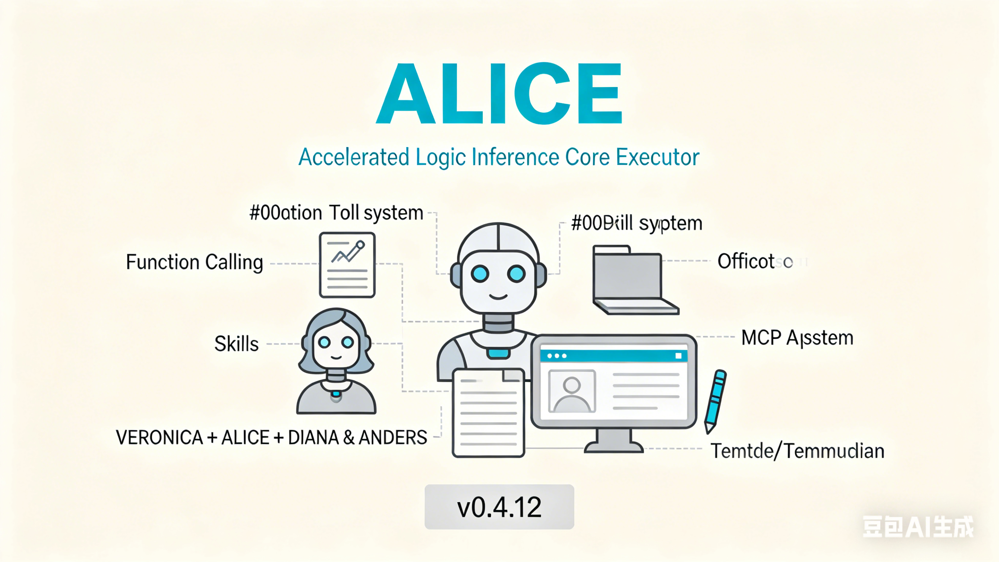

<div align="center">



# ALICE-CLI

🤖 **ALICE** - 基于大语言模型的智能办公助手

[](https://github.com/AndersHsueh/Alice)
[](LICENSE)
[](https://nodejs.org/)

</div>

## 📖 简介

ALICE 是一个现代化的命令行 AI 助手，旨在提供类似 GitHub Copilot CLI 的交互体验。支持多种 LLM 后端（本地和云端），ALICE 可以帮助您：

- 💬 自然语言对话交互
- 🎨 优雅的终端界面设计
- 🚀 快速响应，流畅体验
- 🔒 支持本地部署，保护隐私
- ⚡ 轻量高效，开箱即用
- 🔄 智能降级，保障可用性

## ✨ 特性

### 核心功能
- **多后端支持**: 支持 LM Studio、Ollama、OpenAI 等多种 LLM 服务
- **智能降级**: 主模型故障时自动切换到最快的备用模型
- **模型测速**: 内置 `--test-model` 工具，一键测试所有模型速度
- **智能对话**: 基于 LLM 的自然语言理解和生成
- **命令系统**: 内置快捷命令，提升操作效率
- **历史记录**: 支持上下箭头浏览历史输入
- **会话管理**: 自动保存对话上下文
- **流式输出**: 实时显示 AI 响应

### 视觉体验
- 🎭 炫酷的启动 Banner 动画
- 🌈 渐变色彩主题（科技蓝）
- 📊 清晰的信息层级展示
- ⚡ 流畅的打字机效果

## 🚀 快速开始

### 方式一：下载预编译版本（推荐）

直接从 [Releases 页面](https://github.com/AndersHsueh/Alice/releases) 下载适合您系统的版本：

| 操作系统 | 下载文件 | 说明 |
|---------|---------|------|
| Windows x64 | `alice-win-x64.zip` | 适用于 64 位 Windows |
| macOS Intel | `alice-macos-x64.tar.gz` | 适用于 Intel 芯片 Mac |
| macOS Apple Silicon | `alice-macos-arm64.tar.gz` | 适用于 M1/M2/M3 Mac |
| Linux x64 | `alice-linux-x64.tar.gz` | 适用于 64 位 Linux |

**Windows 用户**:
```powershell
# 解压后直接运行
.\alice.exe
```

**macOS / Linux 用户**:
```bash
# 解压
tar -xzf alice-*.tar.gz

# 添加执行权限
chmod +x alice-*

# 运行（可选：移动到系统路径）
sudo mv alice-* /usr/local/bin/alice

# 直接运行
alice
```

### 方式二：从源码构建

### 前置要求

- **Node.js**: ≥ 18.0.0
- **LM Studio**: 用于本地运行大语言模型
  - 下载地址: [https://lmstudio.ai/](https://lmstudio.ai/)
  - 启动本地服务器（默认端口 1234）

### 安装依赖

```bash
# 克隆仓库
git clone https://github.com/AndersHsueh/Alice.git
cd Alice

# 安装依赖
npm install
```

### 开发模式

```bash
# 启动开发服务（支持键盘输入）
npm run dev

# 跳过启动动画
npm run dev -- --no-banner
```

> ⚠️ **注意**: 不要使用 `npm run dev:watch` 进行交互测试，该模式会拦截 stdin，导致无法接收键盘输入。

### 构建与运行

```bash
# 编译 TypeScript
npm run build

# 运行生产版本
npm start
```

## 📚 使用指南

### 基本命令

启动 ALICE 后，您可以使用以下命令：

| 命令 | 说明 |
|------|------|
| `/help` | 显示帮助信息 |
| `/clear` | 清空对话历史 |
| `/config` | 查看当前配置 |
| `/quit` | 退出 ALICE |
| `Ctrl+C` | 强制退出 |

### 命令行参数

| 参数 | 说明 |
|------|------|
| `--no-banner` | 跳过启动动画 |
| `--test-model` | 测试所有配置的模型并显示速度排名 |

```bash
# 跳过启动动画
alice --no-banner

# 测试所有模型速度
alice --test-model
```

### 配置文件

配置文件位于 `~/.alice/settings.jsonc`（支持注释的 JSON 格式）：

```jsonc
{
  // 默认使用的模型
  "default_model": "lmstudio-local",

  // 系统推荐的最快模型（由 --test-model 自动更新）
  "suggest_model": "lmstudio-local",

  // 多模型配置列表
  "models": [
    {
      "name": "lmstudio-local",
      "provider": "lmstudio",
      "baseURL": "http://127.0.0.1:1234/v1",
      "model": "qwen3-vl-4b-instruct",
      "apiKey": "",
      "temperature": 0.7,
      "maxTokens": 2000,
      "last_update_datetime": null,
      "speed": null
    },
    {
      "name": "ollama-local",
      "provider": "ollama",
      "baseURL": "http://localhost:11434/v1",
      "model": "qwen2.5:7b",
      "apiKey": "",
      "temperature": 0.7,
      "maxTokens": 2000,
      "last_update_datetime": null,
      "speed": null
    },
    {
      "name": "openai-gpt4",
      "provider": "openai",
      "baseURL": "https://api.openai.com/v1",
      "model": "gpt-4",
      "apiKey": "${OPENAI_API_KEY}",  // 从环境变量读取
      "temperature": 0.7,
      "maxTokens": 2000,
      "last_update_datetime": null,
      "speed": null
    }
  ],

  // UI 配置
  "ui": {
    "banner": {
      "enabled": true,
      "style": "particle"
    },
    "theme": "tech-blue"
  },

  // 工作区配置
  "workspace": "."
}
```

#### 支持的 LLM 提供商

ALICE 使用 OpenAI 兼容 API 格式，支持以下提供商：

| 提供商 | provider 值 | 说明 |
|--------|-------------|------|
| **LM Studio** | `lmstudio` | 本地运行，默认端口 1234 |
| **Ollama** | `ollama` | 本地运行，默认端口 11434 |
| **OpenAI** | `openai` | 云服务，需要 API Key |
| **Azure OpenAI** | `azure` | 云服务，需要 API Key |
| **自定义** | `custom` | 任何兼容 OpenAI API 格式的服务 |

#### 环境变量配置

为了安全，建议将 API Key 存储在环境变量中：

```bash
# macOS / Linux
export OPENAI_API_KEY="sk-xxxxx"
export AZURE_OPENAI_KEY="xxxxx"

# Windows
set OPENAI_API_KEY=sk-xxxxx
set AZURE_OPENAI_KEY=xxxxx
```

在配置文件中使用 `${VAR_NAME}` 格式引用环境变量：

```jsonc
{
  "apiKey": "${OPENAI_API_KEY}"
}
```

#### 智能降级机制

ALICE 内置智能降级功能：

- 当 `default_model` 连接失败时，自动切换到 `suggest_model`
- `suggest_model` 由 `--test-model` 命令自动选择最快的模型
- 降级时会显示友好提示，建议用户重新测速

```
⚠️  主模型 (openai-gpt4) 连接失败，已自动切换到备用模型 (ollama-local)
💡 提示：运行 'alice --test-model' 重新测速并更新推荐模型
```

### 系统提示词

系统提示词位于 `~/.alice/system-prompt.txt`，您可以自定义 AI 的行为和角色。

## 🏗️ 技术架构

### 技术栈

- **运行时**: Node.js (ESM)
- **语言**: TypeScript
- **UI 框架**: [Ink](https://github.com/vadimdemedes/ink) (React for CLI)
- **HTTP 客户端**: Axios
- **终端美化**: chalk, figlet, gradient-string

### 项目结构

```
alice-cli/
├── src/
│   ├── index.tsx           # 入口文件
│   ├── cli/                # UI 层
│   │   ├── app.tsx        # 主应用
│   │   └── components/    # React 组件
│   │       ├── Banner.tsx
│   │       ├── Header.tsx
│   │       ├── ChatArea.tsx
│   │       └── InputBox.tsx
│   ├── core/              # 核心逻辑
│   │   ├── llm.ts        # LLM 客户端（支持降级）
│   │   ├── providers/    # Provider 适配器
│   │   │   ├── base.ts
│   │   │   ├── openai-compatible.ts
│   │   │   └── index.ts
│   │   └── session.ts    # 会话管理
│   ├── utils/            # 工具函数
│   │   ├── config.ts     # 配置管理（支持 JSONC）
│   │   └── test-model.ts # 模型测速工具
│   └── types/            # TypeScript 类型
│       └── index.ts
├── dist/                 # 构建输出
└── package.json
```

## 🎨 设计理念

### 视觉风格
- **主色调**: 科技蓝 (#00D9FF)
- **辅助色**: 渐变紫 (#B030FF → #00D9FF)
- **设计原则**: 极简、现代、高效

### 交互体验
- ⚡ 快速响应，避免卡顿
- 💡 清晰的状态反馈
- 🎯 直观的错误提示
- ⌨️ 完善的键盘操作

## 🛠️ 开发指南

### ESM 模块系统

本项目使用 ESM 模块，注意事项：

```typescript
// ✅ 导入时必须包含 .js 扩展名
import { foo } from './utils.js';

// ❌ 错误的导入方式
import { foo } from './utils';
```

### 调试技巧

```bash
# 查看详细日志
DEBUG=* npm run dev

# 清理构建产物
npm run clean
```

### 代码规范

- 使用 async/await 处理异步操作
- 组件文件使用 `.tsx`，逻辑文件使用 `.ts`
- 遵循 TypeScript 严格模式
- 函数组件优先，使用 React Hooks

## 📋 开发路线图

### MVP 阶段 (当前)
- [x] 基础聊天界面
- [x] LLM API 集成
- [x] 启动 Banner 动画
- [x] 命令历史记录
- [x] 配置管理系统
- [x] 多 LLM 后端支持（LM Studio、Ollama、OpenAI 等）
- [x] 智能降级机制
- [x] 模型测速工具（--test-model）
- [ ] 会话持久化
- [ ] 流式输出优化

### 未来计划
- [ ] 更多 LLM 提供商（Anthropic Claude、通义千问、智谱 ChatGLM 等）
- [ ] 插件系统
- [ ] 代码高亮
- [ ] 文件操作能力
- [ ] 终端命令执行
- [ ] 工作区感知

## 🤝 贡献指南

欢迎提交 Issue 和 Pull Request！

### 开发流程

1. Fork 本仓库
2. 创建特性分支 (`git checkout -b feature/AmazingFeature`)
3. 提交更改 (`git commit -m 'Add some AmazingFeature'`)
4. 推送到分支 (`git push origin feature/AmazingFeature`)
5. 开启 Pull Request

## 📄 许可证

本项目采用 MIT 许可证 - 详见 [LICENSE](LICENSE) 文件

## 🙏 致谢

- [Ink](https://github.com/vadimdemedes/ink) - 优秀的 CLI UI 框架
- [LM Studio](https://lmstudio.ai/) - 本地大语言模型运行环境
- [GitHub Copilot](https://github.com/features/copilot) - 设计灵感来源

## 📮 联系方式

- **作者**: Anders
- **项目地址**: [https://github.com/AndersHsueh/Alice](https://github.com/AndersHsueh/Alice)
- **问题反馈**: [Issues](https://github.com/AndersHsueh/Alice/issues)

---

<div align="center">
Made with ❤️ by Anders
</div>
