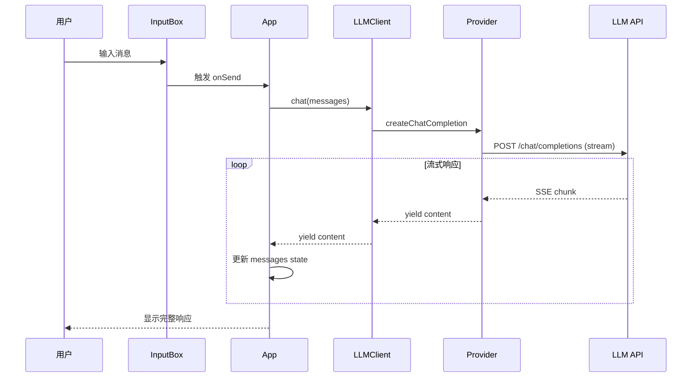
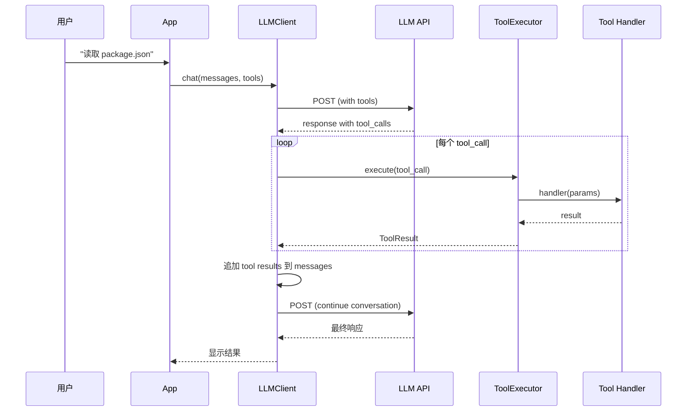
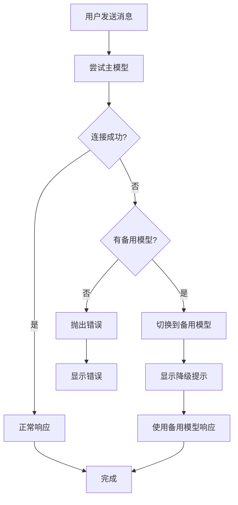

# ALICE CLI 技术架构 🏗️

> **架构理念**: 模块化、可扩展、高性能、易维护

## 📐 整体架构

### 分层架构

```
┌─────────────────────────────────────────────────────┐
│                   用户界面层 (UI Layer)               │
│  ┌──────────┬──────────┬──────────┬──────────────┐  │
│  │  Banner  │  Header  │ChatArea  │  InputBox    │  │
│  │ (动画)   │ (信息栏) │(对话区)  │ (输入)       │  │
│  ├──────────┼──────────┼──────────┼──────────────┤  │
│  │StatusBar │ToolCall  │Dangerous │  Spinner     │  │
│  │ (状态)   │Status    │Confirm   │ (加载)       │  │
│  └──────────┴──────────┴──────────┴──────────────┘  │
│              Ink (React for CLI)                     │
└───────────────────────┬─────────────────────────────┘
                        │
┌───────────────────────▼─────────────────────────────┐
│              应用逻辑层 (App Layer)                   │
│  ┌─────────────────────────────────────────────┐    │
│  │  App.tsx (主应用)                            │    │
│  │  - 状态管理 (useState, useEffect)           │    │
│  │  - 事件处理 (useInput)                      │    │
│  │  - 组件编排                                  │    │
│  └─────────────────────────────────────────────┘    │
└───────────────────────┬─────────────────────────────┘
                        │
┌───────────────────────▼─────────────────────────────┐
│              核心业务层 (Core Layer)                  │
│  ┌──────────────┐  ┌──────────────┐                 │
│  │  LLMClient   │  │ToolExecutor  │                 │
│  │  (聊天)      │  │(工具调用)    │                 │
│  ├──────────────┤  ├──────────────┤                 │
│  │· 消息管理    │  │· 工具注册    │                 │
│  │· 流式输出    │  │· 参数验证    │                 │
│  │· 智能降级    │  │· 结果收集    │                 │
│  │· Provider    │  │· 错误处理    │                 │
│  └──────┬───────┘  └──────┬───────┘                 │
│         │                 │                          │
│  ┌──────▼─────────────────▼───────┐                 │
│  │   SessionManager (会话)        │                 │
│  │   StatusManager (状态)         │                 │
│  │   ConfigManager (配置)         │                 │
│  └────────────────────────────────┘                 │
└───────────────────────┬─────────────────────────────┘
                        │
┌───────────────────────▼─────────────────────────────┐
│              数据访问层 (Data Layer)                  │
│  ┌─────────────┐  ┌──────────────┐                  │
│  │Provider适配 │  │  Tools       │                  │
│  │             │  │  Registry    │                  │
│  ├─────────────┤  ├──────────────┤                  │
│  │OpenAI Compat│  │8 个内置工具  │                  │
│  │· LMStudio   │  │· readFile    │                  │
│  │· Ollama     │  │· listFiles   │                  │
│  │· OpenAI     │  │· searchFiles │                  │
│  │· Azure      │  │· getCurrent··│                 │
│  │· Custom     │  │  ...         │                  │
│  └─────┬───────┘  └──────┬───────┘                  │
└────────┼──────────────────┼──────────────────────────┘
         │                  │
┌────────▼──────────┐  ┌────▼─────────────────────────┐
│   LLM 服务         │  │   系统 API                   │
│ · LM Studio       │  │ · 文件系统 (fs)              │
│ · Ollama          │  │ · Git (simple-git)           │
│ · OpenAI          │  │ · 系统命令 (child_process)   │
│ · Azure           │  │ · Glob (文件搜索)            │
└───────────────────┘  └──────────────────────────────┘
```

## 🧩 核心模块设计

### 1. UI 层 (cli/)

#### 组件架构

```typescript
// 主应用组件
export const App: React.FC<AppProps> = ({ config }) => {
  // 状态管理
  const [messages, setMessages] = useState<Message[]>([]);
  const [input, setInput] = useState('');
  const [isProcessing, setIsProcessing] = useState(false);
  
  // 核心服务
  const llmClient = useMemo(() => new LLMClient(config), [config]);
  const toolExecutor = useMemo(() => new ToolExecutor(), []);
  
  // 事件处理
  useInput((input, key) => {
    if (key.return) handleSend();
    if (key.upArrow) handleHistory('up');
    if (key.downArrow) handleHistory('down');
  });
  
  // 渲染
  return (
    <Box flexDirection="column">
      <Header workspace={config.workspace} model={currentModel} />
      <ChatArea messages={messages} />
      <InputBox value={input} onChange={setInput} />
      <StatusBar status={connectionStatus} />
    </Box>
  );
};
```

#### 组件清单

| 组件 | 职责 | 文件 |
|------|------|------|
| `App` | 主应用，状态管理 | `app.tsx` |
| `Banner` | 启动动画 | `components/Banner.tsx` |
| `Header` | 顶部信息栏 | `components/Header.tsx` |
| `ChatArea` | 对话展示区 | `components/ChatArea.tsx` |
| `InputBox` | 输入框 | `components/InputBox.tsx` |
| `StatusBar` | 状态栏 | `components/StatusBar.tsx` |
| `ToolCallStatus` | 工具执行状态 | `components/ToolCallStatus.tsx` |
| `DangerousCommandConfirm` | 危险命令确认 | `components/DangerousCommandConfirm.tsx` |
| `StreamingMessage` | 流式AI响应渲染 | `components/StreamingMessage.tsx` |
| `Markdown` | 历史消息渲染 | `components/Markdown.tsx` |

### 2. 核心层 (core/)

#### LLMClient 设计

```typescript
export class LLMClient {
  private provider: BaseLLMProvider;
  private config: ModelConfig;
  private fallbackProvider?: BaseLLMProvider;
  
  constructor(config: ModelConfig) {
    this.config = config;
    this.provider = createProvider(config);
    
    // 智能降级: 如果配置了备用模型
    if (config.suggest_model && config.suggest_model !== config.default_model) {
      const fallbackConfig = config.models.find(m => m.name === config.suggest_model);
      if (fallbackConfig) {
        this.fallbackProvider = createProvider(fallbackConfig);
      }
    }
  }
  
  // 流式聊天
  async *chat(messages: Message[]): AsyncGenerator<string> {
    try {
      // 尝试主模型
      yield* this.provider.createChatCompletion(messages);
    } catch (error) {
      // 降级到备用模型
      if (this.fallbackProvider) {
        console.warn('主模型失败，切换到备用模型');
        yield* this.fallbackProvider.createChatCompletion(messages);
      } else {
        throw error;
      }
    }
  }
  
  // Function Calling
  async chatWithTools(
    messages: Message[], 
    tools: ToolDefinition[]
  ): Promise<ChatResponse> {
    return await this.provider.createChatCompletion(messages, tools);
  }
}
```

#### Provider 架构

```typescript
// 基类
export abstract class BaseLLMProvider {
  protected config: ProviderConfig;
  
  abstract createChatCompletion(
    messages: Message[],
    tools?: ToolDefinition[]
  ): AsyncGenerator<string> | Promise<ChatResponse>;
  
  abstract testConnection(): Promise<boolean>;
}

// OpenAI 兼容实现
export class OpenAICompatibleProvider extends BaseLLMProvider {
  private axios: AxiosInstance;
  
  constructor(config: ProviderConfig) {
    super(config);
    this.axios = axios.create({
      baseURL: config.baseURL,
      headers: {
        'Authorization': `Bearer ${config.apiKey}`,
        'Content-Type': 'application/json'
      }
    });
  }
  
  async *createChatCompletion(messages: Message[], tools?: ToolDefinition[]) {
    const response = await this.axios.post('/chat/completions', {
      model: this.config.model,
      messages,
      tools,
      stream: true,
      temperature: this.config.temperature,
      max_tokens: this.config.maxTokens
    }, {
      responseType: 'stream'
    });
    
    // 解析 SSE 流
    for await (const chunk of response.data) {
      const lines = chunk.toString().split('\n');
      for (const line of lines) {
        if (line.startsWith('data: ')) {
          const data = JSON.parse(line.slice(6));
          if (data.choices[0].delta?.content) {
            yield data.choices[0].delta.content;
          }
        }
      }
    }
  }
}

// Factory
export function createProvider(config: ProviderConfig): BaseLLMProvider {
  switch (config.provider) {
    case 'lmstudio':
    case 'ollama':
    case 'openai':
    case 'azure':
    case 'custom':
      return new OpenAICompatibleProvider(config);
    default:
      throw new Error(`Unsupported provider: ${config.provider}`);
  }
}
```

#### ToolExecutor 设计

```typescript
export class ToolExecutor {
  private registry: Map<string, ToolHandler> = new Map();
  
  constructor() {
    this.registerBuiltinTools();
  }
  
  // 注册内置工具
  private registerBuiltinTools() {
    this.register('readFile', readFileHandler);
    this.register('listFiles', listFilesHandler);
    this.register('searchFiles', searchFilesHandler);
    this.register('getCurrentDirectory', getCurrentDirectoryHandler);
    this.register('getGitInfo', getGitInfoHandler);
    this.register('getCurrentDateTime', getCurrentDateTimeHandler);
    this.register('executeCommand', executeCommandHandler);
  }
  
  // 注册工具
  register(name: string, handler: ToolHandler) {
    this.registry.set(name, handler);
  }
  
  // 执行工具
  async execute(toolCall: ToolCall): Promise<ToolResult> {
    const handler = this.registry.get(toolCall.function.name);
    if (!handler) {
      return {
        success: false,
        error: `工具 ${toolCall.function.name} 未找到`
      };
    }
    
    try {
      // 参数验证
      const params = JSON.parse(toolCall.function.arguments);
      
      // 危险命令检查
      if (toolCall.function.name === 'executeCommand') {
        const shouldExecute = await confirmDangerousCommand(params.command);
        if (!shouldExecute) {
          return { success: false, error: '用户取消执行' };
        }
      }
      
      // 执行
      const result = await handler(params);
      return { success: true, data: result };
    } catch (error) {
      return {
        success: false,
        error: error.message
      };
    }
  }
  
  // 获取所有工具定义
  getToolDefinitions(): ToolDefinition[] {
    return Array.from(this.registry.keys()).map(name => ({
      type: 'function',
      function: this.getToolSchema(name)
    }));
  }
}
```

### 3. 工具层 (tools/)

#### 工具定义示例

```typescript
// 读取文件工具
export const readFileHandler: ToolHandler = async (params: { filePath: string }) => {
  const { filePath } = params;
  
  // 安全检查
  if (!isPathSafe(filePath)) {
    throw new Error('不安全的文件路径');
  }
  
  // 读取文件
  const content = await fs.readFile(filePath, 'utf-8');
  
  return {
    filePath,
    content,
    size: content.length,
    lines: content.split('\n').length
  };
};

// 工具 Schema
export const readFileSchema: FunctionSchema = {
  name: 'readFile',
  description: '读取文件内容',
  parameters: {
    type: 'object',
    properties: {
      filePath: {
        type: 'string',
        description: '文件路径 (相对或绝对)'
      }
    },
    required: ['filePath']
  }
};
```

#### 工具注册表

```typescript
// tools/registry.ts
export const builtinTools: Record<string, ToolDefinition> = {
  readFile: {
    type: 'function',
    function: readFileSchema
  },
  listFiles: {
    type: 'function',
    function: listFilesSchema
  },
  searchFiles: {
    type: 'function',
    function: searchFilesSchema
  },
  getCurrentDirectory: {
    type: 'function',
    function: getCurrentDirectorySchema
  },
  getGitInfo: {
    type: 'function',
    function: getGitInfoSchema
  },
  getCurrentDateTime: {
    type: 'function',
    function: getCurrentDateTimeSchema
  },
  executeCommand: {
    type: 'function',
    function: executeCommandSchema
  }
};
```

### 4. 渲染优化

#### Header 静态渲染

使用 ink 的 `<Static>` 组件包裹 Header，确保只渲染一次：

```typescript
<Static items={['header']}>
  {(item) => <Header key={item} ... />}
</Static>
```

#### Think 内容解析

支持解析 `<think>` 标签（DeepSeek/Qwen 模型思考过程），以灰色区分显示：

```typescript
import { splitThinkContent } from '../utils/thinkParser.js';
const segments = splitThinkContent(content);
// segments: { type: 'think' | 'normal', content: string }[]
```

#### 表格渲染

使用 React 组件（`TableRendererComponent`）替代 cli-table3 字符串渲染，通过 ink 的虚拟 DOM diffing 减少终端重绘：

```typescript
import { TableRendererComponent } from '../utils/tableRenderer.js';
// 使用 string-width 计算 CJK/emoji 字符宽度
```

## 📦 数据流

### 1. 基础对话流程



### 2. Function Calling 流程



### 3. 智能降级流程



## 🗂️ 项目结构

```
alice-cli/
├── src/
│   ├── index.tsx                    # 入口文件
│   │   - 命令行参数解析
│   │   - 配置加载
│   │   - App 启动
│   │
│   ├── cli/                         # UI 层
│   │   ├── app.tsx                  # 主应用
│   │   └── components/              # React 组件
│   │       ├── Banner.tsx
│   │       ├── Header.tsx
│   │       ├── ChatArea.tsx
│   │       ├── InputBox.tsx
│   │       ├── StatusBar.tsx
│   │       ├── ToolCallStatus.tsx
│   │       └── DangerousCommandConfirm.tsx
│   │
│   ├── core/                        # 核心层
│   │   ├── llm.ts                   # LLM 客户端
│   │   ├── providers/               # Provider 适配器
│   │   │   ├── base.ts              # 基类
│   │   │   ├── openai-compatible.ts # OpenAI 兼容
│   │   │   └── index.ts             # Factory
│   │   ├── session.ts               # 会话管理
│   │   └── statusManager.ts         # 状态管理
│   │
│   ├── tools/                       # 工具层
│   │   ├── executor.ts              # 工具执行器
│   │   ├── registry.ts              # 工具注册表
│   │   ├── builtin/                 # 内置工具
│   │   │   ├── readFile.ts
│   │   │   ├── listFiles.ts
│   │   │   ├── searchFiles.ts
│   │   │   ├── getCurrentDirectory.ts
│   │   │   ├── getGitInfo.ts
│   │   │   ├── getCurrentDateTime.ts
│   │   │   └── executeCommand.ts
│   │   └── index.ts
│   │
│   ├── utils/                       # 工具函数
│   │   ├── config.ts                # 配置管理
│   │   ├── thinkParser.ts           # Think标签解析
│   │   ├── tableRenderer.tsx        # React表格渲染组件
│   │   ├── test-model.ts            # 模型测速
│   │   └── test-function-calling.ts # FC 测试
│   │
│   └── types/                       # 类型定义
│       ├── index.ts                 # 通用类型
│       └── tool.ts                  # 工具类型
│
├── agents/                          # Agent 配置
│   └── system_prompt.md             # 系统提示词
│
├── dist/                            # 构建输出
├── package.json                     # 项目配置
├── tsconfig.json                    # TypeScript 配置
└── README.md                        # 文档
```

## ⚙️ 配置系统

### 配置文件结构

```typescript
// ~/.alice/settings.jsonc
interface AliceConfig {
  // 模型配置
  default_model: string;      // 默认模型名称
  suggest_model: string;      // 推荐最快模型
  models: ModelConfig[];      // 模型列表
  
  // UI 配置
  ui: {
    banner: {
      enabled: boolean;       // 是否显示 Banner
      style: BannerStyle;     // 动画风格
    };
    theme: ThemeType;         // 主题
  };
  
  // 工作区
  workspace: string;          // 当前工作目录
  
  // 安全
  dangerous_cmd: boolean;     // 危险命令确认
}

interface ModelConfig {
  name: string;               // 模型名称
  provider: ProviderType;     // 提供商
  baseURL: string;            // API 地址
  model: string;              // 模型 ID
  apiKey: string;             // API Key
  temperature: number;        // 温度
  maxTokens: number;          // 最大 Token
  last_update_datetime: string | null; // 最后更新时间
  speed: number | null;       // 速度 (tokens/s)
}
```

### 配置加载流程

```typescript
export class ConfigManager {
  private configPath: string;
  private config: AliceConfig;
  
  async load(): Promise<AliceConfig> {
    // 1. 定位配置文件
    this.configPath = path.join(os.homedir(), '.alice', 'settings.jsonc');
    
    // 2. 检查是否存在
    if (!await fs.pathExists(this.configPath)) {
      // 创建默认配置
      await this.createDefaultConfig();
    }
    
    // 3. 读取并解析 JSONC
    const content = await fs.readFile(this.configPath, 'utf-8');
    this.config = jsonc.parse(content);
    
    // 4. 环境变量替换
    this.config = this.resolveEnvVars(this.config);
    
    // 5. 验证配置
    this.validate(this.config);
    
    return this.config;
  }
  
  private resolveEnvVars(config: any): any {
    const json = JSON.stringify(config);
    const resolved = json.replace(/\$\{(\w+)\}/g, (_, varName) => {
      return process.env[varName] || '';
    });
    return JSON.parse(resolved);
  }
}
```

## 🚀 性能优化

### 1. 启动优化

| 优化项 | 方案 | 效果 |
|--------|------|------|
| **按需加载** | 动态 import 非核心模块 | -200ms |
| **配置缓存** | 缓存解析后的配置 | -50ms |
| **并行初始化** | 同时加载 UI 和核心模块 | -100ms |

### 2. 运行时优化

| 优化项 | 方案 | 效果 |
|--------|------|------|
| **流式渲染** | SSE 逐字渲染 | 体验提升 |
| **虚拟滚动** | 长对话历史虚拟化 | 内存 -30% |
| **防抖节流** | 输入防抖 | CPU -20% |

### 3. 内存优化

```typescript
// 会话历史限制
const MAX_MESSAGES = 100;

// 定期清理
setInterval(() => {
  if (messages.length > MAX_MESSAGES) {
    messages = messages.slice(-MAX_MESSAGES);
  }
}, 60000);
```

## 🔒 安全设计

### 1. 危险命令检测

```typescript
const DANGEROUS_PATTERNS = [
  /rm\s+-rf/,           // 删除
  /sudo/,               // 提权
  /chmod\s+777/,        // 权限修改
  />\s*\/dev\/sda/,     // 磁盘操作
  /mkfs/,               // 格式化
  /dd\s+if=/,           // 磁盘复制
];

function isDangerousCommand(cmd: string): boolean {
  return DANGEROUS_PATTERNS.some(pattern => pattern.test(cmd));
}
```

### 2. 路径安全

```typescript
function isPathSafe(filePath: string): boolean {
  const resolved = path.resolve(filePath);
  const workspace = path.resolve(config.workspace);
  
  // 不允许访问工作区外的文件
  return resolved.startsWith(workspace);
}
```

## 📊 监控与日志

### 日志系统

```typescript
export class Logger {
  private level: LogLevel;
  
  debug(message: string, data?: any) {
    if (this.level >= LogLevel.DEBUG) {
      console.log(`[DEBUG] ${message}`, data);
    }
  }
  
  info(message: string) {
    console.log(chalk.blue(`[INFO] ${message}`));
  }
  
  warn(message: string) {
    console.log(chalk.yellow(`[WARN] ${message}`));
  }
  
  error(message: string, error?: Error) {
    console.error(chalk.red(`[ERROR] ${message}`), error);
  }
}
```

## 📚 参考资料

- [Node.js 最佳实践](https://github.com/goldbergyoni/nodebestpractices)
- [TypeScript 手册](https://www.typescriptlang.org/docs/)
- [React 文档](https://react.dev/)
- [Ink 文档](https://github.com/vadimdemedes/ink)

---

**[[产品需求文档|返回 PRD 主页]]**
