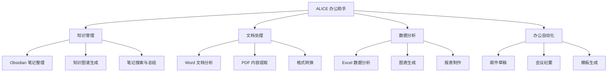

# ALICE - 办公智能助手产品设计

> [!info] 产品定位
> **面向非技术人员的 AI CLI 工具**  
> 专注于文档处理、知识管理、办公自动化
> 
> "让每个办公室职员都拥有自己的 AI 助手"

## 🎯 核心理念

### 为什么先做界面？

> [!success] 设计思路认同
> - ✅ 界面驱动设计：通过可视化交互理解用户需求
> - ✅ 快速迭代：边看效果边调整功能
> - ✅ 用户视角：从使用场景倒推技术实现
> - ✅ 降低门槛：CLI 但要像聊天一样自然

### 与代码工具的差异

| 维度 | 代码工具 (Copilot) | 办公助手 (ALICE) |
|------|---------------------|------------------|
| **目标用户** | 程序员 | 办公职员、知识工作者 |
| **核心场景** | 写代码、Debug | 整理笔记、处理文档 |
| **输入对象** | 代码文件 | Word/Excel/PDF/Markdown |
| **输出结果** | 代码变更 | 文档生成、数据分析 |
| **交互风格** | 技术指令 | 自然语言对话 |
| **成功标准** | 代码能运行 | 内容有价值、省时间 |

---

## 💡 核心功能设计

### 功能分类



---

## 🎨 界面设计优先

### Phase 1: 最小界面原型 (本周完成)

**目标：** 能跑起来，能对话，能看到效果

#### 核心界面元素

```
┌─────────────────────────────────────────────────────────────┐
│  🤖 ALICE - Your Office AI Assistant                       │
│  Workspace: ~/Documents/Projects                            │
│  Mode: Chat | Obsidian: Connected | Model: GPT-4          │
└─────────────────────────────────────────────────────────────┘

┌─────────────────────────────────────────────────────────────┐
│  > You: 帮我整理一下这个月的会议纪要                         │
│                                                              │
│  🤖 Alice: 好的！我找到了 5 份会议纪要文件：                 │
│                                                              │
│  📄 2026-02-03-产品评审会.md                                 │
│  📄 2026-02-10-周例会.md                                     │
│  📄 2026-02-15-客户需求讨论.md                               │
│  📄 2026-02-20-技术方案评审.md                               │
│  📄 2026-02-25-季度规划会.md                                 │
│                                                              │
│  我可以帮你：                                                 │
│  1. 生成月度会议总结报告                                     │
│  2. 提取所有待办事项                                         │
│  3. 分析讨论的关键主题                                       │
│                                                              │
│  你想做哪一个？                                              │
│                                                              │
│  > You: █                                                    │
└─────────────────────────────────────────────────────────────┘

[Ctrl+C] Quit  [/help] Commands  [Tab] Suggestions  [↑↓] History
```

#### 交互流程设计

```typescript
// 用户输入示例
用户: "分析一下本月的销售数据"

// ALICE 处理流程
1. 🔍 理解意图: 数据分析任务
2. 📂 扫描文件: 找到 sales-2026-02.xlsx
3. 📊 读取数据: 解析 Excel 内容
4. 🤔 AI 分析: 生成洞察报告
5. 💬 回复用户: 展示结果 + 可选操作

// 展示结果
Alice:
  📊 二月销售数据分析
  
  总销售额: ¥1,234,567 (环比 +15.3%)
  订单数量: 456 单
  平均客单价: ¥2,706
  
  📈 趋势分析:
  • 周一至周三销量最高
  • 产品 A 占比 45%，是主力
  • 华东区贡献了 60% 营收
  
  🎯 建议:
  • 加大周末营销力度
  • 关注产品 B 的增长潜力
  
  我可以：
  1. 生成详细 Word 报告
  2. 创建可视化图表
  3. 对比上月数据
  
  需要我做什么？
```

---

## 🛠️ 界面实现方案

### 方案 A: Ink + React (推荐快速原型)

**为什么选择 Ink？**
- ✅ 组件化开发，像写网页一样
- ✅ 热更新，实时看效果
- ✅ 丰富的社区组件

```typescript
// src/App.tsx
import React, { useState } from 'react';
import { Box, Text } from 'ink';
import { Header } from './components/Header';
import { ChatArea } from './components/ChatArea';
import { InputBox } from './components/InputBox';
import { StatusBar } from './components/StatusBar';
import { QuickActions } from './components/QuickActions';

interface Message {
  role: 'user' | 'assistant';
  content: string;
  timestamp: Date;
  metadata?: {
    files?: string[];
    actions?: string[];
  };
}

export default function App() {
  const [messages, setMessages] = useState<Message[]>([]);
  const [workspace, setWorkspace] = useState(process.cwd());
  const [obsidianPath, setObsidianPath] = useState('');
  const [isProcessing, setIsProcessing] = useState(false);
  
  const handleUserInput = async (input: string) => {
    // 添加用户消息
    const userMsg: Message = {
      role: 'user',
      content: input,
      timestamp: new Date()
    };
    setMessages(prev => [...prev, userMsg]);
    
    setIsProcessing(true);
    
    // 处理命令
    if (input.startsWith('/')) {
      await handleCommand(input);
    } else {
      await handleChat(input);
    }
    
    setIsProcessing(false);
  };
  
  const handleChat = async (input: string) => {
    // TODO: 调用 LLM + 工具
    const response = await processUserRequest(input, {
      workspace,
      obsidianPath,
      recentMessages: messages.slice(-5)
    });
    
    const assistantMsg: Message = {
      role: 'assistant',
      content: response.content,
      timestamp: new Date(),
      metadata: response.metadata
    };
    
    setMessages(prev => [...prev, assistantMsg]);
  };
  
  return (
    <Box flexDirection="column" height="100%">
      <Header 
        workspace={workspace}
        obsidianConnected={!!obsidianPath}
      />
      
      <ChatArea 
        messages={messages}
        isProcessing={isProcessing}
      />
      
      {messages.length > 0 && messages[messages.length - 1].metadata?.actions && (
        <QuickActions 
          actions={messages[messages.length - 1].metadata!.actions!}
          onSelect={handleUserInput}
        />
      )}
      
      <InputBox 
        onSubmit={handleUserInput}
        disabled={isProcessing}
      />
      
      <StatusBar />
    </Box>
  );
}
```

### 核心组件设计

#### 1. Header 组件

```typescript
// src/components/Header.tsx
import React from 'react';
import { Box, Text } from 'ink';
import chalk from 'chalk';

interface Props {
  workspace: string;
  obsidianConnected: boolean;
}

export const Header: React.FC<Props> = ({ workspace, obsidianConnected }) => {
  return (
    <Box 
      borderStyle="round" 
      borderColor="cyan"
      padding={1}
      marginBottom={1}
    >
      <Box flexDirection="column" width="100%">
        <Text bold color="cyan">
          🤖 ALICE - Your Office AI Assistant
        </Text>
        
        <Box marginTop={1}>
          <Text dimColor>Workspace: </Text>
          <Text color="yellow">{workspace}</Text>
        </Box>
        
        <Box>
          <Text dimColor>Obsidian: </Text>
          <Text color={obsidianConnected ? 'green' : 'gray'}>
            {obsidianConnected ? '✓ Connected' : '✗ Not Connected'}
          </Text>
        </Box>
      </Box>
    </Box>
  );
};
```

#### 2. ChatArea 组件

```typescript
// src/components/ChatArea.tsx
import React, { useEffect, useRef } from 'react';
import { Box, Text } from 'ink';
import Markdown from 'ink-markdown';
import Spinner from 'ink-spinner';

interface Message {
  role: 'user' | 'assistant';
  content: string;
  timestamp: Date;
  metadata?: any;
}

interface Props {
  messages: Message[];
  isProcessing: boolean;
}

export const ChatArea: React.FC<Props> = ({ messages, isProcessing }) => {
  return (
    <Box 
      flexDirection="column" 
      padding={1}
      flexGrow={1}
      overflow="hidden"
    >
      {messages.length === 0 ? (
        <WelcomeScreen />
      ) : (
        messages.map((msg, idx) => (
          <MessageBubble key={idx} message={msg} />
        ))
      )}
      
      {isProcessing && (
        <Box marginTop={1}>
          <Text color="cyan">
            <Spinner type="dots" />
          </Text>
          <Text dimColor> Alice is thinking...</Text>
        </Box>
      )}
    </Box>
  );
};

const WelcomeScreen: React.FC = () => (
  <Box flexDirection="column" alignItems="center" justifyContent="center">
    <Text bold color="cyan">
      👋 Hello! I'm ALICE, your office AI assistant
    </Text>
    
    <Box marginTop={1} flexDirection="column">
      <Text dimColor>I can help you with:</Text>
      <Text>  📝 Organizing Obsidian notes</Text>
      <Text>  📄 Analyzing Word/Excel documents</Text>
      <Text>  📊 Creating reports and summaries</Text>
      <Text>  ✉️ Drafting emails and memos</Text>
    </Box>
    
    <Box marginTop={2}>
      <Text dimColor>Type </Text>
      <Text color="yellow">/help</Text>
      <Text dimColor> to see available commands</Text>
    </Box>
  </Box>
);

const MessageBubble: React.FC<{ message: Message }> = ({ message }) => {
  const isUser = message.role === 'user';
  
  return (
    <Box 
      flexDirection="column" 
      marginBottom={1}
      paddingLeft={isUser ? 0 : 2}
    >
      <Box>
        <Text bold color={isUser ? 'cyan' : 'green'}>
          {isUser ? '> You' : '🤖 Alice'}
        </Text>
        <Text dimColor> • {formatTime(message.timestamp)}</Text>
      </Box>
      
      <Box marginLeft={2} marginTop={0}>
        {isUser ? (
          <Text>{message.content}</Text>
        ) : (
          <Markdown>{message.content}</Markdown>
        )}
      </Box>
      
      {message.metadata?.files && (
        <Box marginLeft={2} marginTop={1}>
          <FileList files={message.metadata.files} />
        </Box>
      )}
    </Box>
  );
};

const FileList: React.FC<{ files: string[] }> = ({ files }) => (
  <Box flexDirection="column">
    {files.map((file, idx) => (
      <Text key={idx} dimColor>
        📄 {file}
      </Text>
    ))}
  </Box>
);

function formatTime(date: Date): string {
  return date.toLocaleTimeString('zh-CN', { 
    hour: '2-digit', 
    minute: '2-digit' 
  });
}
```

#### 3. QuickActions 组件

```typescript
// src/components/QuickActions.tsx
import React, { useState } from 'react';
import { Box, Text, useInput } from 'ink';

interface Props {
  actions: string[];
  onSelect: (action: string) => void;
}

export const QuickActions: React.FC<Props> = ({ actions, onSelect }) => {
  const [selected, setSelected] = useState(0);
  
  useInput((input, key) => {
    if (key.upArrow) {
      setSelected(prev => Math.max(0, prev - 1));
    } else if (key.downArrow) {
      setSelected(prev => Math.min(actions.length - 1, prev + 1));
    } else if (key.return) {
      onSelect(actions[selected]);
    }
  });
  
  return (
    <Box 
      flexDirection="column" 
      borderStyle="round"
      borderColor="yellow"
      padding={1}
      marginBottom={1}
    >
      <Text bold color="yellow">💡 Quick Actions:</Text>
      
      {actions.map((action, idx) => (
        <Box key={idx} marginLeft={1}>
          <Text color={idx === selected ? 'cyan' : 'white'}>
            {idx === selected ? '▶ ' : '  '}
            {idx + 1}. {action}
          </Text>
        </Box>
      ))}
      
      <Box marginTop={1}>
        <Text dimColor>Use ↑↓ arrows to select, Enter to confirm</Text>
      </Box>
    </Box>
  );
};
```

#### 4. InputBox 组件

```typescript
// src/components/InputBox.tsx
import React, { useState } from 'react';
import { Box, Text, useInput } from 'ink';
import TextInput from 'ink-text-input';

interface Props {
  onSubmit: (input: string) => void;
  disabled?: boolean;
}

export const InputBox: React.FC<Props> = ({ onSubmit, disabled = false }) => {
  const [value, setValue] = useState('');
  
  const handleSubmit = () => {
    if (value.trim() && !disabled) {
      onSubmit(value);
      setValue('');
    }
  };
  
  return (
    <Box 
      borderStyle="round" 
      borderColor={disabled ? 'gray' : 'cyan'}
      padding={1}
    >
      <Text color="yellow">{'> '}</Text>
      
      {disabled ? (
        <Text dimColor>Processing...</Text>
      ) : (
        <TextInput
          value={value}
          onChange={setValue}
          onSubmit={handleSubmit}
          placeholder="Type your message or /help for commands..."
        />
      )}
    </Box>
  );
};
```

---

## 🎯 核心功能模块

### 1. Obsidian 集成模块

```typescript
// src/modules/obsidian/index.ts
import fs from 'fs/promises';
import path from 'path';
import matter from 'gray-matter';

export class ObsidianManager {
  private vaultPath: string;
  
  constructor(vaultPath: string) {
    this.vaultPath = vaultPath;
  }
  
  // 搜索笔记
  async searchNotes(query: string): Promise<Note[]> {
    const files = await this.getAllMarkdownFiles();
    const results: Note[] = [];
    
    for (const file of files) {
      const content = await fs.readFile(file, 'utf-8');
      const { data, content: body } = matter(content);
      
      if (body.toLowerCase().includes(query.toLowerCase())) {
        results.push({
          path: file,
          title: this.extractTitle(body),
          frontmatter: data,
          excerpt: this.getExcerpt(body, query)
        });
      }
    }
    
    return results;
  }
  
  // 分析笔记结构
  async analyzeVault(): Promise<VaultAnalysis> {
    const files = await this.getAllMarkdownFiles();
    const tags = new Set<string>();
    const links = new Map<string, string[]>();
    
    for (const file of files) {
      const content = await fs.readFile(file, 'utf-8');
      const { data } = matter(content);
      
      // 提取标签
      if (data.tags) {
        (Array.isArray(data.tags) ? data.tags : [data.tags])
          .forEach(tag => tags.add(tag));
      }
      
      // 提取链接
      const wikiLinks = content.match(/\[\[(.*?)\]\]/g) || [];
      links.set(file, wikiLinks.map(l => l.slice(2, -2)));
    }
    
    return {
      totalNotes: files.length,
      tags: Array.from(tags),
      linkGraph: Object.fromEntries(links),
      orphanNotes: this.findOrphanNotes(links)
    };
  }
  
  // 整理笔记
  async organizeNotes(strategy: 'by-date' | 'by-tag' | 'by-folder'): Promise<OrganizeResult> {
    // 实现不同的整理策略
    switch (strategy) {
      case 'by-date':
        return await this.organizeByDate();
      case 'by-tag':
        return await this.organizeByTag();
      case 'by-folder':
        return await this.organizeByFolder();
      default:
        throw new Error('Unknown strategy');
    }
  }
  
  // 生成目录索引
  async generateIndex(options: IndexOptions): Promise<string> {
    const files = await this.getAllMarkdownFiles();
    let index = '# 📚 Vault Index\n\n';
    
    if (options.groupBy === 'folder') {
      const byFolder = this.groupByFolder(files);
      for (const [folder, items] of Object.entries(byFolder)) {
        index += `## ${folder}\n\n`;
        items.forEach(file => {
          const title = this.extractTitle(file);
          index += `- [[${title}]]\n`;
        });
        index += '\n';
      }
    }
    
    return index;
  }
  
  private async getAllMarkdownFiles(): Promise<string[]> {
    // 递归获取所有 .md 文件
    const files: string[] = [];
    
    async function walk(dir: string) {
      const entries = await fs.readdir(dir, { withFileTypes: true });
      
      for (const entry of entries) {
        const fullPath = path.join(dir, entry.name);
        
        if (entry.isDirectory() && !entry.name.startsWith('.')) {
          await walk(fullPath);
        } else if (entry.isFile() && entry.name.endsWith('.md')) {
          files.push(fullPath);
        }
      }
    }
    
    await walk(this.vaultPath);
    return files;
  }
  
  private extractTitle(content: string): string {
    const match = content.match(/^#\s+(.+)$/m);
    return match ? match[1] : 'Untitled';
  }
  
  private getExcerpt(content: string, query: string): string {
    const lines = content.split('\n');
    const matchLine = lines.find(l => 
      l.toLowerCase().includes(query.toLowerCase())
    );
    
    return matchLine ? matchLine.slice(0, 100) + '...' : '';
  }
  
  private findOrphanNotes(links: Map<string, string[]>): string[] {
    const allLinks = new Set<string>();
    links.forEach(targets => targets.forEach(t => allLinks.add(t)));
    
    const orphans: string[] = [];
    for (const [file] of links) {
      const basename = path.basename(file, '.md');
      if (!allLinks.has(basename) && links.get(file)?.length === 0) {
        orphans.push(file);
      }
    }
    
    return orphans;
  }
}

interface Note {
  path: string;
  title: string;
  frontmatter: any;
  excerpt: string;
}

interface VaultAnalysis {
  totalNotes: number;
  tags: string[];
  linkGraph: Record<string, string[]>;
  orphanNotes: string[];
}
```

### 2. 文档处理模块

```typescript
// src/modules/document/index.ts
import mammoth from 'mammoth';  // Word
import * as XLSX from 'xlsx';    // Excel
import pdf from 'pdf-parse';     // PDF

export class DocumentProcessor {
  // Word 文档处理
  async readWord(filePath: string): Promise<WordDocument> {
    const result = await mammoth.extractRawText({ path: filePath });
    const html = await mammoth.convertToHtml({ path: filePath });
    
    return {
      text: result.value,
      html: html.value,
      wordCount: result.value.split(/\s+/).length,
      metadata: await this.extractWordMetadata(filePath)
    };
  }
  
  // Excel 数据分析
  async analyzeExcel(filePath: string): Promise<ExcelAnalysis> {
    const workbook = XLSX.readFile(filePath);
    const analysis: ExcelAnalysis = {
      sheets: [],
      summary: {}
    };
    
    for (const sheetName of workbook.SheetNames) {
      const sheet = workbook.Sheets[sheetName];
      const data = XLSX.utils.sheet_to_json(sheet);
      
      analysis.sheets.push({
        name: sheetName,
        rowCount: data.length,
        columns: this.getColumns(data),
        statistics: this.calculateStatistics(data)
      });
    }
    
    return analysis;
  }
  
  // PDF 文本提取
  async extractPDF(filePath: string): Promise<PDFContent> {
    const dataBuffer = await fs.readFile(filePath);
    const data = await pdf(dataBuffer);
    
    return {
      text: data.text,
      pages: data.numpages,
      metadata: data.info,
      outline: this.extractOutline(data.text)
    };
  }
  
  // 文档对比
  async compareDocuments(file1: string, file2: string): Promise<DocumentDiff> {
    const doc1 = await this.readDocument(file1);
    const doc2 = await this.readDocument(file2);
    
    return {
      added: this.findAdded(doc1.text, doc2.text),
      removed: this.findRemoved(doc1.text, doc2.text),
      changed: this.findChanged(doc1.text, doc2.text),
      similarity: this.calculateSimilarity(doc1.text, doc2.text)
    };
  }
  
  // 生成摘要
  async summarize(content: string, options: SummaryOptions): Promise<string> {
    // 使用 LLM 生成摘要
    const prompt = `
      请对以下内容生成${options.length || '简短'}的摘要：
      
      ${content}
      
      摘要要求：
      - 提取核心观点
      - 保留关键信息
      - 使用${options.language || '中文'}
    `;
    
    return await this.callLLM(prompt);
  }
  
  private getColumns(data: any[]): string[] {
    if (data.length === 0) return [];
    return Object.keys(data[0]);
  }
  
  private calculateStatistics(data: any[]): Record<string, any> {
    const stats: Record<string, any> = {};
    const columns = this.getColumns(data);
    
    for (const col of columns) {
      const values = data.map(row => row[col]).filter(v => typeof v === 'number');
      
      if (values.length > 0) {
        stats[col] = {
          min: Math.min(...values),
          max: Math.max(...values),
          avg: values.reduce((a, b) => a + b, 0) / values.length,
          sum: values.reduce((a, b) => a + b, 0)
        };
      }
    }
    
    return stats;
  }
}
```

### 3. AI 对话引擎

```typescript
// src/modules/ai/engine.ts
import OpenAI from 'openai';

export class AIEngine {
  private client: OpenAI;
  private conversationHistory: Message[] = [];
  private tools: Tool[] = [];
  
  constructor(apiKey: string) {
    this.client = new OpenAI({ apiKey });
    this.registerTools();
  }
  
  async chat(userInput: string, context: Context): Promise<AIResponse> {
    // 添加系统提示
    const systemPrompt = this.buildSystemPrompt(context);
    
    // 构建消息
    const messages = [
      { role: 'system', content: systemPrompt },
      ...this.conversationHistory,
      { role: 'user', content: userInput }
    ];
    
    // 调用 LLM
    const response = await this.client.chat.completions.create({
      model: 'gpt-4',
      messages: messages as any,
      tools: this.tools.map(t => t.definition),
      stream: false
    });
    
    const choice = response.choices[0];
    
    // 处理工具调用
    if (choice.message.tool_calls) {
      return await this.handleToolCalls(choice.message.tool_calls, context);
    }
    
    // 普通回复
    return {
      content: choice.message.content || '',
      actions: this.extractActions(choice.message.content || '')
    };
  }
  
  private buildSystemPrompt(context: Context): string {
    return `
你是 ALICE，一个专业的办公智能助手。

当前上下文：
- 工作目录: ${context.workspace}
- Obsidian 库: ${context.obsidianPath || '未连接'}
- 最近文件: ${context.recentFiles.join(', ')}

你的能力：
1. 整理和分析 Obsidian 笔记
2. 处理 Word、Excel、PDF 文档
3. 生成报告和摘要
4. 回答办公相关问题

回答风格：
- 使用中文
- 简洁专业
- 提供可操作的建议
- 必要时提供多个选项供用户选择

当用户请求操作时，提供清晰的 Quick Actions 选项。
    `.trim();
  }
  
  private registerTools() {
    // Obsidian 工具
    this.tools.push({
      name: 'search_obsidian_notes',
      definition: {
        type: 'function',
        function: {
          name: 'search_obsidian_notes',
          description: '在 Obsidian 库中搜索笔记',
          parameters: {
            type: 'object',
            properties: {
              query: { type: 'string', description: '搜索关键词' }
            },
            required: ['query']
          }
        }
      },
      handler: async (args: any, context: Context) => {
        const manager = new ObsidianManager(context.obsidianPath);
        return await manager.searchNotes(args.query);
      }
    });
    
    // Excel 分析工具
    this.tools.push({
      name: 'analyze_excel',
      definition: {
        type: 'function',
        function: {
          name: 'analyze_excel',
          description: '分析 Excel 文件数据',
          parameters: {
            type: 'object',
            properties: {
              filePath: { type: 'string', description: '文件路径' }
            },
            required: ['filePath']
          }
        }
      },
      handler: async (args: any, context: Context) => {
        const processor = new DocumentProcessor();
        return await processor.analyzeExcel(args.filePath);
      }
    });
    
    // 更多工具...
  }
  
  private async handleToolCalls(
    toolCalls: any[], 
    context: Context
  ): Promise<AIResponse> {
    const results = [];
    
    for (const call of toolCalls) {
      const tool = this.tools.find(t => t.name === call.function.name);
      if (tool) {
        const args = JSON.parse(call.function.arguments);
        const result = await tool.handler(args, context);
        results.push(result);
      }
    }
    
    // 将工具结果发送回 LLM 获取最终响应
    return await this.synthesizeResponse(results, context);
  }
  
  private extractActions(content: string): string[] {
    // 从回复中提取可执行的操作
    const actions: string[] = [];
    const lines = content.split('\n');
    
    for (const line of lines) {
      const match = line.match(/^\d+\.\s+(.+)$/);
      if (match) {
        actions.push(match[1]);
      }
    }
    
    return actions;
  }
}

interface Context {
  workspace: string;
  obsidianPath: string;
  recentFiles: string[];
}

interface AIResponse {
  content: string;
  actions?: string[];
  metadata?: {
    files?: string[];
    charts?: any[];
  };
}

interface Tool {
  name: string;
  definition: any;
  handler: (args: any, context: Context) => Promise<any>;
}
```

---

## 🚀 快速启动指南

### Step 1: 创建项目 (5分钟)

```bash
mkdir alice-office-assistant
cd alice-office-assistant
npm init -y

# 安装依赖
npm install ink react
npm install @types/react @types/node typescript tsx
npm install chalk gradient-string ora boxen
npm install figlet @types/figlet

# Obsidian 支持
npm install gray-matter glob

# 文档处理
npm install mammoth xlsx pdf-parse

# AI
npm install openai

# 开发工具
npm install -D @types/figlet nodemon
```

### Step 2: 配置 TypeScript

```json
// tsconfig.json
{
  "compilerOptions": {
    "target": "ES2022",
    "module": "ESNext",
    "moduleResolution": "bundler",
    "jsx": "react",
    "outDir": "./dist",
    "rootDir": "./src",
    "strict": true,
    "esModuleInterop": true,
    "skipLibCheck": true
  }
}
```

### Step 3: 创建入口文件

```typescript
// src/index.tsx
#!/usr/bin/env node
import React from 'react';
import { render } from 'ink';
import App from './App.js';
import { showBanner } from './banner/index.js';

async function main() {
  // 显示 banner
  await showBanner();
  
  // 启动应用
  render(<App />);
}

main().catch(console.error);
```

### Step 4: 运行

```bash
# 开发模式（热更新）
npm run dev

# 或直接运行
tsx src/index.tsx
```

---

## 📝 用户故事示例

### 故事 1: 整理会议纪要

```
用户: 帮我整理这个月的会议纪要

Alice: 
  好的！我在 ~/Documents/Meetings 找到了 5 份会议纪要：
  
  📄 2026-02-03-产品评审会.md
  📄 2026-02-10-周例会.md
  📄 2026-02-15-客户需求讨论.md
  📄 2026-02-20-技术方案评审.md
  📄 2026-02-25-季度规划会.md
  
  💡 Quick Actions:
  1. 生成月度会议总结报告
  2. 提取所有待办事项（跨会议）
  3. 按主题分类讨论内容
  4. 创建 Obsidian MOC（内容地图）

用户: 选择 1

Alice:
  正在生成报告...
  
  ✓ 已创建: 2026-02-会议月报.md
  
  📊 报告摘要:
  - 共 5 次会议，15 位参与者
  - 讨论了 3 个核心项目
  - 产生 23 个待办事项（12 个已完成）
  - 重点决策：Q1 产品路线图确定
  
  报告已保存到：~/Documents/Reports/
  
  需要我做什么？
```

### 故事 2: 分析销售数据

```
用户: 分析一下这个 Excel 里的销售数据

Alice:
  找到文件：sales-2026-02.xlsx
  
  📊 二月销售数据分析
  
  📈 总体表现:
  • 总销售额: ¥1,234,567 (环比 +15.3%)
  • 订单数量: 456 单
  • 平均客单价: ¥2,706
  • 客户数: 312 人（新客 89 人）
  
  🏆 Top 产品:
  1. 产品 A - ¥556,789 (45%)
  2. 产品 B - ¥345,678 (28%)
  3. 产品 C - ¥234,567 (19%)
  
  📍 区域分布:
  • 华东: 60%
  • 华南: 25%
  • 华北: 15%
  
  💡 Quick Actions:
  1. 生成 Word 版详细报告
  2. 创建可视化图表（PNG）
  3. 对比上月数据
  4. 发送给管理层（邮件草稿）

用户: 生成图表

Alice:
  正在创建图表...
  
  ✓ 已生成 3 个图表:
  📊 sales-trend.png - 销售趋势图
  🥧 product-distribution.png - 产品占比饼图
  🗺️ region-heatmap.png - 区域热力图
  
  文件保存在：~/Documents/Charts/
  
  需要我打开查看吗？
```

### 故事 3: 创建笔记索引

```
用户: 我的 Obsidian 笔记太乱了，帮我整理一下

Alice:
  正在分析你的 Obsidian 库...
  
  📚 库概览:
  • 共 234 篇笔记
  • 12 个主要标签
  • 156 个内部链接
  • 23 篇孤立笔记（无链接）
  
  🏷️ 主要话题:
  #项目管理 (45篇) | #技术学习 (32篇) | #会议纪要 (28篇)
  
  💡 建议:
  1. 创建 MOC（内容地图）
  2. 整理孤立笔记
  3. 按日期归档旧笔记
  4. 生成标签树状图
  
  我可以帮你:
  1. 自动创建主题 MOC
  2. 为孤立笔记建议链接
  3. 创建每周/每月归档

用户: 创建主题 MOC

Alice:
  ✓ 已创建 3 个 MOC:
  
  📂 00-MOC/
    ├── 项目管理-MOC.md (链接 45 篇笔记)
    ├── 技术学习-MOC.md (链接 32 篇笔记)
    └── 会议纪要-MOC.md (链接 28 篇笔记)
  
  每个 MOC 包含：
  • 按时间排序的笔记列表
  • 双向链接
  • 快速跳转目录
  
  建议：将这些 MOC 添加到你的首页！
```

---

## 🎯 下一步计划

### Week 1: 界面原型
- [x] 基础聊天界面
- [ ] 消息渲染（Markdown）
- [ ] Quick Actions 交互
- [ ] 命令历史
- [ ] Banner 动画

### Week 2: Obsidian 集成
- [ ] 连接 Obsidian 库
- [ ] 笔记搜索
- [ ] 笔记分析
- [ ] MOC 生成
- [ ] 标签管理

### Week 3: 文档处理
- [ ] Word 文档读取
- [ ] Excel 数据分析
- [ ] PDF 提取
- [ ] 文档摘要
- [ ] 报告生成

### Week 4: AI 能力
- [ ] LLM 集成（OpenAI/Claude）
- [ ] 工具调用（Function Calling）
- [ ] 上下文管理
- [ ] 流式输出
- [ ] 多轮对话

---

## 💡 产品差异化

| 特性 | ALICE | GitHub Copilot | ChatGPT |
|------|-------|----------------|---------|
| **目标用户** | 办公职员 | 程序员 | 通用用户 |
| **交互方式** | CLI | CLI/IDE | Web/App |
| **核心场景** | 文档+知识管理 | 写代码 | 聊天 |
| **本地能力** | 文件处理 | 代码分析 | 无 |
| **Obsidian** | ✅ 深度集成 | ❌ | ❌ |
| **Office 文档** | ✅ 原生支持 | ❌ | 🟡 需上传 |
| **离线功能** | 🟡 部分 | ❌ | ❌ |
| **价格** | 💰 更低 | 💰💰 | 💰 |

---

## 🎨 设计原则

> [!important] 核心原则
> 1. **对话优先** - 像和同事聊天一样自然
> 2. **操作透明** - 每个动作都清楚展示
> 3. **省时省力** - 自动化重复性工作
> 4. **循序渐进** - 从简单功能开始，逐步学习
> 5. **非侵入式** - 不改变用户现有工作流

---

**让我们从界面开始，边做边完善！** 🚀

你觉得这个方向怎么样？要不要我现在就帮你搭建一个能跑起来的界面原型？
