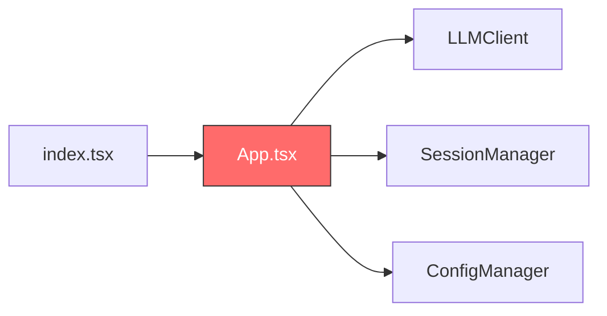
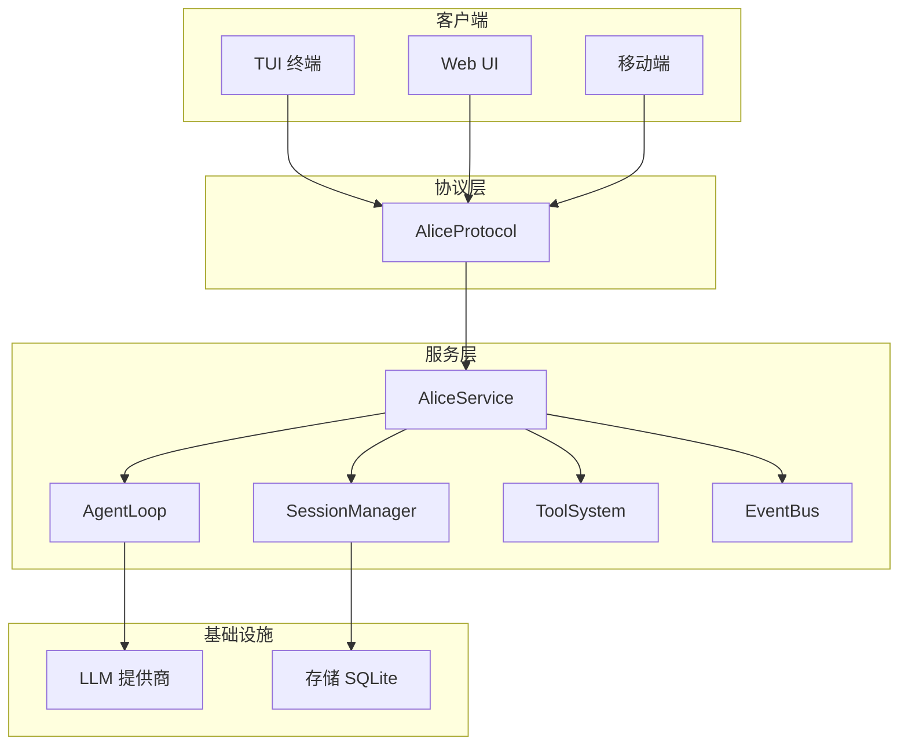
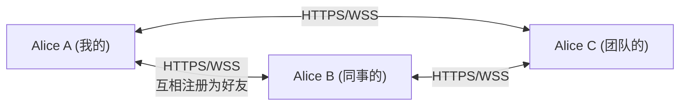
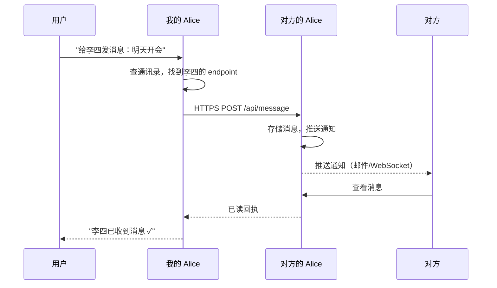
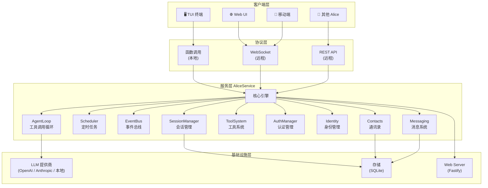

# Alice 服务化架构建议

## 项目现状评估

### 当前代码结构

```
src/
├── index.tsx              # 入口，直接渲染 ink App
├── cli/
│   ├── app.tsx            # UI + 业务逻辑混合 ⚠️
│   └── components/        # Banner / Header / ChatArea / InputBox
├── core/
│   ├── llm.ts             # LLMClient（含降级逻辑）
│   ├── providers/         # OpenAI 兼容 Provider
│   └── session.ts         # 简单 JSON 会话存储
├── types/index.ts         # 类型定义
└── utils/
    ├── config.ts          # JSONC 配置管理
    └── test-model.ts      # 模型测速
```

### 现状评价

> [!success] 做得好的
> - 配置管理支持 JSONC（带注释）+ 环境变量解析
> - 模型降级机制（主模型失败自动切换备用模型）
> - 模型测速功能，自动推荐最快模型
> - Provider 工厂模式，支持多种 OpenAI 兼容后端

> [!warning] 核心缺失
> - ==UI 和业务逻辑完全耦合在 `App.tsx`== 中（`handleSubmit` 同时管理 React state 和 LLM 调用）
> - 无工具调用（tool calling）能力 —— Agent 的核心
> - 无流式渲染（`chat()` 返回完整字符串后才显示）
> - 会话管理过于简单（无分支、无压缩、无树结构）
> - 无扩展/插件机制

> [!danger] 架构瓶颈
> `index.tsx → App.tsx` 的直接渲染模式使得==无法将核心逻辑复用给其他客户端==（Web / Mobile / 远程调用）。这是本次重构必须解决的根本问题。

---

## 六大改造目标分析

### 1. 改造为服务 ✅

> [!tip] 核心思路
> 抽出 **AliceService** 层，与 UI 完全解耦。所有客户端（TUI / Web / Mobile）通过统一协议调用 Service。

**当前问题**：



`App.tsx` 是一个 ==God Component==，同时负责：
- React 状态管理
- LLM 调用
- 命令解析
- 历史管理
- 会话控制

**目标架构**：



**关键接口定义**：

```typescript
interface AliceService {
  // 核心对话
  prompt(text: string, sessionId?: string): AsyncGenerator<AliceEvent>
  abort(sessionId: string): void
  
  // 会话管理
  createSession(): Session
  getSession(id: string): Session
  listSessions(): Session[]
  
  // 模型管理
  listModels(): ModelInfo[]
  setModel(modelId: string): void
  
  // 配置
  getConfig(): Config
  updateConfig(partial: Partial<Config>): void
}
```

> [!important] 这是所有后续功能的基础，==必须最先完成==。

---

### 2. 多端支持（TUI → Web → Mobile）✅

> [!tip] 核心思路
> 定义 **AliceProtocol** 协议层，不同传输方式实现同一协议。

#### 协议设计

| 传输方式 | 适合场景 | 实现复杂度 |
|:---------|:---------|:--------:|
| 直接函数调用 | 本地 TUI | ⭐ |
| WebSocket | Web UI / 移动端 | ⭐⭐ |
| HTTP SSE | 远程只读监控 | ⭐ |
| gRPC | 高性能跨语言 | ⭐⭐⭐ |

**建议路线**：==先函数调用（本地），再 WebSocket（远程）==，覆盖所有需求。

#### 事件流协议

```typescript
type AliceEvent =
  | { type: "text_delta"; delta: string }
  | { type: "tool_start"; toolName: string; args: any }
  | { type: "tool_progress"; content: string }
  | { type: "tool_end"; result: any }
  | { type: "thinking"; text: string }
  | { type: "error"; message: string }
  | { type: "done"; usage: TokenUsage }
```

> [!note] 学习 Pi 的设计
> Pi 的 `@mariozechner/pi-agent-core` 定义了 ==11 种事件类型==，覆盖了 Agent 生命周期的每个阶段。Alice 可以参考但适当简化。
> 参见 [[pi-mono架构说明#2. Agent 层（`@mariozechner/pi-agent-core`）]]

---

### 3. 定时触发 / 事件响应 ✅

> [!tip] 核心思路
> 从 ==被动助手== 转变为 ==主动代理==。

#### 两层设计

**Scheduler（定时任务）**：

```typescript
interface Scheduler {
  cron(expr: string, task: Task): string    // "0 9 * * *" 每天9点
  interval(ms: number, task: Task): string  // 每隔N毫秒
  once(date: Date, task: Task): string      // 定时一次
  cancel(taskId: string): void
  list(): ScheduledTask[]
}
```

**Trigger（事件触发）**：

```typescript
interface TriggerSystem {
  on(event: "file_changed", opts: { pattern: string }, handler: Handler): void
  on(event: "schedule", opts: { cron: string }, handler: Handler): void
  on(event: "webhook", opts: { path: string }, handler: Handler): void
  on(event: "message_received", opts: { from?: string }, handler: Handler): void
}
```

#### 应用场景

- [x] `cron("0 9 * * 1-5")` → 每个工作日早9点汇总待办
- [x] `on("file_changed", "*.xlsx")` → Excel 更新时自动生成报告
- [x] `on("webhook", "/notify")` → 接收外部系统通知
- [ ] `on("email_received")` → 收到邮件时自动分类摘要

> [!warning] 安全风险
> 自主行为的 Agent 如果没有良好的权限控制和日志审计，==可能造成不可逆的损害==。
> 
> 必要措施：
> 1. 所有自动操作记录==详细日志==
> 2. 敏感操作需要用户确认（可异步推送到手机）
> 3. 设置==操作频率上限==
> 4. 支持==紧急停止==（kill switch）

---

### 4. Web Server + 远程调用 ✅

> [!tip] 核心思路
> 基于 Fastify 提供 REST + WebSocket 接口，支持 API Key 认证。

#### 接口设计

```
POST   /api/prompt          发送消息（返回 SSE 流）
POST   /api/abort           中止当前任务
GET    /api/sessions         会话列表
GET    /api/sessions/:id     会话详情
POST   /api/sessions         创建会话
WS     /ws                  实时双向通信
GET    /api/status           服务状态
POST   /api/trigger          手动触发任务
```

#### 安全清单

- [ ] API Key 认证（`Authorization: Bearer sk-xxx`）
- [ ] HTTPS（Let's Encrypt / Cloudflare Tunnel）
- [ ] 速率限制（rate limiting）
- [ ] Bash 工具沙箱化（远程模式下限制命令）
- [ ] 请求日志审计
- [ ] CORS 配置

> [!example] 使用场景
> 用户在手机上打开 Web UI → 通过 WebSocket 连接到家中/办公室的 Alice 服务 → 下达任务 → Alice 自动执行 → 用户随时查看进展。
> 
> ==不必全天在电脑前，只需观察 Agent 工作进展。==

---

### 5. P2P 集群互联 ⚠️

> [!danger] 高风险，建议大幅简化
> 这是六个想法中==最危险的一个==，原因如下：

| 问题 | 说明 |
|:-----|:-----|
| NAT 穿透 | 大多数网络在 NAT 后面，P2P 直连极难 |
| 安全性 | 开放节点互联 = 巨大的攻击面 |
| 共识机制 | 谁调度任务？如何保证结果？如何防恶意节点？ |
| 数据隐私 | 提示词/文件可能包含敏感信息 |
| 成本 | 每个节点都需 LLM API Key，谁付费？ |

#### 替代方案：Alice 联邦

> [!tip] 不做 P2P，做 "Alice 联邦"
> 手动添加信任节点，通过 HTTPS/WSS 直连。



**与 BT/P2P 的区别**：
- ==不需要发现机制==（手动添加节点）
- ==不需要 DHT/NAT 穿透==（需公网 IP 或 Cloudflare Tunnel）
- ==信任模型简单==（只连接你认识的人）

> [!note] 如果真需要分布式计算
> 建议用现成方案：
> - 简单任务分发 → Redis + Bull Queue
> - 复杂编排 → Temporal.io
> - ==不要自己造轮子==

---

### 6. 用户身份 + 通讯录 + 消息 ✅

> [!tip] 核心思路
> 每个 Alice 实例有独立身份，用户通过 Alice 收发消息。

#### 数据模型

```typescript
interface AliceIdentity {
  userId: string           // UUID
  displayName: string      // "张三"
  publicKey: string        // 端到端加密用
  endpoint: string         // "https://alice.zhangsan.com:8080"
}

interface Contact {
  identity: AliceIdentity
  alias: string            // 备注名
  status: "online" | "offline"
  lastSeen: Date
}

interface DirectMessage {
  id: string
  from: string             // userId
  to: string               // userId
  content: string
  timestamp: Date
  encrypted: boolean
  read: boolean
}
```

#### 消息流程



#### 分阶段实现

- [ ] **Phase 1**：本地身份管理 + 通讯录存储
- [ ] **Phase 2**：Alice-to-Alice 消息（依赖 #4 Web Server）
- [ ] **Phase 3**：离线消息队列 + 消息加密

> [!note] 本质
> 这是在做一个==去中心化的即时通讯==。每个 Alice 既是客户端又是服务端。

---

## 推荐的整体架构



---

## 实施路线图

> [!abstract] 总体原则
> ==每次只聚焦一个 Phase==，做完再做下一个。不要并行推进。

### Phase 0：架构重构（基础）🔴

> [!important] 必须最先完成

- [ ] 从 `App.tsx` 中抽离 `AliceService` 类
- [ ] 定义 `AliceProtocol` 接口
- [ ] `App.tsx` 只负责 UI 渲染，通过 Protocol 调用 Service
- [ ] 添加 `EventBus` 组件通信

**验证标准**：`App.tsx` 中不再有任何 LLM 调用或会话操作代码。

### Phase 1：Agent 核心能力 🔴

- [ ] 实现 Agent Loop（LLM 调用 → 工具执行 → 递归）
- [ ] 实现内置工具：`read` / `write` / `edit` / `bash`
- [ ] 实现流式输出（`AsyncGenerator<AliceEvent>`）
- [ ] 会话树结构（JSONL 格式，支持分支）
- [ ] 上下文压缩（compaction）

**验证标准**：可以让 Alice 读取文件、执行命令、编辑文件。

### Phase 2：Web Server + 远程调用 🟡

- [ ] Fastify HTTP 服务器
- [ ] WebSocket 实时通信
- [ ] API Key 认证
- [ ] HTTPS 支持
- [ ] 基础 Web UI

**验证标准**：从浏览器访问 Alice，发送消息并收到流式响应。

### Phase 3：Scheduler + Trigger 🟡

- [ ] Cron 定时任务引擎
- [ ] 文件变化监听
- [ ] Webhook 接收
- [ ] 任务日志和审计
- [ ] 紧急停止机制

**验证标准**：设置 "每天早9点汇总待办" 并自动执行。

### Phase 4：Identity + Messaging 🟢

- [ ] 本地身份管理
- [ ] 通讯录存储（SQLite）
- [ ] Alice-to-Alice 消息发送/接收
- [ ] 消息推送通知
- [ ] 端到端加密（可选）

**验证标准**：两个 Alice 实例之间可以互发消息。

### Phase 5：Alice 联邦 🔵

- [ ] 节点注册与发现
- [ ] 任务委派协议
- [ ] 结果聚合
- [ ] 负载均衡
- [ ] 安全隔离

**验证标准**：Alice A 将子任务分发给 Alice B 执行并汇总结果。

---

## 风险提醒

> [!danger] 三大风险

### 功能蔓延
6 个想法每一个都够做一个独立项目。==必须克制==，按 Phase 顺序推进。没有 Phase 0 和 Phase 1，后面全是空中楼阁。

### 过早优化
不要在没有基础功能的时候就想集群。==先把单机的 Agent 做到能用==。

### 安全隐患
远程执行 + 自动触发 + 多实例互联 = ==安全噩梦==。每一步都需要认真考虑鉴权和沙箱。

---

## 技术选型建议

| 领域 | 推荐 | 理由 |
|:-----|:-----|:-----|
| HTTP 框架 | Fastify | 高性能，TypeScript 友好，插件生态 |
| WebSocket | ws / Fastify WebSocket | 轻量，与 Fastify 集成 |
| 数据库 | better-sqlite3 | 零配置，嵌入式，适合单机服务 |
| 定时任务 | node-cron | 轻量，POSIX cron 语法 |
| 文件监听 | chokidar | 跨平台，稳定 |
| 类型校验 | TypeBox | 运行时 + 编译时类型安全 |
| 测试 | Vitest | 快速，ESM 原生支持 |
| 日志 | pino | 高性能 JSON 日志 |

---

## 从 Pi-Mono 学到的关键经验

> [!quote] Pi 的设计哲学
> "Pi is aggressively extensible so it doesn't have to dictate your workflow."

### 应该学习的 ✅

1. **分层解耦** — `ai` / `agent` / `tui` / `coding-agent` 四层清晰分离
2. **事件驱动** — EventBus 解耦组件通信，==11 种事件类型==覆盖全生命周期
3. **流式优先** — 所有 LLM 调用都是 `AsyncGenerator`，工具执行支持 `onUpdate` 回调
4. **会话树** — JSONL + `parentId` 实现原地分支，==所有历史在一个文件中==
5. **差分渲染** — TUI 只更新变化的行，CSI 2026 同步输出无闪烁
6. **类型安全** — 全量 TypeScript strict，TypeBox 运行时校验

### 不应复制的 ❌

1. **无 MCP** — Alice 可以考虑原生支持 MCP（Model Context Protocol）
2. **无子 Agent** — Alice 可以内置简单的子 Agent 机制
3. **无计划模式** — Alice 可以内置轻量级的计划功能
4. **无内置权限** — Alice 作为服务==必须有权限控制==

> [!note] 相关文档
> 详细的 Pi 架构分析见 [[pi-mono架构说明]]

---

## 下一步行动

> [!todo] 立即开始
> 1. 开始 **Phase 0**：从 `App.tsx` 中抽离 `AliceService`
> 2. 定义 `AliceProtocol` 接口和 `AliceEvent` 事件类型
> 3. 重写 `App.tsx` 为纯 UI 组件，通过 Protocol 调用 Service
