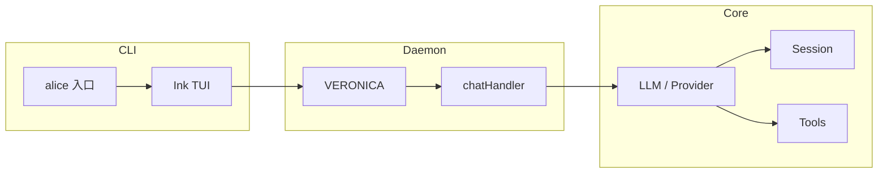

# ALICE CLI 技术总结

> [!info] 文档说明  
> 本文档从技术视角对 ALICE 项目做结构化总结，便于在 [[A.L.I.C.E]]、[[V.E.R.O.N.I.C.A]]、[[PROVIDERS]]、[[EVENT_SYSTEM]] 等笔记间跳转与复盘。

---

## 1. 项目定位与产品体系

- **ALICE**：基于大语言模型的智能办公助手 CLI，目标是在终端内提供类似 GitHub Copilot CLI 的对话与工具调用体验。
- **技术栈**：Node.js ≥ 18、TypeScript（ESM）、Ink（React for CLI）。

### 1.1 Agent 产品体系

| 产品 | 命令 | 角色 |
|------|------|------|
| **[[V.E.R.O.N.I.C.A]]** | `veronica` | 常驻 Daemon，会话与推理持有者 |
| **[[A.L.I.C.E]]** | `alice` | 主 CLI 入口，TUI 与用户交互 |
| DIANA | — | 规划中，移动端 Agent |
| ANDERS | — | 规划中，架构师 Agent |

> [!tip] 边界  
> 会话与消息由 Daemon 持有；CLI 通过 `DaemonClient` 拉取/推送，本地 `sessionManager` 仅做持久化与统计，非单一数据源。

---

## 2. 架构特性

### 2.1 分层概览



- **CLI 层**：`index.tsx` → `cli/app.tsx`、components、context、hooks；负责输入、展示、键绑定。
- **Daemon 层**：[[V.E.R.O.N.I.C.A]] 常驻进程，`server`、`routes`、`chatHandler`、`processManager`；持有会话、执行 `chatStreamWithTools`、输出 NDJSON 流。
- **Core 层**：`llm`、[[PROVIDERS]]、`session`、[[EVENT_SYSTEM]]、`theme`、`mcp`、`skillManager` 等；与具体 UI 解耦。

### 2.2 配置分离

| 文件 | 用途 |
|------|------|
| `~/.alice/settings.jsonc` | 模型、UI、工作区、键绑定等（CLI 与 daemon 内业务共用） |
| `~/.alice/daemon_settings.jsonc` | Daemon 通信方式（transport）、socket 路径、心跳、日志等 |

两者文件与职责分离，不重叠。

### 2.3 会话与消息边界

- **会话与消息由 daemon 持有**：TUI 下当前会话 ID 与消息列表由 daemon 管理；CLI 通过 `DaemonClient` 拉取（`getSession` / 初始化时 `createSession`）和推送（`chatStream` 的 `done` 事件带回最新 messages）。
- **CLI 侧 sessionManager**：用于本地持久化与统计（如退出汇报、消息数）；在初始化时通过 `applySession` 与 daemon 同步，在每次 `done` 时用服务端下发的 `event.messages` 更新本地 state。

---

## 3. 技术栈与工程规范

### 3.1 运行时与语言

- **Node.js** ≥ 18
- **TypeScript**：ES2022、`"strict": true`、模块解析 `bundler`
- **ESM**：`"type": "module"`，导入路径必须带 `.js` 扩展名

### 3.2 UI 与交互

- **Ink**：React for CLI，函数组件 + Hooks，`useInput` 处理键盘
- **chalk**、**gradient-string**：颜色与 Banner
- **commander**：CLI 参数解析

### 3.3 核心能力

- **流式响应**：AsyncGenerator / SSE，逐 chunk 产出
- **多 Provider**：[[PROVIDERS]] 注册表，统一 `BaseProvider`，支持 OpenAI / Azure / Anthropic / Google / Mistral / Ollama / xAI 等，可扩展
- **Function Calling**：工具注册表 → OpenAI 格式 → LLM 返回 tool_calls → `ToolExecutor` 执行 → 结果以 tool message 回填
- **MCP**：`@modelcontextprotocol/sdk`，Stdio 传输，发现工具后桥接到 `ToolRegistry`（`mcp__{server}__{toolName}`）
- **工具参数校验**：AJV + JSON Schema，在 `ToolRegistry.register` 与执行前校验

### 3.4 错误与异步

- **catch 参数**：统一 `unknown`，禁止 `error: any`
- **可读错误**：使用 `getErrorMessage(error)`（`utils/error.js`）而非直接访问 `error.message`
- **降级**：主模型失败时可配置 `suggest_model` 自动切换到备用模型

---

## 4. 目录与代码规模

```
src/
├── index.tsx              # CLI 入口
├── cli/                   # UI 层（app, components, context, hooks）
├── components/            # 可复用 UI（Markdown, Loader, Editor, Overlay…）
├── core/                  # 核心（llm, providers, session, events, theme, mcp, skillManager…）
├── tools/                 # 工具（registry, executor, builtin 11 个）
├── daemon/                # VERONICA（server, routes, chatHandler, processManager…）
├── utils/                 # 配置、错误、daemonClient、mcpConfig…
└── types/                 # 类型定义
```

- **规模**：约 64 个 `.ts` + 24 个 `.tsx`
- **内置工具**：11 个（readFile, writeFile, editFile, listFiles, searchFiles, getCurrentDirectory, getGitInfo, getCurrentDateTime, executeCommand, askUser, loadSkill）
- **Provider**：4 类实现 + OpenAI 兼容多别名（lmstudio, ollama, openai, azure, custom, xai, grok, anthropic, claude, google, gemini, mistral）

---

## 5. 类型与数据流

### 5.1 核心类型（`types/`）

- **Message**：`role`（user | assistant | system | tool）、`content`、`timestamp`、`tool_calls` / `tool_call_id` / `name`（Function Calling）
- **Session**：`id`、`createdAt`、`messages`、`metadata`
- **ModelConfig**：`name`、`provider`、`baseURL`、`model`、`apiKey`、`temperature`、`maxTokens` 等
- **Provider**：联合类型，覆盖所有已注册 provider 名称

### 5.2 对话流（Daemon）

1. CLI 发 `ChatStreamRequest`（message、sessionId、model、includeThink 等）
2. Daemon `runChatStream`：加载/创建 session，取 modelConfig、systemPrompt，构造 `LLMClient`
3. `client.chatStreamWithTools(messages, onToolRecord)`：流式产出 content + 工具调用
4. 工具调用由 daemon 侧执行，结果以 tool message 追加，继续下一轮 LLM 调用（最多 `maxIterations`）
5. 事件以 NDJSON 推回 CLI：`content`、`tool_call`、`done`（含最终 messages）等

---

## 6. 设计原则（与文档一致）

- **视觉**：主色科技蓝 `#00D9FF`，极简，渐变色增强层次，灰色 `#808080` 次要信息
- **交互**：快速响应、清晰加载状态、友好错误提示、键盘快捷键

详见项目根目录 [[AGENTS]]（开发指南）。

---

## 7. 相关文档索引

- [[A.L.I.C.E]]：品牌与全称
- [[V.E.R.O.N.I.C.A]]：Daemon 说明
- [[PROVIDERS]]：多模型与 Provider
- [[EVENT_SYSTEM]]：事件系统
- [[OVERLAY_SYSTEM]]：覆盖层与弹窗
- [[REFACTOR_PLAN]]：产品与品牌概念、重构规划

---

> [!note] 维护  
> 代码与配置以仓库为准；本文档随版本迭代可增删小节，保持与 AGENTS.md 及上述 doc 链接一致即可。
