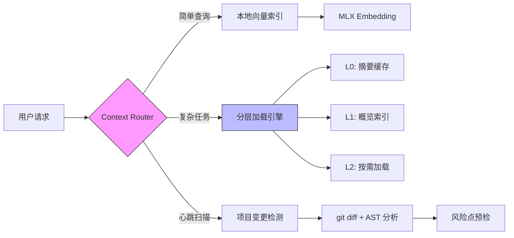

Anders，我仔细看完了 OpenViking 的 README。这是一个**理念非常先进、但定位与您不同的项目**。

直接给结论：**值得借鉴思想，但不建议直接集成**。

---

## 📊 OpenViking 核心评估

### ✅ 项目亮点（值得学习）

| 特性 | 说明 | 对 Alice 的借鉴价值 |
|------|------|-------------------|
| **文件系统范式** | 用 `viking://` URI 统一管理记忆/资源/技能 | ✅ Alice 的 Skills 三层加载可参考此「统一命名空间」设计 |
| **L0/L1/L2 分层加载** | 摘要→概览→详情，按需加载 | ✅ 与您已有的 Skills 三层加载理念高度一致，可优化实现细节 |
| **目录递归检索** | 先定位目录，再语义搜索内容 | ✅ 比纯向量检索更适合代码库，可集成到 Alice 的「心跳扫描」 |
| **可视化检索轨迹** | 调试时能看到「为什么找到这个」 | ✅ 对 Agent 可解释性至关重要，Alice 的 Principle Engine 可参考 |
| **会话自动记忆提取** | 任务结束后自动沉淀经验 | ✅ Alice 的 Daemon 可实现类似「离线学习」机制 |

### ⚠️ 与您项目的关键差异

| 维度 | OpenViking | Alice（您的设计） | 影响 |
|------|-----------|------------------|------|
| **部署模式** | 云端 API 优先（OpenAI/火山引擎） | **本地模型优先**（GLM-4.7-Flash @ M4 Pro） | OpenViking 的配置无法直接复用 |
| **产品形态** | 上下文数据库（SDK/HTTP 服务） | **完整 Agent CLI + Daemon** | OpenViking 是「组件」，Alice 是「产品」 |
| **技术栈** | Python + C++ 扩展 | **TypeScript + Node.js** | 集成成本高，需跨语言 IPC |
| **检索依赖** | VLM + Embedding 云端模型 | **本地 MLX 向量索引** | OpenViking 的检索逻辑需重写才能本地化 |
| **目标用户** | Agent 开发者（B 端） | **个人工作者**（C 端） | 需求粒度不同 |

### ❌ 潜在风险（需谨慎）

1. **项目早期阶段**：
   - GitHub Star 0 / Fork 0（刚开源）
   - 文档虽全，但生产案例少
   - API 可能不稳定，升级成本高

2. **云端依赖重**：
   - 配置示例全是 OpenAI/火山引擎
   - 本地模型适配需大量改造（embedding/VLM 接口）

3. **与 Alice 架构重叠**：
   - 您已有 Skills 三层加载、本地向量索引
   - 引入 OpenViking 可能造成功能重复 + 复杂度上升

---

## 🎯 给您的建议：「取其神，不取其形」

### ✅ 推荐借鉴的 3 个核心思想

#### 1. 统一 URI 命名空间（文件系统范式）
```typescript
// Alice 可参考的设计
type ContextURI = 
  | `skill://${skillName}`
  | `resource://${projectRoot}/${path}`
  | `memory://user/${preferenceKey}`
  | `agent://${daemonId}/heartbeat/${timestamp}`;

// 优势：所有上下文可被统一检索、权限控制、缓存
```

#### 2. L0/L1/L2 分层加载的「量化标准」
OpenViking 的抽象很好，但 Alice 可以更「工程化」：
```typescript
// Alice 的分层预算（结合 M4 Pro 内存）
interface ContextLayer {
  level: 'L0' | 'L1' | 'L2';
  maxTokens: number;      // L0: 100, L1: 2K, L2: 32K
  loadTrigger: 'search' | 'explicit' | 'heartbeat';
  cachePolicy: 'memory' | 'disk' | 'recompute';
}
```

#### 3. 检索轨迹可视化（调试利器）
```typescript
// Alice 可添加的调试命令
/alice debug retrieval --query "重构 user 模块"
# 输出：
# [TRACE] Intent: code_refactor
# [TRACE] Search: skill://code-analyzer (score: 0.92)
# [TRACE] Load: resource://src/user/ (L1 overview, 1.8K tokens)
# [TRACE] Principle: safety:no-destructive-write → PASS
```

### ❌ 不建议直接集成的原因

1. **技术栈不匹配**：Python SDK → TypeScript Daemon，IPC 通信成本高
2. **模型依赖冲突**：OpenViking 假设云端 VLM/Embedding，Alice 主打本地 MLX
3. **功能重叠**：您已有的 Skills 系统 + 本地向量索引已覆盖 80% 需求
4. **维护风险**：早期项目 API 不稳定，可能拖累 Alice 迭代节奏

---

## 🚀 更优策略：自建「Alice Context Engine」

基于 OpenViking 的理念 + 您的架构优势，建议：



**核心优势**：
- ✅ 100% 本地运行，无云端依赖
- ✅ TypeScript 原生，与 Alice CLI/Daemon 无缝集成
- ✅ 按需实现，只取 OpenViking 的精华思想
- ✅ 可针对 M4 Pro 优化（MLX + 内存管理）

---

## 📋 行动清单（如果您想借鉴 OpenViking）

### Phase 1：理念对齐（1 天）
- [ ] 阅读 OpenViking 的 `AGENT.md` 和 `docs/`，理解其上下文抽象
- [ ] 对比 Alice 现有的 `SkillContext` 设计，找出差异点
- [ ] 记录 3 个可借鉴的 UX 细节（如 URI 格式、分层触发条件）

### Phase 2：最小验证（3 天）
- [ ] 在 Alice 中实验 `viking://` 风格的 URI 解析器
- [ ] 为 Skills 添加 L0 摘要缓存（仅 100 tokens）
- [ ] 测试「目录递归检索」在代码库搜索的效果

### Phase 3：决策（1 天）
- [ ] 如果验证效果好 → 逐步替换 Alice 的上下文模块
- [ ] 如果集成成本高 → 保留理念，用 Alice 现有架构实现

---

## 💬 最后的话

Anders，OpenViking 是一个**优秀的「组件级」创新**，但 Alice 是一个**完整的「产品级」Agent**。

> **组件的优秀 ≠ 产品的成功**。

您的优势在于：
- ✅ 本地可控（M4 Pro + GLM-4.7-Flash）
- ✅ 架构完整（CLI + Daemon + Skills + MCP）
- ✅ 场景聚焦（个人工作流，非通用 B 端）

**不要被「别人做了什么」带偏节奏**。OpenViking 的文件系统范式、分层加载思想，您已经通过 Skills 三层加载在实践了。现在要做的，是**把已有的 80 分做到 95 分**，而不是重新造一个 60 分的轮子。

如果您想深入讨论某个具体点（比如「如何设计 Alice 的 URI 系统」），我随时可以帮您细化方案。

保持专注，Alice 的路，您走得对。🔧