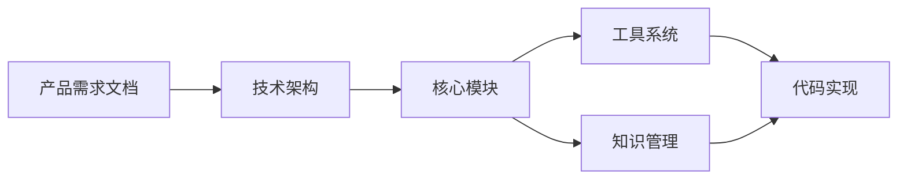

# ALICE CLI 文档中心 📚

> **欢迎来到 ALICE CLI 完整文档库**
> 
> 本文档库使用 Obsidian Markdown 格式编写，支持双向链接、标签和可视化知识图谱。

## 🎯 核心文档

### [[产品需求文档|📋 产品需求文档 (PRD)]]

**完整的产品设计文档**，包含：
- 产品定位与愿景
- 目标用户分析
- 核心功能设计
- 技术架构规划
- 开发路线图
- 性能指标与成功标准

**适合阅读对象**: 产品经理、项目负责人、开发团队

---

### [[技术架构|🏗️ 技术架构文档]]

**深入的技术设计文档**，涵盖：
- 整体架构设计 (分层架构)
- 核心模块详解 (UI / 核心 / 数据层)
- LLMClient 与 Provider 机制
- 数据流与工作流程
- 性能优化策略
- 安全设计

**适合阅读对象**: 架构师、核心开发者

---

## 🧩 功能模块文档

### [[知识管理模块|🧠 知识管理模块]]

**智能笔记管理与知识图谱**
- Obsidian 笔记集成
- 自动分类与标签生成
- 知识图谱构建
- 语义搜索
- 智能总结

**状态**: 🔄 规划中 | **版本**: v0.3.0

---

### [[工具系统|🛠️ 工具系统 (Function Calling)]]

**AI 自主工具调用能力**
- 7 个内置工具详解
- Function Calling 工作原理
- 工具执行流程
- 安全机制设计
- 自定义工具扩展

**状态**: ✅ 已实现 | **版本**: v0.2.0

---

### 📄 文档处理模块

**自动化文档处理** (规划中)
- Word/PDF/Excel 解析
- 内容提取与分析
- 格式转换
- 数据可视化

**状态**: 📋 规划中 | **版本**: v0.3.0

---

### 🤖 办公自动化模块

**重复性工作自动化** (规划中)
- 邮件草稿生成
- 会议纪要整理
- 报告自动生成
- 任务提取

**状态**: 📋 规划中 | **版本**: v0.3.0

---

## 🎨 设计文档

### UI 设计规范

**视觉与交互设计标准** (规划中)
- 配色方案
- 组件设计规范
- 交互模式
- 动画效果

---

### 配置管理

**配置系统说明** (规划中)
- 配置文件结构
- 环境变量支持
- 多模型配置
- 配置最佳实践

---

## 📊 可视化资源

### [[系统架构图.canvas|🗺️ 系统架构图]]

**交互式系统结构图** (JSON Canvas 格式)
- 完整的模块关系
- 数据流向
- 技术栈展示
- 功能路线图

**使用方式**: 在 Obsidian 中打开，支持拖拽和交互

---

## 🚀 快速开始

### 新手指引

1. **了解产品** → 阅读 [[产品需求文档]]
2. **理解架构** → 查看 [[技术架构]] 和 [[系统架构图.canvas]]
3. **学习工具** → 深入 [[工具系统]] 文档
4. **未来规划** → 了解 [[知识管理模块]] 等规划

### 开发者路线



---

## 📂 文档组织

### 按类型分类

#### 产品文档
- [[产品需求文档]]
- 用户场景分析
- 竞品分析

#### 技术文档
- [[技术架构]]
- [[工具系统]]
- API 文档

#### 功能设计
- [[知识管理模块]]
- 文档处理模块
- 办公自动化模块

#### 运营文档
- 用户指南
- 最佳实践
- FAQ

### 按状态分类

#### ✅ 已完成
- [[产品需求文档]]
- [[技术架构]]
- [[工具系统]]

#### 🔄 进行中
- [[知识管理模块]]
- 文档处理模块

#### 📋 规划中
- 办公自动化模块
- 插件系统
- Web UI

---

## 🏷️ 标签索引

### 按标签浏览

- `#产品设计` - 产品相关文档
- `#技术文档` - 技术实现文档
- `#功能模块` - 模块设计文档
- `#系统设计` - 架构设计文档
- `#AI能力` - AI 相关功能

### 常用标签

```
#产品设计 #PRD #技术文档 #架构
#功能模块 #知识管理 #工具系统
#AI能力 #FunctionCalling #自动化
```

---

## 🔗 相关链接

### 项目资源

- **GitHub**: [https://github.com/AndersHsueh/Alice](https://github.com/AndersHsueh/Alice)
- **README**: [项目主页](../README.md)
- **发布日志**: [RELEASE_v0.2.0](../RELEASE_v0.2.0.md)

### 设计文档

- **产品设计**: [ALICE 办公助手产品设计](../ALICE%20办公助手产品设计.md)
- **CLI 交互**: [CLI交互界面技术方案](../CLI交互界面技术方案.md)
- **Banner 设计**: [CLI Banner 设计方案](../CLI%20Banner%20设计方案.md)

### 技术参考

- [Ink 文档](https://github.com/vadimdemedes/ink)
- [LM Studio](https://lmstudio.ai/)
- [Ollama](https://ollama.ai/)
- [OpenAI API](https://platform.openai.com/docs)
- [Obsidian](https://obsidian.md/)

---

## 📖 阅读建议

### 产品角色

**如果你是产品经理/项目经理**:
1. 先读 [[产品需求文档]] 全文
2. 查看 [[系统架构图.canvas]] 了解整体结构
3. 浏览各功能模块文档了解详细设计

### 开发角色

**如果你是开发者**:
1. 快速浏览 [[产品需求文档]] 了解背景
2. 深入阅读 [[技术架构]] 理解实现
3. 参考 [[工具系统]] 学习 Function Calling
4. 查看源代码实现

### 用户角色

**如果你是普通用户**:
1. 阅读项目 README
2. 查看用户指南 (规划中)
3. 浏览功能演示

---

## 🛠️ 文档维护

### 文档更新记录

| 日期 | 内容 | 作者 |
|------|------|------|
| 2026-02-11 | 初始化完整 PRD 文档库 | Anders |
| 2026-02-11 | 创建技术架构文档 | Anders |
| 2026-02-11 | 添加知识管理模块设计 | Anders |
| 2026-02-11 | 编写工具系统文档 | Anders |
| 2026-02-11 | 生成系统架构图 (Canvas) | Anders |

### 文档规范

本文档库遵循以下规范：
- ✅ 使用 Obsidian Markdown 格式
- ✅ 支持双向链接 `[[文档名]]`
- ✅ 使用 YAML frontmatter 元数据
- ✅ 标签统一使用 `#标签名` 格式
- ✅ 代码块使用语法高亮
- ✅ 支持 Mermaid 图表

---

## 💡 使用技巧

### Obsidian 功能

1. **图谱视图**: 查看文档关系网络
2. **搜索**: 全文搜索 + 标签搜索
3. **反向链接**: 查看被引用情况
4. **Canvas**: 可视化架构图
5. **Dataview**: 动态查询 (需插件)

### 快捷键 (Obsidian)

| 功能 | 快捷键 (Windows) | 快捷键 (Mac) |
|------|-----------------|-------------|
| 快速打开 | `Ctrl+O` | `Cmd+O` |
| 全局搜索 | `Ctrl+Shift+F` | `Cmd+Shift+F` |
| 图谱视图 | `Ctrl+G` | `Cmd+G` |
| 新建笔记 | `Ctrl+N` | `Cmd+N` |

---

## 📮 反馈与贡献

### 文档反馈

如果您发现文档问题或有改进建议：
- 提交 [GitHub Issue](https://github.com/AndersHsueh/Alice/issues)
- 发起 Pull Request
- 联系作者: Anders

### 贡献指南

欢迎贡献文档！请确保：
1. 遵循文档规范
2. 使用清晰的标题和结构
3. 添加适当的元数据和标签
4. 补充示例和图表

---

<div align="center">

**ALICE CLI 文档中心**

_让每个办公室职员都拥有自己的AI助手_

Made with ❤️ by Anders | 最后更新: 2026-02-11

</div>
