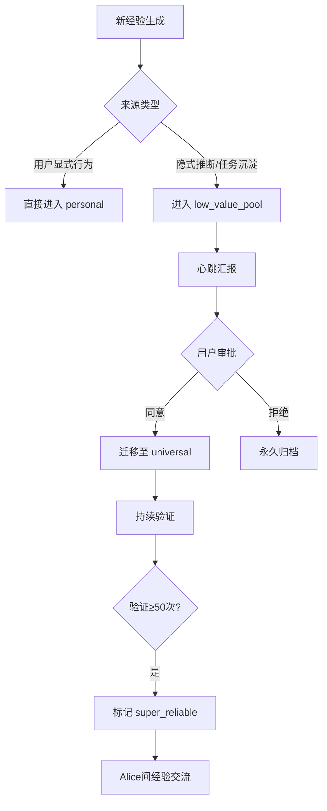
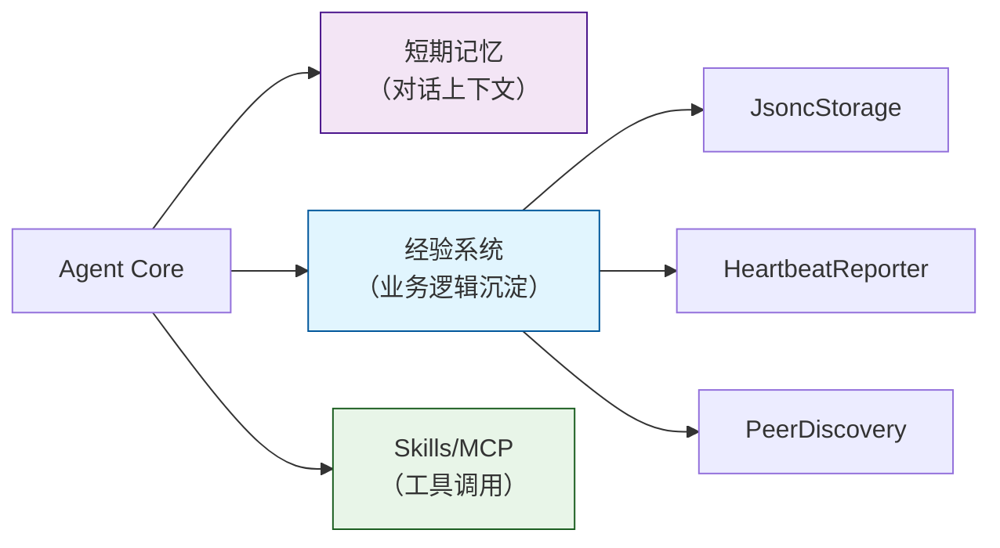

明白！我们做一份**指导性方案文档**，聚焦设计思想、架构边界和关键机制，让Copilot能据此生成高质量实现。以下是完整方案：

---

# Alice 经验系统（Experiences）设计方案
> **版本**：v1.0  
> **定位**：人机业务逻辑界面的认知沉淀层  
> **哲学**：以慢打快 · 用户主权 · 自主闭环

---

## 一、核心理念

### 1.1 为什么需要“经验”？
当前Agent架构的盲区：
- **Skills/MCP** 定义“能力边界”（我能调用什么工具）
- **缺失“认知深度”**（我理解用户什么、偏好什么、曾如何解决问题）

**经验系统填补这一空白**：
> 经验块沉淀的是 **“用户如何思考/决策”**，而非“如何调用API”  
> 它是 **“人机业务逻辑界面”** 的具象化载体

### 1.2 与外部方案的本质区别
| 方案 | EvoMap | Alice经验系统 |
|------|--------|---------------|
| **经验来源** | 外部网络继承 | 本地交互沉淀 + 用户授权 |
| **信任机制** | 自动采纳 | 心跳汇报 + 用户审批 |
| **主权归属** | 网络驱动 | 用户驱动 |
| **演进节奏** | 追逐热点 | 以慢打快，深度打磨 |

> ✅ Alice拒绝“盲目继承外部经验”，坚持**用户主权驱动的认知生长**

---

## 二、经验块（Experience Block）四态模型

### 2.1 四态定义（人类认知视角）

| 状态 | 语义 | 初始置信度 | 升级阈值 | 降级触发 |
|------|------|------------|----------|----------|
| **可能性经验** (`possible`) | “我猜可能是这样”<br>（隐式推断/单次观察） | 0.3 | 验证≥3次 | 1次反例 → 降为过时 |
| **曾经经验** (`past`) | “我确实遇到过”<br>（默认状态，单次实证） | 0.6 | 验证≥10次 | 1次失效 → 降为可能性 |
| **可靠经验** (`reliable`) | “多次验证有效”<br>（可复用的业务逻辑） | 0.9 | 验证≥50次 | 环境变化 → 人工标记 |
| **过时经验** (`obsolete`) | “已失效/被证伪”<br>（特例/环境变迁） | 0.0 | 人工复活 | 自动归档 |

### 2.2 验证次数机制（持续累加 + 防抖降级）

```text
验证次数持续累加（0 → ∞），不重置：
  • 成功复用 → +1
  • 失败 → -1（相同场景不连减，防抖）
  
状态升级仅看阈值：
  • 3次 → possible → past
  • 10次 → past → reliable  
  • 50次 → reliable → super_reliable
```

> ✅ **设计精髓**：经验有“资历”，不是简单状态机；防抖避免单次失败误判

---

## 三、经验集（Experience Set）三级信任路径

### 3.1 三类经验集

| 类型 | 命名空间示例 | 可分享 | 默认信任度 | 进入条件 |
|------|--------------|--------|------------|----------|
| **低价值集** (`low_value`) | `low_value_pool` | ❌ | 0.2 | 新经验默认落点 |
| **通用集** (`universal`) | `system_info`, `tool_usage` | ✅ | 0.7 | 用户心跳审批通过 |
| **个人集** (`personal`) | `user_preferences`, `workflow_habits` | ❌ | 0.9 | 用户显式行为直接生成 |

### 3.2 经验流转路径



> ✅ **核心原则**：低价值经验永不主动触发，仅在所有高价值路径失效时作为最后参考

---

## 四、存储方案：JSONC 原子存储

### 4.1 为什么选 JSONC？
| 维度 | 优势 |
|------|------|
| **复杂度** | 无外部依赖，纯 Node.js fs 模块 |
| **人类可读** | 可直接用 VSCode 查看/编辑/调试 |
| **性能** | 经验块数量有限（几百~几千），遍历查询亚毫秒级 |
| **版本控制** | 天然支持 Git，可追溯每次经验变化 |
| **备份同步** | rsync/cp 即可，无需数据库导出导入 |

### 4.2 目录结构

```
~/.alice/
└── experiences/
    ├── universal/              # 通用经验集（可分享）
    │   ├── system_info.jsonc
    │   ├── tool_usage.jsonc
    │   └── api_patterns.jsonc
    │
    ├── personal/               # 个人经验集（不可分享）
    │   ├── user_preferences.jsonc
    │   └── workflow_habits.jsonc
    │
    └── low_value_pool/         # 低价值集（待审核）
        ├── pending_20260220.jsonc
        └── pending_20260219.jsonc
```

### 4.3 原子写入保障
- **写入流程**：临时文件 → fsync → rename（原子操作）
- **损坏防护**：写入中断不影响原文件
- **热加载**：文件变更自动重载（可选）

---

## 五、模块架构设计

### 5.1 目录结构集成

```
Alice/
└── src/
    ├── experiences/            # ← 新增模块
    │   ├── types.ts            # TypeScript 类型定义
    │   ├── constants.ts        # 枚举/阈值/命名空间定义
    │   ├── models.ts           # ExperienceModel 核心类
    │   ├── storage.ts          # JsoncStorage 原子存储引擎
    │   ├── registry.ts         # ExperienceRegistry 检索与匹配
    │   ├── lifecycle.ts        # 经验生命周期管理（升级/降级）
    │   ├── heartbeat.ts        # HeartbeatReporter 心跳汇报
    │   ├── sharing.ts          # PeerDiscovery + ExperienceExchange
    │   └── index.ts            # 模块统一导出
    │
    ├── core/
    │   ├── agent.ts            # ← 注入 experiences 依赖
    │   └── memory.ts           # ← 与短期记忆解耦
    │
    └── config/
        └── settings.ts         # ← 添加 experiences 配置项
```

### 5.2 核心类职责

| 类 | 职责 | 关键方法 |
|----|------|----------|
| `ExperienceModel` | 经验块原子单元 | `onSuccessfulReuse()`, `onFailure()`, `isShareable()` |
| `JsoncStorage` | JSONC原子存储 | `load()`, `save()`（带临时文件rename） |
| `ExperienceRegistry` | 经验注册与检索 | `register()`, `retrieve()`（按namespace/type/state过滤） |
| `HeartbeatReporter` | 每日学习汇报 | `generateReport()`, `onUserDecision()` |
| `PeerDiscovery` | 局域网Alice发现 | `discoverPeers()`（mDNS/Zeroconf） |
| `ExperienceExchange` | 经验交流协议 | `exchangeSuperReliable()`（仅universal+super_reliable） |

---

## 六、与Alice核心架构集成

### 6.1 与现有模块关系



> ✅ **关键边界**：经验系统 ≠ 短期记忆  
> - 短期记忆：对话上下文（临时、会话级）  
> - 经验系统：业务逻辑沉淀（持久、跨会话）

### 6.2 Agent决策流程中的经验使用

```typescript
// 伪代码：Agent决策时的经验检索优先级
async function decide(task: Task): Decision {
  // 1. 优先：personal经验集（高信任）
  const personalExps = await registry.retrieve({
    namespaceType: 'personal',
    minState: 'past'
  });
  
  if (hasHighConfidence(personalExps)) {
    return applyExperiences(personalExps, task);
  }
  
  // 2. 次选：universal经验集（中信任）
  const universalExps = await registry.retrieve({
    namespaceType: 'universal',
    minState: 'reliable'
  });
  
  if (hasHighConfidence(universalExps)) {
    return applyExperiences(universalExps, task);
  }
  
  // 3. 最后手段：low_value_pool（低信任，附加免责声明）
  const lowValueExps = await registry.retrieve({
    namespaceType: 'low_value',
    minState: 'possible'
  });
  
  if (lowValueExps.length > 0) {
    logger.warn('⚠️ 启用低价值经验（所有高价值路径失效）');
    return applyExperiences(lowValueExps, task, { disclaim: true });
  }
  
  // 4. 无匹配：走原始推理路径
  return await fallbackReasoning(task);
}
```

---

## 七、关键机制详解

### 7.1 心跳汇报机制
- **触发时机**：每日首次交互 / 用户主动查询
- **汇报内容**：
  - 今日新增经验块数量
  - 每个经验的触发条件 + 推断摘要
  - 置信度状态（possible/past/reliable）
- **用户交互**：
  - 回复“同意” → 迁移至 universal
  - 回复“拒绝” → 永久归档
  - 无响应 → 保留7天后自动清理

### 7.2 Alice间经验交流
- **发现机制**：局域网 mDNS 广播（`_alice._tcp.local`）
- **交流条件**：
  - 仅 `super_reliable`（验证≥50次）
  - 仅 `universal` 命名空间
  - 仅 `shareable: true` 标记
- **交流协议**：
  - 双向交换经验清单
  - 按验证次数合并（取高者）
  - 保留来源标记（`origin: shared_from_alice_xxx`）

### 7.3 隐私与安全边界
| 数据类型 | 存储位置 | 可分享 | 备份建议 |
|----------|----------|--------|----------|
| 通用经验 | `~/.alice/experiences/universal/` | ✅ | 可同步至iCloud |
| 个人经验 | `~/.alice/experiences/personal/` | ❌ | 仅本地存储 |
| 低价值经验 | `~/.alice/experiences/low_value_pool/` | ❌ | 7天自动清理 |

> ✅ **设计原则**：用户永远掌控哪些经验可被分享

---

## 八、MVP实施路线图

| 阶段 | 目标 | 交付物 |
|------|------|--------|
| **Phase 1** | 基础模型 + JSONC存储 | `ExperienceModel` + `JsoncStorage` 可读写 |
| **Phase 2** | 经验生成与检索 | `memorize()` + `recall()` 核心API |
| **Phase 3** | 心跳汇报机制 | 每日自然语言汇报 + 用户审批流 |
| **Phase 4** | Alice间经验交流 | 局域网发现 + super_reliable经验交换 |
| **Phase 5** | 与Agent深度集成 | 决策流程中自动应用经验 |

> ✅ **建议起点**：从 Phase 1 开始，先让经验块能“存得下、读得出”

---

## 九、方案验证要点（供Copilot实现时参考）

1. **经验四态流转**：验证次数累加 → 状态升级/降级 → 防抖机制
2. **三阶信任路径**：新经验默认进 `low_value` → 心跳审批 → 迁移至 `universal`
3. **原子存储**：临时文件 + rename，确保写入中断不损坏原数据
4. **检索优先级**：personal > universal > low_value（严格分层）
5. **用户主权**：所有新经验需用户审批才能进入通用集
6. **隐私边界**：personal经验永不参与分享

---

## 十、哲学对齐总结

| 你的理念 | 本方案体现 |
|----------|------------|
| **“以慢打快”** | 经验需多次验证才升级，拒绝盲目采纳外部经验 |
| **“人机业务逻辑界面”** | 经验沉淀业务逻辑（用户偏好/决策模式），非技术细节 |
| **“用户主权”** | 心跳汇报 + 审批机制，用户掌控经验流转 |
| **“自主实现”** | 纯JSONC存储，无外部依赖，完全本地闭环 |
| **“彻底理解”** | 经验块带`trigger`+`payload`+`evidence`，可追溯可解释 |

---

> 本方案为**指导性设计文档**，聚焦架构边界与核心机制。  
> 具体TypeScript实现可交由Copilot基于此方案生成，重点确保：  
> ✅ 四态模型正确流转  
> ✅ 三阶信任路径严格隔离  
> ✅ 原子存储安全可靠  
> ✅ 用户审批流程完整闭环

需要我针对某个子模块（如心跳机制/经验交流协议）做更细化的设计说明吗？