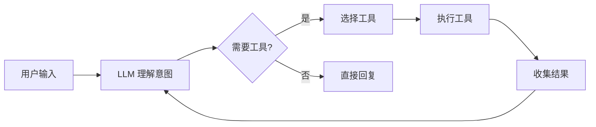

# ALICE CLI - 产品需求文档 (PRD)

## 📋 文档信息

| 项目 | 信息 |
|------|------|
| **产品名称** | ALICE CLI |
| **产品版本** | v0.3.0 |
| **文档版本** | v1.0.0 |
| **创建日期** | 2026-02-11 |
| **最后更新** | 2026-02-14 |
| **文档状态** | 发布 |
| **作者** | Anders |

## 🎯 产品概述

### 产品定位

ALICE (AI-powered Local Interactive Command Environment) 是一款**基于大语言模型的智能办公助手命令行工具**，旨在为办公职员和知识工作者提供一个高效、智能、易用的 AI 工作伙伴。

> **核心理念**: "让每个办公室职员都拥有自己的AI助手"

### 愿景与使命

**愿景**: 成为办公职员首选的 AI 助手工具，重新定义人机协作方式。

**使命**: 
- 降低 AI 使用门槛，让非技术人员也能享受 AI 带来的效率提升
- 提供隐私安全的本地 AI 解决方案
- 打造智能化的知识管理和办公自动化平台

### 核心价值主张

| 价值点 | 说明 | 优势 |
|--------|------|------|
| 🎯 **易用性** | 自然语言交互，零学习成本 | 降低使用门槛 |
| 🔒 **隐私性** | 支持本地模型部署 | 保护企业数据安全 |
| ⚡ **高效性** | 智能工具调用，自动化任务 | 提升工作效率 |
| 🎨 **体验性** | 优雅的视觉设计，流畅的交互 | 愉悦的使用体验 |
| 🔄 **可靠性** | 智能降级机制，多后端支持 | 保障服务可用性 |

## 🎭 目标用户

### 用户画像

#### 主要用户群体

| 用户类型 | 职业特征 | 典型场景 | 核心需求 |
|---------|---------|---------|---------|
| **办公白领** | 行政、人事、财务 | 文档处理、数据统计 | 重复性工作自动化 |
| **知识工作者** | 研究员、分析师 | 信息管理、笔记整理 | 知识管理与检索 |
| **产品运营** | 产品经理、运营 | 需求整理、数据分析 | 快速生成文档 |
| **市场销售** | 市场、销售 | 客户管理、邮件撰写 | 沟通效率提升 |

#### 用户特征

- **技术水平**: 非技术背景，不熟悉编程
- **工作环境**: 办公室、远程办公
- **设备**: Windows/macOS 电脑
- **痛点**: 信息过载、重复工作多、效率低

### 用户需求分析

#### 核心需求

1. **信息管理需求**
   - 快速查找和整理大量文档
   - 自动生成知识图谱
   - 智能搜索和总结

2. **办公自动化需求**
   - 自动生成会议纪要
   - 快速撰写邮件和报告
   - 数据分析和可视化

3. **学习成本需求**
   - 自然语言交互
   - 无需学习复杂命令
   - 友好的错误提示

4. **隐私安全需求**
   - 本地模型部署选项
   - 数据不上传云端
   - 企业级安全保障

## 💡 核心功能

### 功能架构图

```
ALICE CLI
├── 知识管理模块
│   ├── Obsidian 笔记集成
│   ├── 知识图谱生成
│   └── 智能搜索总结
├── 文档处理模块
│   ├── Word/PDF 解析
│   ├── Excel 数据分析
│   └── 格式转换
├── 办公自动化模块
│   ├── 邮件草稿生成
│   ├── 会议纪要整理
│   └── 报告自动生成
└── 工具系统
    ├── 文件操作工具
    ├── 系统信息工具
    └── 命令执行工具
```

### 详细功能列表

#### 1. [[知识管理模块]] 🧠

**优先级**: P0

| 功能点 | 说明 | 状态 | 版本 |
|--------|------|------|------|
| 笔记整理 | Obsidian 笔记自动分类和标签 | 🔄 规划中 | v0.3.0 |
| 知识图谱 | 自动生成笔记关系图 | 🔄 规划中 | v0.3.0 |
| 智能搜索 | 语义搜索笔记内容 | 🔄 规划中 | v0.4.0 |
| 内容总结 | 长文档智能摘要 | 🔄 规划中 | v0.4.0 |

**用户价值**: 帮助用户高效管理和检索知识，提升信息利用率。

**使用场景**:
```
用户: "整理我这个月所有关于产品设计的笔记"
ALICE: 
1. 扫描 Obsidian 笔记库
2. 识别相关笔记
3. 生成分类和摘要
4. 更新知识图谱
```

#### 2. [[文档处理模块]] 📄

**优先级**: P1

| 功能点 | 说明 | 状态 | 版本 |
|--------|------|------|------|
| 文档读取 | 支持 Word/PDF/Excel 解析 | 🔄 规划中 | v0.3.0 |
| 内容提取 | 提取关键信息和数据 | 🔄 规划中 | v0.3.0 |
| 格式转换 | Markdown/HTML/PDF 互转 | 🔄 规划中 | v0.4.0 |
| 数据分析 | Excel 数据统计和可视化 | 🔄 规划中 | v0.5.0 |

**用户价值**: 减少手动处理文档的时间，自动化数据分析。

**使用场景**:
```
用户: "分析这个 Excel 表格，告诉我销售趋势"
ALICE:
1. 读取 Excel 文件
2. 解析数据结构
3. 进行趋势分析
4. 生成可视化图表
5. 提供文字总结
```

#### 3. [[办公自动化模块]] 🤖

**优先级**: P0

| 功能点 | 说明 | 状态 | 版本 |
|--------|------|------|------|
| 邮件助手 | 根据要点生成邮件 | 🔄 规划中 | v0.3.0 |
| 会议纪要 | 自动整理会议要点 | 🔄 规划中 | v0.3.0 |
| 报告生成 | 基于模板生成周报月报 | 🔄 规划中 | v0.4.0 |
| 任务提取 | 从文本中提取待办事项 | 🔄 规划中 | v0.4.0 |

**用户价值**: 自动化重复性工作，释放创造力。

**使用场景**:
```
用户: "根据这个会议记录，生成待办事项列表"
ALICE:
1. 分析会议记录
2. 识别行动项
3. 提取责任人和截止日期
4. 生成结构化清单
5. 可选：创建日历事件
```

#### 4. [[工具系统]] 🛠️

**优先级**: P0 (核心基础)

| 工具名称 | 功能 | 状态 | 参数 |
|---------|------|------|------|
| `readFile` | 读取文件内容 | ✅ 已实现 | `filePath` |
| `listFiles` | 列出目录文件 | ✅ 已实现 | `directoryPath` |
| `searchFiles` | 搜索文件 (glob) | ✅ 已实现 | `pattern` |
| `getCurrentDirectory` | 获取当前目录 | ✅ 已实现 | 无 |
| `getGitInfo` | Git 仓库信息 | ✅ 已实现 | 无 |
| `getCurrentDateTime` | 获取时间 | ✅ 已实现 | 无 |
| `executeCommand` | 执行系统命令 | ✅ 已实现 | `command` |

**用户价值**: 提供 AI 自主操作系统的能力，实现真正的智能助手。

**Function Calling 工作流程**:


## 🏗️ 技术架构

### [[技术架构|技术架构详情]]

#### 技术栈选型

| 层级 | 技术选型 | 理由 |
|------|---------|------|
| **运行时** | Node.js ≥18 | 跨平台、生态丰富 |
| **语言** | TypeScript (ESM) | 类型安全、现代化 |
| **UI 框架** | Ink (React for CLI) | 声明式、组件化 |
| **HTTP** | Axios | 成熟稳定、拦截器 |
| **终端美化** | chalk, figlet | 视觉体验增强 |
| **工具库** | glob, ajv, jsonc-parser | 功能完善 |

#### 系统架构

```
┌─────────────────────────────────────────┐
│          用户界面层 (Ink React)          │
│  ┌────────┬────────┬────────┬────────┐  │
│  │ Banner │ Header │ChatArea│InputBox│  │
│  └────────┴────────┴────────┴────────┘  │
└─────────────────┬───────────────────────┘
                  │
┌─────────────────▼───────────────────────┐
│            核心逻辑层                     │
│  ┌──────────┐  ┌──────────┐             │
│  │LLMClient │  │ToolExecutor│            │
│  │  (降级)  │  │  (FC)    │             │
│  └─────┬────┘  └────┬─────┘             │
└────────┼────────────┼───────────────────┘
         │            │
┌────────▼────────┐   │
│  Provider层     │   │
│ ┌──────────────┐│   │
│ │OpenAI Compat ││   │
│ └──────────────┘│   │
└────────┬────────┘   │
         │            │
┌────────▼────────┐ ┌─▼────────────┐
│  LLM 后端       │ │  工具注册表   │
│ ┌─────────────┐ │ │ ┌──────────┐ │
│ │LM Studio    │ │ │ │7个内置   │ │
│ │Ollama       │ │ │ │工具      │ │
│ │OpenAI       │ │ │ └──────────┘ │
│ └─────────────┘ │ └──────────────┘
└─────────────────┘
```

### 数据流设计

#### 对话流程

```
1. 用户输入 → InputBox
2. InputBox → App (state update)
3. App → LLMClient.chat()
4. LLMClient → Provider.createChatCompletion()
5. Provider → LLM 后端 (streaming)
6. LLM 响应 (SSE) → Provider
7. Provider → LLMClient (逐字解析)
8. LLMClient → App (state update)
9. App → ChatArea (渲染)
```

#### Function Calling 流程

```
1. LLM 返回 tool_calls
2. App → ToolExecutor.execute()
3. ToolExecutor → 查找工具
4. 危险命令? → 用户确认
5. 执行工具 → 收集结果
6. 结果 → LLMClient (追加消息)
7. LLMClient → LLM (继续对话)
8. 最终响应 → 用户
```

## 🎨 [[UI设计规范|交互设计]]

### 视觉设计语言

#### 配色方案

| 用途 | 颜色 | Hex | 说明 |
|------|------|-----|------|
| **主色调** | 科技蓝 | `#00D9FF` | Logo、强调元素 |
| **渐变色** | 青紫渐变 | `#B030FF → #00D9FF` | Banner、标题 |
| **成功色** | 绿色 | `#00FF00` | 成功提示 |
| **警告色** | 黄色 | `#FFFF00` | 警告信息 |
| **错误色** | 红色 | `#FF0000` | 错误提示 |
| **文本色** | 白色 | `#FFFFFF` | 主要文本 |
| **次要色** | 灰色 | `#808080` | 次要信息 |

#### 字体规范

```
标题: Figlet ASCII Art (ANSI Shadow)
正文: 终端默认字体
代码: 等宽字体
强调: 粗体 (chalk.bold)
```

### 界面布局

```
┌───────────────────────────────────────────┐
│ Header: 工作区 | 模型: xxx | Token: xxx   │ ← 顶部信息栏
├───────────────────────────────────────────┤
│                                           │
│  ChatArea: 对话历史                        │
│  ┌─────────────────────────────────────┐ │
│  │ User: 你好                           │ │
│  │ Alice: 你好！我是 ALICE...           │ │
│  │ [🔧 执行工具] 正在读取文件...         │ │
│  │ Alice: 文件内容是...                 │ │
│  └─────────────────────────────────────┘ │
│                                           │
├───────────────────────────────────────────┤
│ > 输入您的问题...                  ⬆️⬇️ 历史│ ← 输入框
├───────────────────────────────────────────┤
│ 状态: 已连接 | /help 查看命令             │ ← 状态栏
└───────────────────────────────────────────┘
```

### 交互规范

#### 键盘操作

| 按键 | 功能 |
|------|------|
| `Enter` | 发送消息 |
| `Ctrl+C` | 退出程序 |
| `↑` | 上一条历史 |
| `↓` | 下一条历史 |
| `Tab` | 自动补全 (规划中) |

#### 状态反馈

| 状态 | 图标 | 颜色 | 说明 |
|------|------|------|------|
| 加载中 | `⏳` | 黄色 | 正在执行 |
| 成功 | `✅` | 绿色 | 执行成功 |
| 失败 | `❌` | 红色 | 执行失败 |
| 警告 | `⚠️` | 黄色 | 需要注意 |
| 信息 | `ℹ️` | 蓝色 | 提示信息 |

### Banner 设计

详见：[[CLI Banner 设计方案]]

**动画风格**:
- ✅ 极简动画 (推荐)
- 赛博朋克
- 粒子聚合
- 打字机效果

## 📊 产品指标

### 关键指标 (KPI)

#### 性能指标

| 指标 | 目标值 | 当前值 | 优先级 |
|------|--------|--------|--------|
| 启动时间 | <1.5s | ~1.2s | P0 |
| 首次响应 | <2s | ~1.8s | P0 |
| 内存占用 | <100MB | ~60MB | P1 |
| 二进制大小 | <100MB | ~80MB | P2 |

#### 体验指标

| 指标 | 目标 | 测量方式 |
|------|------|---------|
| 工具调用成功率 | >95% | 日志统计 |
| 对话流畅度 | >4.5/5 | 用户反馈 |
| 降级成功率 | >99% | 监控数据 |
| UI 响应速度 | <100ms | 性能测试 |

#### 业务指标

| 指标 | 定义 | 目标 |
|------|------|------|
| DAU | 日活跃用户数 | 1000+ (3个月) |
| 平均会话时长 | 单次使用时长 | >10min |
| 功能使用率 | 工具调用频次 | >5次/会话 |
| 留存率 | 7日留存 | >40% |

### 成功标准

#### MVP 成功标准 (v0.2.0)

- ✅ 基础对话功能稳定运行
- ✅ 支持至少 3 种 LLM 后端
- ✅ Function Calling 可用
- ✅ UI 视觉体验良好
- ✅ 智能降级机制有效

#### v0.3.0 成功标准

- [ ] 知识管理模块可用
- [ ] 文档处理基础功能
- [ ] 用户反馈平均 4+ 分
- [ ] Bug 数量 <10

#### v0.4.0 成功标准

- [ ] 办公自动化核心功能
- [ ] 数据分析能力
- [ ] 插件系统框架
- [ ] DAU >500

## 🗺️ 开发路线图

### 版本规划

#### ✅ v0.1.0 - 基础框架 (已完成)

**发布日期**: 2026-01
**状态**: ✅ 已完成

- [x] 项目初始化
- [x] Ink UI 框架搭建
- [x] LLM API 集成
- [x] 基础对话功能

#### ✅ v0.2.0 - 工具系统 (已完成)

**发布日期**: 2026-02-10
**状态**: ✅ 已发布

- [x] Function Calling 架构
- [x] 7 个内置工具
- [x] 多后端支持
- [x] 智能降级机制
- [x] 配置管理 (JSONC)
- [x] 模型测速工具
- [x] Banner 动画系统
- [x] 危险命令确认

#### 🔄 v0.3.0 - 技能与MCP (当前版本)

**状态**: 🔄 开发中

已完成:
- [x] Skills 技能系统（三阶段渐进式加载）
- [x] MCP (Model Context Protocol) 支持
- [x] 组件化 UI（5 个可复用组件）
- [x] 流式输出优化（空行压缩、表格渲染、Think内容区分）
- [x] UI 闪烁修复（Static Header、React表格组件）
- [x] 聊天标签优化（内联显示）

规划中:
- [ ] Obsidian 笔记集成
- [ ] 知识图谱生成
- [ ] 文档读取 (Word/PDF)
- [ ] 邮件助手
- [ ] 会议纪要整理

#### 📋 v0.4.0 - 数据分析

**计划日期**: 2026-04
**状态**: 📋 规划中

- [ ] Excel 数据分析
- [ ] 可视化图表生成
- [ ] 报告自动生成
- [ ] 智能搜索
- [ ] 内容总结

#### 🚀 v0.5.0 - 高级功能

**计划日期**: 2026-05
**状态**: 🚀 未来规划

- [ ] 插件系统
- [ ] Web UI Dashboard
- [ ] 团队协作
- [ ] 工作流引擎
- [ ] 企业知识库

### 迭代策略

**两周一迭代**:
- Week 1: 功能开发 + 测试
- Week 2: Bug 修复 + 优化 + 发布

**发布节奏**:
- 主版本 (x.0.0): 3-4 个月
- 次版本 (0.x.0): 1 个月
- 修订版 (0.0.x): 按需发布

## 🔐 安全与隐私

### 数据安全

| 安全措施 | 说明 | 优先级 |
|---------|------|--------|
| **本地部署** | 支持本地 LLM，数据不出网 | P0 |
| **环境变量** | API Key 存储在环境变量 | P0 |
| **危险命令** | 执行前需用户确认 | P0 |
| **会话加密** | 会话文件加密存储 (规划) | P1 |
| **权限控制** | 工具执行权限限制 (规划) | P1 |

### 隐私保护

- ✅ 本地会话存储，不上传云端
- ✅ 支持完全离线模式 (LM Studio/Ollama)
- 🔄 敏感信息自动脱敏 (规划中)
- 🔄 用户数据导出/删除 (规划中)

## 📈 运营策略

### 用户获取

#### 渠道策略

| 渠道 | 策略 | 目标 |
|------|------|------|
| **GitHub** | 开源项目推广 | Star >1000 |
| **技术社区** | 知乎、掘金文章 | 阅读量 >10k |
| **社交媒体** | Twitter、微信公众号 | 关注 >5000 |
| **线下活动** | 技术分享会 | 触达 >500 人 |

#### 内容策略

- 📝 产品使用教程
- 🎥 视频演示
- 📊 性能对比测试
- 💡 最佳实践分享

### 用户留存

#### 激励机制

- 🏆 完成首次对话奖励
- 📚 使用指南闯关
- 🎁 功能解锁成就系统
- 👥 社区贡献者认证

#### 反馈机制

- 📮 GitHub Issues
- 💬 Discord 社区
- 📧 邮件反馈
- 📊 使用数据分析

## 🤝 商业化思路

### 免费版 (开源)

- ✅ 核心功能全部开放
- ✅ 本地模型支持
- ✅ 基础工具系统
- ✅ 社区支持

### 企业版 (计划)

- 🔐 企业知识库集成
- 👥 团队协作功能
- 📊 使用数据分析
- 🛡️ 安全审计
- 🆘 专业技术支持

### 云服务版 (未来)

- ☁️ 托管服务
- 🚀 高性能模型
- 💾 云端存储
- 🔄 自动同步

## 📚 相关文档

### 内部文档链接

- [[技术架构]] - 详细技术设计
- [[知识管理模块]] - 功能详细设计
- [[文档处理模块]] - 模块设计
- [[办公自动化模块]] - 自动化方案
- [[工具系统]] - Function Calling 设计
- [[配置管理]] - 配置系统说明
- [[UI设计规范]] - 界面设计标准

### 外部参考

- [Ink 文档](https://github.com/vadimdemedes/ink)
- [LM Studio](https://lmstudio.ai/)
- [Ollama](https://ollama.ai/)
- [OpenAI API](https://platform.openai.com/docs)

## 📝 变更记录

| 版本 | 日期 | 变更内容 | 作者 |
|------|------|---------|------|
| 1.0.0 | 2026-02-11 | 初始版本，完整 PRD | Anders |
| 1.1.0 | 2026-02-14 | 更新至 v0.3.0，添加 Skills/MCP/UI优化 | Anders |

---

## 📮 联系方式

- **项目地址**: [https://github.com/AndersHsueh/Alice](https://github.com/AndersHsueh/Alice)
- **问题反馈**: [GitHub Issues](https://github.com/AndersHsueh/Alice/issues)
- **作者**: Anders

---

<div align="center">

**ALICE CLI - 让每个办公室职员都拥有自己的AI助手**

Made with ❤️ by Anders

</div>
