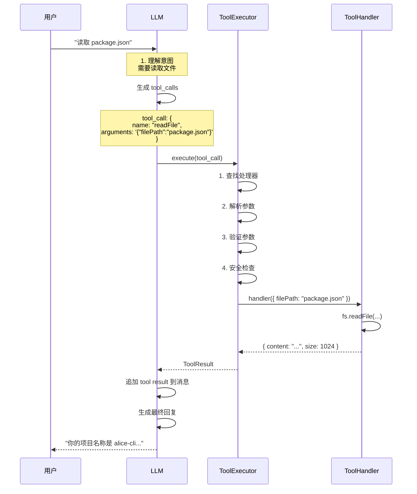

# 工具系统 (Function Calling) 🛠️

> **设计理念**: 赋予 AI 自主操作能力，从对话助手进化为行动助手

## 📋 系统概述

### 什么是 Function Calling?

Function Calling (函数调用) 是 AI 大语言模型的一项高级能力，允许模型：

1. **理解用户意图** - 识别何时需要外部工具
2. **选择合适工具** - 从工具库中选择最匹配的工具
3. **生成调用参数** - 自动提取和格式化参数
4. **处理返回结果** - 整合工具输出到对话中

### 核心价值

| 价值点 | 说明 | 示例 |
|--------|------|------|
| 🎯 **自主性** | AI 自己决定何时使用工具 | 用户问"几点了"，AI 自动调用 `getCurrentDateTime` |
| 🔧 **能力扩展** | 突破纯文本限制 | 读文件、执行命令、查询数据库 |
| 🚀 **效率提升** | 一次对话完成多步操作 | "分析这个文件并生成报告" |
| 🛡️ **可控性** | 工具执行可见、可审计 | 显示工具调用状态和结果 |

## 🎨 架构设计

### 整体架构

```
┌─────────────────────────────────────────────┐
│              LLM (大语言模型)                 │
│                                             │
│  ┌─────────────────────────────────────┐   │
│  │  理解用户意图                        │   │
│  │  ↓                                   │   │
│  │  选择工具: readFile                  │   │
│  │  ↓                                   │   │
│  │  生成参数: { filePath: "pkg.json" } │   │
│  └───────────────────┬─────────────────┘   │
└────────────────────────┼───────────────────┘
                         │ tool_calls
                         │
┌────────────────────────▼───────────────────┐
│           ToolExecutor (工具执行器)        │
│                                             │
│  1. 接收 tool_calls                         │
│  2. 查找工具处理器                          │
│  3. 验证参数                                │
│  4. 安全检查 (危险命令?)                    │
│  5. 执行工具                                │
│  6. 收集结果                                │
│  └───────────────────┬─────────────────────┘
                       │ ToolResult[]
                       │
┌──────────────────────▼─────────────────────┐
│          Tool Registry (工具注册表)        │
│                                             │
│  ┌──────────┐  ┌──────────┐  ┌──────────┐ │
│  │readFile  │  │listFiles │  │searchFiles│ │
│  └──────────┘  └──────────┘  └──────────┘ │
│  ┌──────────┐  ┌──────────┐  ┌──────────┐ │
│  │getCurDir │  │getGitInfo│  │getDateTime│ │
│  └──────────┘  └──────────┘  └──────────┘ │
│  ┌──────────┐                              │
│  │execCmd   │  ...更多工具                 │
│  └──────────┘                              │
└─────────────────────────────────────────────┘
```

### 核心组件

#### 1. ToolDefinition (工具定义)

```typescript
interface ToolDefinition {
  type: 'function';
  function: FunctionSchema;
}

interface FunctionSchema {
  name: string;                    // 工具名称
  description: string;             // 功能描述 (供 LLM 理解)
  parameters: JSONSchema;          // 参数 Schema
}

// 示例
const readFileTool: ToolDefinition = {
  type: 'function',
  function: {
    name: 'readFile',
    description: '读取文件内容。支持相对路径和绝对路径。',
    parameters: {
      type: 'object',
      properties: {
        filePath: {
          type: 'string',
          description: '要读取的文件路径'
        }
      },
      required: ['filePath']
    }
  }
};
```

#### 2. ToolHandler (工具处理器)

```typescript
type ToolHandler<T = any, R = any> = (params: T) => Promise<R>;

// 示例
const readFileHandler: ToolHandler = async (params: { filePath: string }) => {
  const { filePath } = params;
  
  // 安全检查
  if (!isPathSafe(filePath)) {
    throw new Error('路径不安全');
  }
  
  // 执行
  const content = await fs.readFile(filePath, 'utf-8');
  
  // 返回
  return {
    filePath,
    content,
    size: content.length,
    encoding: 'utf-8'
  };
};
```

#### 3. ToolExecutor (工具执行器)

```typescript
export class ToolExecutor {
  private registry: Map<string, ToolHandler> = new Map();
  private schemas: Map<string, FunctionSchema> = new Map();
  
  // 注册工具
  register(schema: FunctionSchema, handler: ToolHandler) {
    this.schemas.set(schema.name, schema);
    this.registry.set(schema.name, handler);
  }
  
  // 执行工具
  async execute(toolCall: ToolCall): Promise<ToolResult> {
    const { function: func } = toolCall;
    
    // 1. 查找处理器
    const handler = this.registry.get(func.name);
    if (!handler) {
      return {
        success: false,
        error: `工具 ${func.name} 未注册`
      };
    }
    
    try {
      // 2. 解析参数
      const params = JSON.parse(func.arguments);
      
      // 3. 参数验证
      this.validateParams(func.name, params);
      
      // 4. 安全检查
      if (func.name === 'executeCommand') {
        const confirmed = await this.confirmDangerous(params.command);
        if (!confirmed) {
          return {
            success: false,
            error: '用户取消执行'
          };
        }
      }
      
      // 5. 执行
      const result = await handler(params);
      
      // 6. 返回
      return {
        success: true,
        data: result
      };
    } catch (error) {
      return {
        success: false,
        error: error.message
      };
    }
  }
  
  // 获取所有工具定义 (供 LLM 使用)
  getToolDefinitions(): ToolDefinition[] {
    return Array.from(this.schemas.values()).map(schema => ({
      type: 'function',
      function: schema
    }));
  }
}
```

## 🔧 内置工具清单

### 1. readFile - 读取文件

**功能**: 读取文件内容

**参数**:
```typescript
{
  filePath: string  // 文件路径 (相对或绝对)
}
```

**返回**:
```typescript
{
  filePath: string,
  content: string,
  size: number,       // 字节数
  encoding: string    // 编码
}
```

**示例**:
```
用户: "读取 package.json 的内容"
工具调用: readFile({ filePath: "package.json" })
返回: { content: "{\n  \"name\": \"alice-cli\"...", size: 1024 }
AI 回复: "你的项目名称是 alice-cli，版本 0.2.0..."
```

### 2. listFiles - 列出目录文件

**功能**: 列出指定目录下的文件和子目录

**参数**:
```typescript
{
  directoryPath: string,  // 目录路径
  recursive?: boolean     // 是否递归 (默认 false)
}
```

**返回**:
```typescript
{
  path: string,
  files: string[],       // 文件列表
  directories: string[], // 目录列表
  total: number
}
```

**示例**:
```
用户: "src 目录下有哪些文件?"
工具调用: listFiles({ directoryPath: "src" })
返回: { files: ["index.tsx", "app.tsx"], directories: ["cli", "core"] }
AI 回复: "src 目录包含 2 个文件和 2 个子目录..."
```

### 3. searchFiles - 搜索文件

**功能**: 使用 glob 模式搜索文件

**参数**:
```typescript
{
  pattern: string,       // glob 模式
  baseDir?: string      // 基础目录 (默认当前目录)
}
```

**返回**:
```typescript
{
  pattern: string,
  matches: string[],    // 匹配的文件
  count: number
}
```

**示例**:
```
用户: "找出所有 TypeScript 文件"
工具调用: searchFiles({ pattern: "**/*.ts" })
返回: { matches: ["src/index.ts", "src/app.ts"...], count: 25 }
AI 回复: "找到 25 个 TypeScript 文件，主要分布在..."
```

### 4. getCurrentDirectory - 获取当前目录

**功能**: 获取当前工作目录

**参数**: 无

**返回**:
```typescript
{
  path: string,          // 当前目录路径
  basename: string       // 目录名
}
```

**示例**:
```
用户: "当前在哪个目录?"
工具调用: getCurrentDirectory()
返回: { path: "/home/user/alice-cli", basename: "alice-cli" }
AI 回复: "你当前在 alice-cli 目录"
```

### 5. getGitInfo - 获取 Git 信息

**功能**: 查看当前 Git 仓库信息

**参数**: 无

**返回**:
```typescript
{
  isRepo: boolean,       // 是否是 Git 仓库
  branch: string,        // 当前分支
  commit: string,        // 最新提交 SHA
  remote: string,        // 远程仓库 URL
  status: {
    modified: string[],  // 修改的文件
    added: string[],     // 新增的文件
    deleted: string[]    // 删除的文件
  }
}
```

**示例**:
```
用户: "查看 Git 状态"
工具调用: getGitInfo()
返回: { branch: "main", modified: ["src/app.tsx"], ... }
AI 回复: "当前分支 main，有 1 个文件被修改..."
```

### 6. getCurrentDateTime - 获取当前时间

**功能**: 获取当前日期和时间

**参数**: 无

**返回**:
```typescript
{
  datetime: string,      // ISO 8601 格式
  timestamp: number,     // Unix 时间戳
  timezone: string,      // 时区
  formatted: {
    date: string,        // "2026-02-11"
    time: string,        // "14:30:00"
    full: string         // "2026-02-11 14:30:00"
  }
}
```

**示例**:
```
用户: "现在几点了?"
工具调用: getCurrentDateTime()
返回: { formatted: { full: "2026-02-11 14:30:00" } }
AI 回复: "现在是 2026 年 2 月 11 日 14:30"
```

### 7. executeCommand - 执行系统命令

**功能**: 执行 Shell 命令 (需用户确认)

**参数**:
```typescript
{
  command: string,       // 要执行的命令
  cwd?: string          // 工作目录 (可选)
}
```

**返回**:
```typescript
{
  command: string,
  stdout: string,        // 标准输出
  stderr: string,        // 标准错误
  exitCode: number,      // 退出码
  success: boolean
}
```

**示例**:
```
用户: "运行测试"
工具调用: executeCommand({ command: "npm test" })

[⚠️ 危险命令确认]
命令: npm test
确认执行? (y/N): y

返回: { stdout: "All tests passed", exitCode: 0 }
AI 回复: "测试全部通过!"
```

## 🔄 工作流程

### 完整调用流程



### 多工具调用流程

```
用户: "分析这个项目的结构"

LLM 分析:
1. 需要获取当前目录
2. 需要列出文件
3. 需要读取 package.json

生成 3 个 tool_calls:
- getCurrentDirectory()
- listFiles({ directoryPath: "." })
- readFile({ filePath: "package.json" })

顺序执行:
[工具 1] getCurrentDirectory → { path: "/home/user/alice" }
[工具 2] listFiles → { files: [...], directories: [...] }
[工具 3] readFile → { content: "..." }

LLM 综合结果:
"这是一个 Node.js 项目，主要使用 TypeScript..."
```

## 🛡️ 安全机制

### 1. 危险命令检测

```typescript
const DANGEROUS_PATTERNS = [
  /rm\s+-rf/,              // 强制删除
  /sudo/,                  // 提权
  /chmod\s+777/,           // 权限修改
  />.*\/dev\/sd[a-z]/,     // 磁盘操作
  /mkfs/,                  // 格式化
  /dd\s+if=/,              // 磁盘写入
  /shutdown/,              // 关机
  /reboot/,                // 重启
  /:\(\)\{.*\}/,           // Fork 炸弹
];

function isDangerousCommand(cmd: string): boolean {
  return DANGEROUS_PATTERNS.some(pattern => pattern.test(cmd));
}
```

### 2. 用户确认流程

```typescript
async function confirmDangerousCommand(command: string): Promise<boolean> {
  if (!config.dangerous_cmd) {
    return true;  // 配置禁用确认，直接执行
  }
  
  if (!isDangerousCommand(command)) {
    return true;  // 非危险命令，直接执行
  }
  
  // 显示确认对话框
  return await showConfirmDialog({
    title: '⚠️ 危险命令警告',
    message: `命令: ${command}\n确认执行?`,
    defaultValue: false
  });
}
```

### 3. 路径安全

```typescript
function isPathSafe(filePath: string): boolean {
  const resolved = path.resolve(filePath);
  const workspace = path.resolve(config.workspace);
  
  // 检查是否在工作区内
  if (!resolved.startsWith(workspace)) {
    throw new Error('不允许访问工作区外的文件');
  }
  
  // 检查是否是符号链接
  const stats = fs.lstatSync(resolved);
  if (stats.isSymbolicLink()) {
    throw new Error('不允许访问符号链接');
  }
  
  return true;
}
```

### 4. 参数验证

```typescript
class ToolExecutor {
  private validateParams(toolName: string, params: any) {
    const schema = this.schemas.get(toolName);
    if (!schema) return;
    
    // 使用 ajv 验证 JSON Schema
    const validate = ajv.compile(schema.parameters);
    const valid = validate(params);
    
    if (!valid) {
      throw new Error(`参数验证失败: ${ajv.errorsText(validate.errors)}`);
    }
  }
}
```

## 📊 状态展示

### UI 状态组件

```typescript
// ToolCallStatus.tsx
export const ToolCallStatus: React.FC<{ toolCall: ToolCall }> = ({ toolCall }) => {
  const [status, setStatus] = useState<'pending' | 'success' | 'error'>('pending');
  
  const icon = {
    pending: '⏳',
    success: '✅',
    error: '❌'
  }[status];
  
  const color = {
    pending: 'yellow',
    success: 'green',
    error: 'red'
  }[status];
  
  return (
    <Box>
      <Text color={color}>
        {icon} [{toolCall.function.name}] {getStatusText(status, toolCall)}
      </Text>
    </Box>
  );
};
```

### 状态文案

| 工具 | Pending | Success | Error |
|------|---------|---------|-------|
| readFile | 正在读取... | 文件读取成功 | 读取失败 |
| listFiles | 正在扫描... | 找到 N 个文件 | 扫描失败 |
| searchFiles | 正在搜索... | 找到 N 个匹配 | 搜索失败 |
| executeCommand | 正在执行... | 执行完成 | 执行失败 |

## 🔌 扩展工具

### 添加自定义工具

```typescript
// 1. 定义 Schema
const customToolSchema: FunctionSchema = {
  name: 'myCustomTool',
  description: '我的自定义工具',
  parameters: {
    type: 'object',
    properties: {
      param1: { type: 'string', description: '参数1' }
    },
    required: ['param1']
  }
};

// 2. 实现 Handler
const customToolHandler: ToolHandler = async (params: { param1: string }) => {
  // 实现逻辑
  return { result: 'success' };
};

// 3. 注册工具
toolExecutor.register(customToolSchema, customToolHandler);
```

### 工具插件系统 (规划)

```typescript
// 插件接口
interface ToolPlugin {
  name: string;
  version: string;
  tools: Array<{
    schema: FunctionSchema;
    handler: ToolHandler;
  }>;
  
  initialize?(): Promise<void>;
  cleanup?(): Promise<void>;
}

// 插件管理器
class ToolPluginManager {
  async loadPlugin(pluginPath: string) {
    const plugin = await import(pluginPath);
    
    // 注册所有工具
    for (const tool of plugin.tools) {
      toolExecutor.register(tool.schema, tool.handler);
    }
  }
}
```

## 📈 性能优化

### 1. 参数验证缓存

```typescript
class ToolExecutor {
  private validatorCache = new Map<string, ValidateFunction>();
  
  private getValidator(toolName: string): ValidateFunction {
    if (!this.validatorCache.has(toolName)) {
      const schema = this.schemas.get(toolName);
      const validator = ajv.compile(schema.parameters);
      this.validatorCache.set(toolName, validator);
    }
    return this.validatorCache.get(toolName)!;
  }
}
```

### 2. 并行执行 (未来)

```typescript
// 当多个工具调用独立时，可并行执行
async executeParallel(toolCalls: ToolCall[]): Promise<ToolResult[]> {
  return await Promise.all(
    toolCalls.map(call => this.execute(call))
  );
}
```

## 📚 最佳实践

### 工具设计原则

1. **单一职责** - 每个工具只做一件事
2. **清晰命名** - 使用动词开头，如 readFile, listFiles
3. **详细描述** - description 要清晰，帮助 LLM 理解
4. **参数验证** - 使用 JSON Schema 严格验证
5. **错误处理** - 提供友好的错误信息
6. **幂等性** - 相同输入产生相同输出

### Schema 编写技巧

```typescript
// ✅ 好的 Schema
{
  name: 'searchFiles',
  description: '使用 glob 模式搜索文件。例如: **/*.ts 匹配所有 TypeScript 文件',
  parameters: {
    type: 'object',
    properties: {
      pattern: {
        type: 'string',
        description: 'glob 模式，如 **/*.js, src/**/*.tsx'
      }
    },
    required: ['pattern']
  }
}

// ❌ 不好的 Schema
{
  name: 'search',  // 太模糊
  description: '搜索',  // 描述不清
  parameters: {
    type: 'object',
    properties: {
      p: { type: 'string' }  // 参数名不清晰
    }
  }
}
```

## 🗺️ 未来规划

### v0.3.0
- [ ] 文档处理工具 (Word, PDF, Excel)
- [ ] Obsidian 笔记工具
- [ ] 数据库查询工具

### v0.4.0
- [ ] 网络请求工具 (HTTP API 调用)
- [ ] 邮件工具 (发送/接收)
- [ ] 日历工具 (事件管理)

### v0.5.0
- [ ] 工具插件系统
- [ ] 工具市场
- [ ] 工具使用统计

---

**[[产品需求文档|返回 PRD 主页]]** | **[[技术架构|技术架构详情]]**
