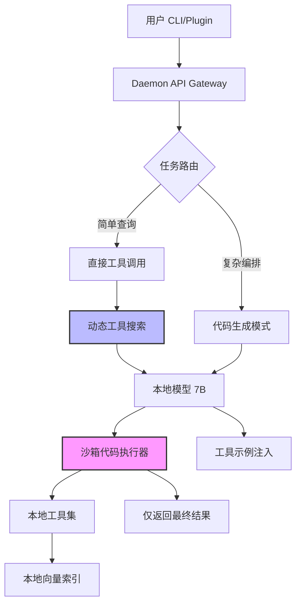

# Alice 核心升级方案：工程驱动的 Agent 优化

> **来源参考**：Anthropic Claude Developer Platform 高级工具使用指南  
> **核心目标**：在不依赖大模型训练的前提下，通过工程架构优化，使本地小模型（7B-14B）具备接近超大模型的工具编排与上下文处理能力。  
> **适用版本**：Alice Daemon v2.0+  
> **制定时间**：2026-01-XX

---

## 1. 背景与痛点

当前 Alice 项目已实现基础对话、MCP 调用及 Skills 三层加载。但在面对复杂任务时，仍面临以下瓶颈：
1.  **上下文受限**：本地模型上下文窗口小（32K-128K），全量加载工具定义消耗过大。
2.  **推理链脆弱**：自然语言工具调用在复杂逻辑（循环/条件）下易出错，中间结果堆积消耗 Token。
3.  **工具使用模糊**：JSON Schema 仅定义结构，无法传达“何时用”、“如何用”的隐性知识。

本方案基于 Anthropic 最新工程实践，结合 Alice Daemon 架构特性，提出三大核心升级点。

---

## 2. 核心升级点详解

### 2.1 动态工具发现 (Tool Search)

**原理**：不再预先加载所有 MCP/Tools 定义到 Prompt，而是基于用户意图动态搜索并加载相关工具。

| 维度 | 当前方案 | 升级方案 |
|------|----------|----------|
| **加载策略** | 全量加载 / 三层静态加载 | **向量检索 + 按需加载** |
| **Token 消耗** | 随工具数量线性增长 (易超限) | **固定开销 + 少量动态开销** |
| **模型聚焦** | 易被无关工具干扰 | **仅关注当前任务相关工具** |

**Alice 实现设计**：
```typescript
// daemon/src/tools/tool-searcher.ts
interface ToolRegistry {
  name: string;
  description: string; // 用于向量检索
  tags: string[];
  definitionPath: string; // 懒加载路径
}

class ToolSearcher {
  async findRelevantTools(userIntent: string, limit: number = 5): Promise<ToolDefinition[]> {
    // 1. 本地轻量向量索引 (MLX / Chroma) 检索
    const matches = await this.vectorIndex.search(userIntent, limit);
    
    // 2. 仅加载匹配工具的完整 Schema
    const definitions = await Promise.all(matches.map(m => this.loadDefinition(m.path)));
    
    // 3. 强制保留高频基础工具 (read_file, run_shell 等)
    const baseTools = await this.loadBaseTools();
    
    return [...baseTools, ...definitions];
  }
}
```

**预期收益**：
- Token 使用量减少 **85%**（参考 Anthropic 数据）。
- 工具调用准确率提升 **20%+**（减少噪声干扰）。

---

### 2.2 代码编排工具调用 (Programmatic Tool Calls)

**原理**：对于复杂任务，让模型生成**可执行代码**（Python/TS）来编排工具调用，而非通过自然语言多轮交互。代码在 Daemon 沙箱中执行，仅返回最终结果。

| 维度 | 当前方案 (自然语言编排) | 升级方案 (代码编排) |
|------|--------------------------|---------------------|
| **交互模式** | 模型 → 工具 → 结果 → 模型 (循环 N 次) | 模型 → 代码 → 沙箱执行 → 结果 (1 次) |
| **上下文消耗** | 中间结果全量进入上下文 (易爆炸) | **仅最终结果进入上下文** |
| **逻辑可靠性** | 依赖模型推理循环/条件 (易错) | **依赖代码执行逻辑 (确定性高)** |

**Alice 实现设计**：
```typescript
// daemon/src/orchestrator/code-executor.ts
class CodeExecutor {
  async executeOrchestrationCode(code: string, context: ExecutionContext): Promise<string> {
    // 1. 安全沙箱执行 (Restricted Python/Node VM)
    // 代码中可调用本地工具函数：tools.read_file(), tools.git_diff()
    const result = await this.sandbox.run(code, {
      tools: context.availableTools,
      fs: context.fsProxy
    });
    
    // 2. 只返回最终输出给模型，中间过程不消耗模型上下文
    return result.finalOutput; 
  }
}
```

**场景示例**：
- **任务**：「检查所有修改过的文件，找出包含 `TODO` 的行」
- **旧模式**：模型循环调用 `git diff` → `read_file` → 分析 → 重复 10 次。
- **新模式**：模型生成 Python 脚本遍历文件 → 沙箱执行 → 返回「3 个文件包含 TODO」。

**预期收益**：
- 复杂任务上下文消耗减少 **100 倍+** (200KB → 1KB)。
- 逻辑错误率大幅降低（代码逻辑优于自然语言推理）。

---

### 2.3 工具使用示例 (Tool Use Examples)

**原理**：在工具定义中加入 Few-Shot 示例，展示“何时用”、“参数如何组合”，弥补 JSON Schema 的语义缺失。

| 维度 | 当前方案 (仅 Schema) | 升级方案 (Schema + Examples) |
|------|----------------------|------------------------------|
| **信息量** | 仅结构有效性 (类型/必填) | **结构 + 语义模式 (约定/场景)** |
| **模型理解** | 需推理参数含义 | **直接模仿示例模式** |
| **准确性** | 复杂参数易出错 | **复杂参数准确率显著提升** |

**Alice 实现设计**：
```typescript
// packages/core/src/skills/types.ts
interface SkillDefinition {
  name: string;
  parameters: JSONSchema;
  
  // 新增：Few-shot 示例
  examples?: Array<{
    description: string;
    input: string;
    output: object; // 正确的工具调用参数
  }>;
  
  // 新增：返回格式文档 (帮助代码编排解析)
  returns?: {
    format: string;
    example: any;
  };
}
```

**预期收益**：
- 复杂工具调用准确率从 **72% 提升至 90%**（参考 Anthropic 数据）。
- 减少模型“幻觉”参数。

---

## 3. 架构演进图



---

## 4. 实施路线图 (Roadmap)

### Phase 1: 工具示例增强 (预计 1 周)
- [ ] 修改 `SkillDefinition` 接口，增加 `examples` 字段。
- [ ] 为核心工具 (`read_file`, `run_shell`, `git`) 编写 3-5 个高质量示例。
- [ ] 更新 Prompt 构建器，在检测到复杂任务时注入示例。
- **验收标准**：复杂参数工具调用错误率降低 50%。

### Phase 2: 动态工具搜索 (预计 2 周)
- [ ] 实现 `ToolSearcher` 模块，集成本地向量索引 (MLX/Chroma)。
- [ ] 修改 Skills 加载逻辑，支持懒加载工具定义。
- [ ] 保留 3-5 个高频工具始终加载，其余按需检索。
- **验收标准**：工具定义 Token 消耗减少 80%，支持加载 50+ MCP 工具。

### Phase 3: 代码编排沙箱 (预计 3 周)
- [ ] 集成 Python/Node 沙箱环境 (安全隔离)。
- [ ] 设计「代码模式」System Prompt，引导模型生成编排代码。
- [ ] 实现工具函数的沙箱绑定 (`tools.read_file` 等)。
- [ ] 实现执行结果过滤与摘要。
- **验收标准**：复杂任务（如「重构模块」）中间 Token 消耗减少 90%，执行成功率提升。

---

## 5. 关键配置示例

### 5.1 工具定义配置 (`~/.alice/tools/git.json`)
```json
{
  "name": "git_diff",
  "description": "获取指定文件的 git 差异内容",
  "parameters": {
    "type": "object",
    "properties": {
      "file": { "type": "string" },
      "staged": { "type": "boolean" }
    }
  },
  "examples": [
    {
      "description": "查看当前文件暂存区差异",
      "input": "查看我刚暂存的改动",
      "output": { "file": "current_file", "staged": true }
    }
  ],
  "returns": {
    "format": "Unified Diff String",
    "example": "@@ -1,3 +1,4 @@\n+ new line"
  }
}
```

### 5.2 Daemon 资源配置 (`~/.alice/daemon.conf`)
```json
{
  "toolSearch": {
    "enabled": true,
    "maxLoadedTools": 5,
    "vectorIndex": "~/.alice/index/tools.vec"
  },
  "codeExecution": {
    "enabled": true,
    "sandbox": "python-restricted",
    "timeout": 60000,
    "maxOutputTokens": 4096
  }
}
```

---

## 6. 成功度量指标 (Metrics)

| 指标 | 当前基准 | 目标值 | 测量方法 |
|------|----------|--------|----------|
| **工具调用准确率** | 75% | **90%+** | 单元测试 + 人工抽检 |
| **复杂任务 Token 消耗** | 50K/token | **5K/token** | Daemon 日志统计 |
| **任务完成时间** | 30s | **15s** | 端到端计时 |
| **支持工具数量** | 20 个 | **100+ 个** | 不增加上下文压力 |

---

## 7. 风险与应对

| 风险 | 影响 | 应对策略 |
|------|------|----------|
| **沙箱安全风险** | 恶意代码执行 | 使用严格受限的 VM/容器，禁止网络/文件系统越权访问 |
| **工具搜索不准** | 找不到 нуж工具 | 保留高频工具常驻 + 搜索失败时 fallback 到全量扫描 |
| **代码执行超时** | 任务卡死 | 设置严格 Timeout + 用户可中断机制 |
| **本地向量索引开销** | 启动变慢 | 增量更新索引 + 异步加载 |

---

## 8. 结语

> **核心理念**：模型只是引擎，工程才是方向盘。
> 
> 通过 **动态工具搜索** 解决上下文瓶颈，通过 **代码编排** 解决逻辑可靠性，通过 **工具示例** 解决语义歧义。
> 
> 这三点结合 Alice 的 **Daemon 常驻架构**，将使我们在不依赖超大模型的前提下，实现超越通用 CLI 工具的个人工作流体验。
> 
> **行动口号**：工程优化，小模型大作为。

---
*文档版本：v1.0 | 作者：Anders | 最后更新：2026-01-XX*