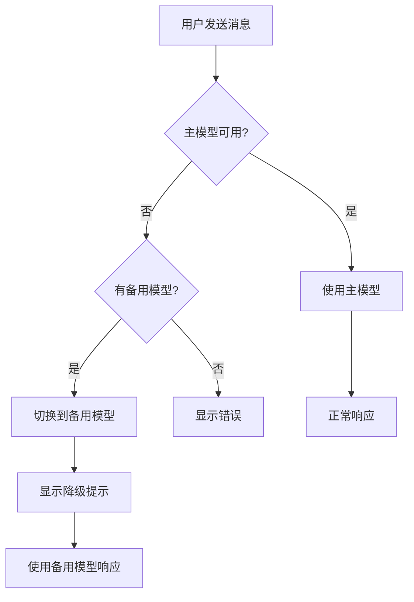

# 配置管理系统 ⚙️

> **设计理念**: 灵活配置、开箱即用、用户友好

## 📋 系统概述

### 配置文件位置

```
用户主目录
└── .alice/
    ├── settings.jsonc       # 主配置文件 (JSONC 格式)
    ├── system-prompt.txt    # 系统提示词
    └── sessions/            # 会话历史
        ├── session-uuid1.json
        └── session-uuid2.json
```

### 配置格式

使用 **JSONC** (JSON with Comments) 格式:
- ✅ 支持单行注释 `//`
- ✅ 支持多行注释 `/* */`
- ✅ 更易读、易维护
- ✅ 兼容标准 JSON

## 🎨 配置文件结构

### 完整配置示例

```jsonc
{
  // ========== 模型配置 ==========
  
  // 默认使用的模型
  "default_model": "lmstudio-local",
  
  // 系统推荐的最快模型 (由 --test-model 自动更新)
  "suggest_model": "lmstudio-local",
  
  // 模型列表配置
  "models": [
    {
      // 模型名称 (唯一标识)
      "name": "lmstudio-local",
      
      // 提供商类型: lmstudio | ollama | openai | azure | custom
      "provider": "lmstudio",
      
      // API 基础 URL
      "baseURL": "http://127.0.0.1:1234/v1",
      
      // 模型 ID (由提供商决定)
      "model": "qwen3-vl-4b-instruct",
      
      // API Key (可选，本地模型不需要)
      "apiKey": "",
      
      // 温度参数 (0.0 - 2.0，越高越随机)
      "temperature": 0.7,
      
      // 最大 Token 数
      "maxTokens": 2000,
      
      // 最后测速时间 (自动更新)
      "last_update_datetime": "2026-02-11T14:30:00.000Z",
      
      // 速度 (tokens/s，自动更新)
      "speed": 45.2
    },
    {
      "name": "ollama-local",
      "provider": "ollama",
      "baseURL": "http://localhost:11434/v1",
      "model": "qwen2.5:7b",
      "apiKey": "",
      "temperature": 0.7,
      "maxTokens": 2000,
      "last_update_datetime": null,
      "speed": null
    },
    {
      "name": "openai-gpt4",
      "provider": "openai",
      "baseURL": "https://api.openai.com/v1",
      "model": "gpt-4",
      
      // 使用环境变量 (推荐)
      "apiKey": "${OPENAI_API_KEY}",
      
      "temperature": 0.7,
      "maxTokens": 2000,
      "last_update_datetime": null,
      "speed": null
    },
    {
      "name": "azure-gpt4",
      "provider": "azure",
      "baseURL": "https://your-resource.openai.azure.com/openai/deployments/your-deployment",
      "model": "gpt-4",
      "apiKey": "${AZURE_OPENAI_KEY}",
      "temperature": 0.7,
      "maxTokens": 2000,
      "last_update_datetime": null,
      "speed": null
    }
  ],
  
  // ========== UI 配置 ==========
  
  "ui": {
    // Banner 动画配置
    "banner": {
      // 是否显示 Banner
      "enabled": true,
      
      // 动画风格: minimal | cyberpunk | particle | typewriter
      "style": "minimal"
    },
    
    // 主题: tech-blue | dark | light
    "theme": "tech-blue"
  },
  
  // ========== 工作区配置 ==========
  
  // 当前工作目录 (. 表示当前目录)
  "workspace": ".",
  
  // ========== 安全配置 ==========
  
  // 危险命令确认
  // true: 执行前需要用户确认 (推荐)
  // false: 直接执行，不需要确认
  "dangerous_cmd": true
}
```

## 📦 配置项详解

### 1. 模型配置

#### default_model

**类型**: `string`  
**必填**: 是  
**说明**: 默认使用的模型名称，必须在 `models` 数组中存在

**示例**:
```jsonc
"default_model": "lmstudio-local"
```

#### suggest_model

**类型**: `string`  
**必填**: 否  
**说明**: 系统推荐的最快模型，由 `--test-model` 自动更新

**用途**:
- 作为智能降级的备用模型
- 当 `default_model` 连接失败时自动切换

#### models

**类型**: `ModelConfig[]`  
**必填**: 是  
**说明**: 模型配置列表

**ModelConfig 字段**:

| 字段 | 类型 | 必填 | 说明 |
|------|------|------|------|
| `name` | string | ✅ | 模型名称 (唯一标识) |
| `provider` | Provider | ✅ | 提供商类型 |
| `baseURL` | string | ✅ | API 基础 URL |
| `model` | string | ✅ | 模型 ID |
| `apiKey` | string | ❌ | API Key |
| `temperature` | number | ❌ | 温度 (默认 0.7) |
| `maxTokens` | number | ❌ | 最大 Token (默认 2000) |
| `last_update_datetime` | string | ❌ | 最后测速时间 |
| `speed` | number | ❌ | 速度 (tokens/s) |

**Provider 类型**:
- `lmstudio` - LM Studio 本地服务
- `ollama` - Ollama 本地服务
- `openai` - OpenAI 云服务
- `azure` - Azure OpenAI 云服务
- `custom` - 自定义 OpenAI 兼容服务

### 2. UI 配置

#### banner

**类型**: `BannerConfig`  
**说明**: 启动 Banner 动画配置

```typescript
interface BannerConfig {
  enabled: boolean;    // 是否显示
  style: BannerStyle;  // 动画风格
}

type BannerStyle = 'minimal' | 'cyberpunk' | 'particle' | 'typewriter';
```

**动画风格**:
- `minimal` - 极简动画 (推荐，加载快)
- `cyberpunk` - 赛博朋克风格
- `particle` - 粒子聚合效果
- `typewriter` - 打字机效果

**示例**:
```jsonc
"banner": {
  "enabled": true,
  "style": "minimal"
}
```

**跳过 Banner**:
```bash
# 命令行参数优先级更高
alice --no-banner
```

#### theme

**类型**: `ThemeType`  
**说明**: 主题颜色方案

```typescript
type ThemeType = 'tech-blue' | 'dark' | 'light';
```

- `tech-blue` - 科技蓝主题 (默认)
- `dark` - 深色主题
- `light` - 浅色主题

### 3. 工作区配置

#### workspace

**类型**: `string`  
**默认**: `"."`  
**说明**: 当前工作目录，工具执行的基础路径

**用途**:
- 文件操作的根目录
- 路径安全检查的基准

**示例**:
```jsonc
// 使用当前目录
"workspace": "."

// 使用绝对路径
"workspace": "/home/user/projects/alice"

// 使用相对路径
"workspace": "../projects"
```

### 4. 安全配置

#### dangerous_cmd

**类型**: `boolean`  
**默认**: `true`  
**说明**: 是否对危险命令进行二次确认

**危险命令示例**:
- `rm -rf` - 强制删除
- `sudo` - 提权操作
- `chmod 777` - 修改权限
- `mkfs` - 格式化磁盘

**行为**:
- `true`: 执行前弹出确认对话框
- `false`: 直接执行 (不推荐)

## 🔐 环境变量

### 使用环境变量

配置文件支持环境变量替换，使用 `${VAR_NAME}` 语法:

```jsonc
{
  "models": [
    {
      "name": "openai-gpt4",
      "apiKey": "${OPENAI_API_KEY}"
    }
  ]
}
```

### 设置环境变量

**macOS / Linux**:
```bash
export OPENAI_API_KEY="sk-xxxxx"
export AZURE_OPENAI_KEY="xxxxx"
```

**Windows (PowerShell)**:
```powershell
$env:OPENAI_API_KEY="sk-xxxxx"
$env:AZURE_OPENAI_KEY="xxxxx"
```

**Windows (CMD)**:
```cmd
set OPENAI_API_KEY=sk-xxxxx
set AZURE_OPENAI_KEY=xxxxx
```

### 持久化环境变量

**macOS / Linux** (添加到 `~/.bashrc` 或 `~/.zshrc`):
```bash
echo 'export OPENAI_API_KEY="sk-xxxxx"' >> ~/.bashrc
source ~/.bashrc
```

**Windows** (系统环境变量):
1. 系统属性 → 环境变量
2. 新建用户变量
3. 变量名: `OPENAI_API_KEY`
4. 变量值: `sk-xxxxx`

## 🛠️ 配置管理

### 初始化配置

首次运行 ALICE 时自动创建默认配置:

```bash
alice
# 自动创建 ~/.alice/settings.jsonc
```

### 查看当前配置

```bash
# 在 ALICE 中执行
/config
```

### 编辑配置

**手动编辑**:
```bash
# macOS / Linux
nano ~/.alice/settings.jsonc

# Windows
notepad %USERPROFILE%\.alice\settings.jsonc
```

**使用 VS Code**:
```bash
code ~/.alice/settings.jsonc
```

### 验证配置

修改配置后，重启 ALICE 即可生效。如果配置有误，ALICE 会提示错误信息。

```bash
# 重启 ALICE
alice
```

## ⚡ 模型测速

### 测速命令

```bash
alice --test-model
```

### 测速过程

1. 读取 `models` 配置
2. 逐个测试每个模型
3. 发送测试消息，计算响应速度
4. 更新 `speed` 和 `last_update_datetime`
5. 自动设置最快模型为 `suggest_model`

### 测速输出

```
🧪 开始测试模型性能...

[1/3] 测试 lmstudio-local...
  ✅ 连接成功
  ⚡ 速度: 45.2 tokens/s

[2/3] 测试 ollama-local...
  ✅ 连接成功
  ⚡ 速度: 38.7 tokens/s

[3/3] 测试 openai-gpt4...
  ❌ 连接失败 (API Key 未设置)

📊 测速结果:
┌─────────────────┬──────────┬─────────────┐
│ 模型            │ 状态     │ 速度        │
├─────────────────┼──────────┼─────────────┤
│ lmstudio-local  │ ✅ 正常  │ 45.2 tok/s  │
│ ollama-local    │ ✅ 正常  │ 38.7 tok/s  │
│ openai-gpt4     │ ❌ 失败  │ -           │
└─────────────────┴──────────┴─────────────┘

🏆 推荐模型: lmstudio-local (最快)
✅ 配置已更新
```

### 自动更新配置

测速后 `settings.jsonc` 会自动更新:

```jsonc
{
  "suggest_model": "lmstudio-local",
  "models": [
    {
      "name": "lmstudio-local",
      "speed": 45.2,
      "last_update_datetime": "2026-02-11T14:30:00.000Z"
    }
  ]
}
```

## 🔄 智能降级

### 降级机制

当 `default_model` 连接失败时，自动切换到 `suggest_model`:

```
⚠️  主模型 (openai-gpt4) 连接失败
🔄 已自动切换到备用模型 (lmstudio-local)
💡 提示: 运行 'alice --test-model' 重新测速并更新推荐模型
```

### 降级流程



## 📝 配置最佳实践

### 1. API Key 安全

❌ **不推荐** (直接写在配置文件):
```jsonc
{
  "apiKey": "sk-xxxxxxxxxxxxx"  // 容易泄露
}
```

✅ **推荐** (使用环境变量):
```jsonc
{
  "apiKey": "${OPENAI_API_KEY}"  // 安全
}
```

### 2. 多模型配置

为不同场景配置多个模型:

```jsonc
{
  "models": [
    {
      "name": "fast-local",      // 快速响应
      "model": "qwen3-vl-4b",
      "temperature": 0.5
    },
    {
      "name": "quality-local",   // 高质量
      "model": "qwen3-vl-14b",
      "temperature": 0.7
    },
    {
      "name": "cloud-backup",    // 云端备份
      "provider": "openai",
      "model": "gpt-4"
    }
  ]
}
```

### 3. 定期测速

建议每周运行一次 `--test-model`:
- 网络环境可能变化
- 模型可能更新
- 确保最佳性能

### 4. 备份配置

在修改配置前备份:

```bash
cp ~/.alice/settings.jsonc ~/.alice/settings.jsonc.backup
```

## 🔧 高级配置

### 自定义提供商

使用 `custom` 提供商连接任何 OpenAI 兼容 API:

```jsonc
{
  "name": "my-custom-llm",
  "provider": "custom",
  "baseURL": "https://my-api.com/v1",
  "model": "my-model-name",
  "apiKey": "${MY_API_KEY}",
  "temperature": 0.7,
  "maxTokens": 2000
}
```

### 温度参数调优

| 场景 | 推荐温度 | 说明 |
|------|---------|------|
| 代码生成 | 0.2 - 0.4 | 需要精确性 |
| 文档写作 | 0.5 - 0.7 | 平衡创造性 |
| 创意写作 | 0.8 - 1.2 | 需要多样性 |
| 数据分析 | 0.1 - 0.3 | 需要一致性 |

## 📚 配置文件模板

### 最小配置

```jsonc
{
  "default_model": "lmstudio-local",
  "models": [
    {
      "name": "lmstudio-local",
      "provider": "lmstudio",
      "baseURL": "http://127.0.0.1:1234/v1",
      "model": "your-model-name",
      "apiKey": ""
    }
  ]
}
```

### 完整配置 (生产环境)

见本文档开头的 **完整配置示例**

---

**[[产品需求文档|返回 PRD 主页]]** | **[[技术架构|技术架构详情]]**
