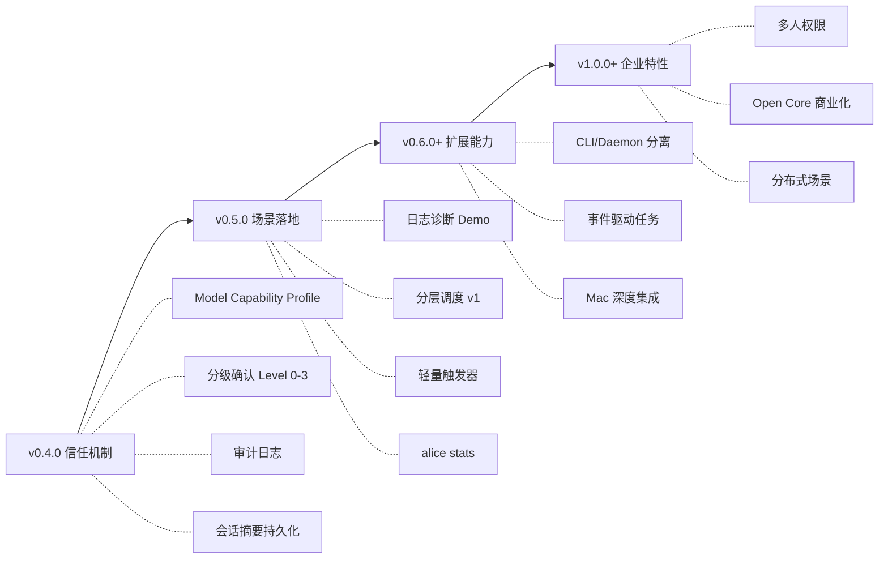

# ALICE 未来 Issue 待办列表 📋

> [!abstract] 文档说明
> 本文档从 ==Alice创意讨论== 系列文档中提炼各 AI（**Opus**、**Qwen**、**Grok**）的意见和建议，整理为可执行的 Issue 待办列表，按版本和优先级分类。

---

## 🔴 v0.4.0 — 信任机制（高优先级）

### 架构与模型层

- [ ] **Model Capability Profile 层** #架构 #模型
  每个模型注册时声明支持的能力（function calling、streaming、vision 等），ALICE 根据 profile 动态调整交互策略，避免"最低公约数体验"。
  > [!cite] 来源
  > Opus：模型中立 ≠ 模型无差异，需要能力声明层

- [ ] **功能降级而非质量降级机制** #模型 #UX
  从高能力模型切换到低能力模型时，收窄 ALICE 的能力边界而非降低输出质量。类似汽车 Eco 模式——功能集不同，而非"变傻了"。
  > [!cite] 来源
  > Opus：不要让用户感知到模型切换

- [ ] **差异化系统 Prompt 配置** #模型
  为不同能力的模型配置对应的系统 prompt，确保每个模型在其擅长领域发挥最佳。

- [ ] **模型自动降级** #模型 #可靠性
  云端 → 离线无缝切换，网络断开时自动回退到本地模型。

### 安全与确认机制

- [ ] **意图确认回显** #安全 #UX
  危险操作前，ALICE 用自然语言说清意图："我理解你要做的是：删除 /tmp/logs 下超过 30 天的文件，共 142 个，总大小 3.2GB。确认？"
  > [!cite] 来源
  > Opus：自然语言也有歧义，需要意图回显

- [ ] **分级确认机制（Level 0-3）** #安全
  - **Level 0**（安全操作）：直接执行，如 `ls`、`cat`、`grep`
  - **Level 1**（常规操作）：简单确认，如 `cp`、`mkdir`
  - **Level 2**（敏感操作）：意图回显 + 确认，如 `rm`（非递归）
  - **Level 3**（危险操作）：意图回显 + 预演 + 二次确认 + 自动备份，如 `rm -rf`、`DROP TABLE`；要求用户**输入目标名称**确认
  > [!cite] 来源
  > Opus：分级确认 + 摩擦设计防手滑

- [ ] **静态危险命令模式库** #安全
  维护正则匹配规则库（`rm -rf`、`dd if=`、`mkfs`、`chmod 777` 等），不依赖模型判断危险性，框架层直接拦截。
  > [!cite] 来源
  > Opus：小模型对危险命令判断能力弱，安全底线不能依赖模型

- [ ] **责任边界协议** #安全 #合规
  Level 3 操作要求用户手写简短理由（如"清理临时日志"），理由与操作绑定写入审计日志，形成法律级证据链。
  > [!cite] 来源
  > Qwen：责任归属问题，保护用户免责

- [ ] **认知摩擦设计** #安全 #UX
  关键操作强制要求用户用自然语言复述 ALICE 的意图，避免"确认疲劳"导致的虚假安全感。
  > [!cite] 来源
  > Qwen：信任不是让用户放手，而是知情状态下放手

### 审计与持久化

- [ ] **Append-only 审计日志** #审计
  每次操作写文件，记录 `agent_id` + `timestamp` + `task_id` 三元组，天然可追溯事件流。
  > [!cite] 来源
  > Opus：append-only 日志格式 + 三元组

- [ ] **会话摘要持久化** #会话
  会话结束时自动生成 `~/.alice/sessions/{session_id}/summary.md`，包含关键决策和待办事项。下次对话时可恢复上下文。
  > [!cite] 来源
  > Opus：纯文件系统实现，不依赖 Obsidian

### 角色与 Prompt

- [ ] **单 Agent 多角色切换** #Agent
  通过切换 system prompt 实现模式切换（通用/运维/编码等），用户感知为 ALICE 的"模式"变了而非跟不同 AI 说话。
  > [!cite] 来源
  > Opus：短期不碰多 Agent，先做多角色切换

---

## 🟡 v0.5.0 — 场景落地（中优先级）

### 核心诊断场景

- [ ] **日志诊断场景完整 Demo** #场景 #运维
  实现 grep + 多日志对比 + 时间戳对齐 + 诊断报告生成的完整流程。
  > [!cite] 来源
  > Opus/Qwen：邮件诊断场景是最佳 MVP 故事

- [ ] **诊断报告区分"事实"与"建议"** #安全 #UX
  事实部分（日志内容）标为高置信度，建议部分标为"需人工确认"，避免用户盲信错误修复建议。
  > [!cite] 来源
  > Opus：错误建议的风险

- [ ] **日志聚合能力** #运维
  多个日志文件的汇总、对比和时间戳对齐。

### 智能调度

- [ ] **分层调度 v1（静态规则 + 试错升级）** #调度 #架构
  - 基于任务类型的静态映射（"查日志" → 4B, "修代码" → Claude）
  - 4B 先尝试，检测到输出质量低时自动升级到更强模型
  - 始终支持 `alice --model=claude` 用户 override
  > [!cite] 来源
  > Opus：试错-升级策略比预测复杂度更实用

- [ ] **上下文压缩协议** #调度 #优化
  分层调度时，低能力模型生成结构化 JSON 摘要传递给高能力模型，避免重复读取原始数据，降低 30%+ token 消耗。
  > [!cite] 来源
  > Qwen：分层调度的隐藏上下文切换成本

### 触发器与集成

- [ ] **轻量触发器（Slack/飞书/Telegram Bot）** #集成
  用 webhook 实现轻量消息触发，==不要在 MVP 阶段做邮件==。
  > [!cite] 来源
  > Opus/Qwen：邮件是工程自杀，先用轻量方式验证价值

- [ ] **`alice stats` 成本统计命令** #营销 #UX
  显示：本月任务数、各模型使用比例、全用 Claude 的预估成本、实际成本、节省比例。
  > [!cite] 来源
  > Opus：统计数据是最好的自传播营销

- [ ] **`alice diagnose` CLI 命令** #场景
  实现 `alice diagnose --order=F9987` 形式的 CLI 诊断入口，验证核心诊断能力。
  > [!cite] 来源
  > Qwen：渐进式触发，先 CLI 再 Bot

### Benchmark 与验证

- [ ] **自建运维专用评估集** #测试 #模型
  收集 200+ 真实运维场景（日志解析、命令生成、故障诊断），关注"命令生成安全率"而非"回答正确率"。
  > [!cite] 来源
  > Opus：不要用通用 benchmark

- [ ] **确定最低可用模型门槛** #模型
  1.7B 仅限命令补全（类似 shell autocomplete），命令生成场景最低 3B-4B。
  > [!cite] 来源
  > Opus：1.7B 基本不可用于命令生成

- [ ] **能力漂移检测机制** #模型 #自动化
  每月自动用新版本小模型重跑历史 benchmark，准确率提升 >15% 时自动放宽能力边界，通知用户。
  > [!cite] 来源
  > Qwen：小模型能力边界会随时间漂移

### 权限管理

- [ ] **最小权限模型** #安全 #运维
  ALICE 仅拥有 read-only 日志访问权限，日志路径需预先白名单配置。
  > [!cite] 来源
  > Opus：安全团队会质疑双向网络权限

- [ ] **基于发件人的权限控制** #安全
  不同用户只能查询其权限范围内的日志和资源。

---

## 🟢 v0.6.0+ — 扩展能力（中长期）

### 后台服务架构

- [ ] **CLI 与 Daemon 架构分离** #架构
  - `alice` CLI：交互式前端，用完即走
  - `alice-agent` daemon：后台常驻服务，处理心跳、定时任务等
  - 两者通过 Unix socket 或本地 HTTP 通信
  - daemon 用 systemd/launchd 管理，崩溃自动重启
  > [!cite] 来源
  > Opus：CLI 做后台常驻任务架构上极其别扭

- [ ] **事件驱动任务（优先于轮询）** #架构
  先做事件驱动型（webhook 触发、邮件触发），不做轮询型（每隔 N 分钟检查）。
  > [!cite] 来源
  > Opus：事件驱动更可靠更省资源

- [ ] **后台任务权限隔离与冲突检测** #安全
  白名单 + 角色控制，前台用户操作与后台任务的冲突检测和资源限流。

- [ ] **命令执行预演机制** #安全 #UX
  执行前在沙箱环境预跑，展示潜在输出和影响，再让用户确认。
  > [!cite] 来源
  > Grok：模拟执行模式

- [ ] **自动备份与回滚机制** #安全
  危险操作前自动备份，出问题时支持快速回滚。

- [ ] **多步骤复盘** #审计
  执行完自动总结"我做了什么，为什么"。

- [ ] **角色隔离** #安全
  `alice --role=sre` 加载运维安全限制规则集。

### 触发器扩展

- [ ] **邮件触发器** #集成
  监听邮箱、解析邮件体和附件、自动识别意图、格式化回复。
  > [!cite] 来源
  > Qwen：v1.0 才考虑邮件集成

### Mac 生态集成

- [ ] **macOS launchd 零配置后台服务** #Mac #DX
  利用 macOS 的 launchd 实现开箱即用的后台服务管理。

- [ ] **Spotlight 集成** #Mac #UX
  `Cmd+Space` → "alice diagnose F9987" 直接触发。

- [ ] **Shortcuts.app 联动** #Mac #UX
  用户可创建"一键诊断"等快捷指令。

- [ ] **Apple Silicon MLX 加速** #Mac #性能
  利用 M 系列芯片神经引擎加速本地模型推理（MLX 框架验证 3-4 倍提速）。
  > [!cite] 来源
  > Qwen：Mac-first 体验是竞品难以复制的护城河

---

## 🔵 v1.0.0+ — 企业特性（长期）

### 企业级功能

- [ ] **多人权限管理** #企业
  操作审计、权限控制、企业 SSO 集成。

- [ ] **企业日志系统集成** #企业 #运维
  ELK、Splunk 等日志平台对接。

- [ ] **配置管理工具集成** #企业 #运维
  Ansible、Terraform 等工具联动。

- [ ] **分布式场景支持（企业版）** #企业 #商业化
  跨服务器协调、集群操作、多环境同步——作为企业版核心价值。
  > [!cite] 来源
  > Qwen：场景切割比功能切割更好

### 多 Agent 协作

- [ ] **内部流水线式多 Agent** #Agent #架构
  用户不可见的内部 prompt 流水线：诊断 prompt → 修复 prompt → 验证 prompt。
  > [!cite] 来源
  > Opus：比显式多 Agent 更实用

- [ ] **显式多 Agent 协作** #Agent
  不同角色 Agent 间的编排、IPC、上下文传递。==最后才做==。
  > [!cite] 来源
  > Opus：多 Agent 最容易过度设计，短期不碰

### 商业化

- [ ] **Open Core 模式落地** #商业化
  - 开源：CLI 本体、模型适配层、基础工具执行、本地运行（**单机场景**）
  - 商业化：审计日志 Dashboard、多人协作、企业 SSO、SLA、**分布式场景**
  > [!cite] 来源
  > Opus + Qwen：Open Core + 场景切割

---

## ⚡ 产品叙事与营销 Issue

- [ ] **产品定位叙事升维** #营销 #定位
  从"支持小模型所以便宜"→ "智能分配资源，用对的模型做对的事"（进攻性定位）。
  > [!cite] 来源
  > Opus：叙事升维，从防御变进攻

- [ ] **引入"模型流动性"概念** #营销 #定位
  用户可随时将任务从 A 模型迁移到 B 模型，历史上下文、审计日志、操作习惯无缝继承。
  > [!cite] 来源
  > Qwen：用户为中立带来的具体价值买单

- [ ] **MTTR 指标引入** #营销
  用 "MTTR 降低 83%" 替代 "节省 25 分钟" 作为营销话术，对 CTO 更有杀伤力。
  > [!cite] 来源
  > Opus：MTTR 是企业 SLA 合规的硬指标

- [ ] **README 增加邮件诊断场景 Demo** #文档
  将邮件诊断场景作为官网/README 的第一个用户故事。
  > [!cite] 来源
  > Opus：最有说服力的部分

- [ ] **明确 "trust-first, not model-first" 定位** #文档 #定位
  在 README 和文档中贯穿这一架构哲学。
  > [!cite] 来源
  > Opus：护城河在架构哲学而非功能

- [ ] **成本计算使用保守估计** #营销
  用 10 次/天、节省 1 人时的保守数据，比 50 次/天更可信。
  > [!cite] 来源
  > Opus：采购决策者会质疑乐观数字

---

## ⚠️ 需要警惕的风险

> [!warning] 功能蔓延风险
> 邮件、心跳、多 Agent、Obsidian IPC——每一个都是一个产品。MVP 只做一件事：**用 CLI 安全地执行运维操作，带审计日志**。^[Opus 总评]

> [!warning] 竞品对比过于自信
> 对 Claude Code 的评价基于当前状态，大公司迭代速度很快。护城河不能建立在"别人还没做"之上，而要建立在"架构从根基上就是为信任设计的"。^[Opus 总评]

> [!warning] 笔记系统不要绑定 Obsidian
> 核心协议应是 Markdown + YAML frontmatter（文件系统优先），Obsidian 仅作为"推荐 UI"。这样 VS Code、Vim、甚至无 GUI 服务器都能用。^[Opus]

> [!warning] 信任需要时间建立
> 设计产品的"**信任阶梯**"：观望期 → 试探期 → 依赖期 → 共生期。不要一上来就展示最强功能。^[Opus + Qwen]

---

## 📊 优先级总览

---

> [!tip] 执行原则
> **先做窄，做深，做到一个运维愿意在生产环境用它。然后让这个人告诉他的同事。** 这比任何营销策略都有效。^[Opus]

---

*最后更新：2026-02-15*
*来源：[[Alice创意讨论]] · [[Alice创意讨论-2]]*
*意见提供者：Opus、Qwen-Max、Grok*
